---

# Data Model for Lexicography (DMLex) Version 1.0

## OASIS Standard

## 29 April 2025

#### This stage:

https://docs.oasis-open.org/lexidma/dmlex/v1.0/os/dmlex-v1.0-os.html \
https://docs.oasis-open.org/lexidma/dmlex/v1.0/os/dmlex-v1.0-os.pdf (Authoritative)

#### Previous stage:

https://docs.oasis-open.org/lexidma/dmlex/v1.0/cs01/dmlex-v1.0-cs01.html \
https://docs.oasis-open.org/lexidma/dmlex/v1.0/cs01/dmlex-v1.0-cs01.pdf (Authoritative)

#### Latest stage:

https://docs.oasis-open.org/lexidma/dmlex/v1.0/dmlex-v1.0.html \
https://docs.oasis-open.org/lexidma/dmlex/v1.0/dmlex-v1.0.pdf (Authoritative)

#### Technical Committee:

[OASIS Lexicographic Infrastructure Data Model and API (LEXIDMA) TC](http://www.oasis-open.org/committees/lexidma/)

#### Chair:

Michal Měchura (michmech@mail.muni.cz), [Masaryk University](http://www.ijs.si/)

#### Editors:

David Filip (glorfindel@mail.muni.cz), [Masaryk University](https://www.muni.cz/) \
Miloš Jakubíček (milos.jakubicek@sketchengine.eu), [Lexical Computing](http://www.lexicalcomputing.com/) \
Vojtěch Kovář (vojcek@mail.muni.cz), [Masaryk University](https://www.muni.cz/) \
Simon Krek (simon.krek@ijs.si), [Jozef Stefan Institute](http://www.ijs.si/) \
John McCrae (john.mccrae@universityofgalway.ie), [University of Galway](https://www.universityofgalway.ie/) \
Michal Měchura (michmech@mail.muni.cz), [Masaryk University](https://www.muni.cz/)

#### Additional artifacts:

This prose specification is one component of a Work Product that also includes declarative validation artifacts accessible from <https://docs.oasis-open.org/lexidma/dmlex/v1.0/os/schemas/>:

- XML: <https://docs.oasis-open.org/lexidma/dmlex/v1.0/os/schemas/XML/>

- JSON: <https://docs.oasis-open.org/lexidma/dmlex/v1.0/os/schemas/JSON/>

- RDF: <https://docs.oasis-open.org/lexidma/dmlex/v1.0/os/schemas/RDF/>

Informative copies of third party schemas are provided:

<https://docs.oasis-open.org/lexidma/dmlex/v1.0/os/schemas/informativeCopiesOf3rdPartySchemas/>

#### Declared namespaces: <a id='namespaces'></a>

This specification declares one or more namespaces. Namespace isn't considered an XML specific feature in this serialization independent specification.

**The core and modules namespace**

- <http://docs.oasis-open.org/lexidma/ns/dmlex-1.0>

#### Abstract:

This document defines the 1st version of a data model in support of the high-priority technical goals described in the LEXIDMA TC's charter, including:

- A serialization-independent Data Model for Lexicography (DMLex)

- An XML serialization of DMLex

- A JSON serialization of DMLex

- A relational database serialization of DMLex

- An RDF serialization of DMLex

- An informative NVH serialization of DMLex

#### Status:

This document was last revised or approved by the LEXIDMA TC on the above date. The level of approval is also listed above. Check the "Latest version" location noted above for possible later revisions of this document. Any other numbered Versions and other technical work produced by the Technical Committee (TC) are listed at <https://www.oasis-open.org/committees/tc_home.php?wg_abbrev=lexidma#technical>.

TC members should send comments on this document to the TC's email list. Others should send comments to the TC's public comment list, after subscribing to it by following the instructions at the "[Send A Comment](https://www.oasis-open.org/committees/comments/index.php?wg_abbrev=lexidma)" button on the TC's web page at <https://www.oasis-open.org/committees/lexidma/>.

This specification is provided under the [Non-Assertion](https://www.oasis-open.org/policies-guidelines/ipr/#Non-Assertion-Mode) Mode of the [OASIS IPR Policy](https://www.oasis-open.org/policies-guidelines/ipr/), the mode chosen when the Technical Committee was established. For information on whether any patents have been disclosed that may be essential to implementing this specification, and any offers of patent licensing terms, please refer to the Intellectual Property Rights section of the TC's web page (<https://www.oasis-open.org/committees/lexidma/ipr.php>).

Note that any machine-readable content ([Computer Language Definitions](https://www.oasis-open.org/policies-guidelines/tc-process-2017-05-26/#wpComponentsCompLang)) declared Normative for this Work Product is provided in separate plain text files. In the event of a discrepancy between any such plain text file and display content in the Work Product's prose narrative document(s), the content in the separate plain text file prevails.

#### Key words:

The key words MUST, MUST NOT, REQUIRED, SHALL, SHALL NOT, SHOULD, SHOULD NOT, RECOMMENDED, MAY, and OPTIONAL in this document are to be interpreted as described in [BCP 14](https://tools.ietf.org/html/bcp14) \[[RFC2119](#rfc2119)\] and \[[RFC8174](#rfc8174)\] if, and only if, they appear in all capitals, as shown here.

#### Citation format:

When referencing this specification the following citation format should be used:

\[DMLex-1.0\]

*Data Model for Lexicography Version 1.0*. Edited by David Filip, Miloš Jakubíček, Simon Krek, John McCrae, and Michal Měchura. 29 April 2025. OASIS OASIS Standard. <https://docs.oasis-open.org/lexidma/dmlex/v1.0/os/dmlex-v1.0-os.html>. Latest version: <https://docs.oasis-open.org/lexidma/dmlex/v1.0/dmlex-v1.0.html>.

---

## Notices

Copyright © OASIS Open 2025.

All Rights Reserved.Distributed under the terms of the OASIS [IPR Policy](https://www.oasis-open.org/policies-guidelines/ipr/).

The name "OASIS" is a trademark of [OASIS](https://www.oasis-open.org/), the owner and developer of this specification, and should be used only to refer to the organization and its official outputs.

For complete copyright information please see the [full Notices](#full-notices) section in an Appendix below.

---

# Table of Contents

- [1 Introduction (Normative)](#Introduction)
    - [1.1 Modular structure of DMLex](#1-1-modular-structure-of-dmlex)
    - [1.2 Implementing DMLex](#1-2-implementing-dmlex)
    - [1.3 The metamodel behind DMLex](#1-3-the-metamodel-behind-dmlex)
        - [1.3.1 Object types](#1-3-1-object-types)
        - [1.3.2 Properties](#modelProperties)
        - [1.3.3 Tree structures](#1-3-3-tree-structures)
        - [1.3.4 Relational structures](#1-3-4-relational-structures)
        - [1.3.5 Unique identifiers](#uniqueids)
    - [1.4 Definitions](#definitions)
- [2 Conformance](#Conformance)
- [3 DMLex Core](#core)
    - [3.1 Optional roots](#optionalroots)
    - [3.2 Fragment identification](#fragid)
        - [3.2.1 DMLex fragment identification strings](#frag_iri)
    - [3.3 lexicographicResource](#core_lexicographicResource)
    - [3.4 entry](#core_entry)
    - [3.5 partOfSpeech](#core_partOfSpeech)
    - [3.6 inflectedForm](#core_inflectedForm)
    - [3.7 sense](#core_sense)
    - [3.8 definition](#core_definition)
    - [3.9 label](#core_label)
    - [3.10 pronunciation](#core_pronunciation)
    - [3.11 transcription](#core_transcription)
    - [3.12 example](#core_example)
- [4 DMLex OPTIONAL Modules (Normative)](#modules)
    - [4.1 DMLex Crosslingual Module](#xlingual)
        - [4.1.1 Extensions to lexicographicResource](#xlingual_lexicographicResource)
        - [4.1.2 translationLanguage](#xlingual_translationLanguage)
        - [4.1.3 Extensions to sense](#xlingual_sense)
        - [4.1.4 headwordTranslation](#xlingual_headwordTranslation)
        - [4.1.5 headwordExplanation](#xlingual_headwordExplanation)
        - [4.1.6 Extensions to example](#xlingual_example)
        - [4.1.7 exampleTranslation](#xlingual_exampleTranslation)
        - [4.1.8 Extensions to partOfSpeech](#xlingual_partOfSpeech)
        - [4.1.9 Extensions to label](#xlingual_label)
        - [4.1.10 Extensions to pronunciation](#xlingual_pronunciation)
        - [4.1.11 Extensions to inflectedForm](#xlingual_inflectedForm)
    - [4.2 DMLex Controlled Values Module](#values)
        - [4.2.1 Extensions to lexicographicResource](#values_lexicographicResource)
        - [4.2.2 definitionTypeTag](#values_definitionTypeTag)
        - [4.2.3 inflectedFormTag](#values_inflectedFormTag)
        - [4.2.4 labelTag](#values_labelTag)
        - [4.2.5 labelTypeTag](#values_labelTypeTag)
        - [4.2.6 partOfSpeechTag](#values_partOfSpeechTag)
        - [4.2.7 sourceIdentityTag](#values_sourceIdentityTag)
        - [4.2.8 transcriptionSchemeTag](#values_transcriptionSchemeTag)
        - [4.2.9 sameAs](#values_sameAs)
    - [4.3 DMLex Linking Module](#linking)
        - [4.3.1 Extensions to lexicographicResource](#linking_lexicographicResource)
        - [4.3.2 relation](#linking_relation)
        - [4.3.3 member](#linking_member)
        - [4.3.4 relationType](#linking_relationType)
        - [4.3.5 memberType](#linking_memberType)
        - [4.3.6 Extensions to sameAs](#linking_sameAs)
    - [4.4 DMLex Annotation Module](#annotation)
        - [4.4.1 Extensions to entry](#annotation_entry)
        - [4.4.2 Extensions to headwordTranslation](#annotation_headwordTranslation)
        - [4.4.3 placeholderMarker](#annotation_placeholderMarker)
        - [4.4.4 Extensions to definition](#annotation_definition)
        - [4.4.5 Extensions to example](#annotation_example)
        - [4.4.6 Extensions to exampleTranslation](#annotation_exampleTranslation)
        - [4.4.7 headwordMarker](#annotation_headwordMarker)
        - [4.4.8 collocateMarker](#annotation_collocateMarker)
        - [4.4.9 Extensions to label](#annotation_label)
    - [4.5 DMLex Etymology Module](#etymology)
        - [4.5.1 Extensions to entry](#etymology_entry)
        - [4.5.2 etymology](#etymology_etymology)
        - [4.5.3 etymon](#etymology_etymon)
        - [4.5.4 etymonUnit](#etymology_etymonUnit)
        - [4.5.5 Extensions to lexicographicResource](#etymology_lexicographicResource)
        - [4.5.6 etymonType](#etymology_etymonType)
        - [4.5.7 etymonLanguage](#etymology_etymonLanguage)
        - [4.5.8 Extensions to partOfSpeech](#etymology_partOfSpeech)
        - [4.5.9 Extensions to sameAs](#etymology_sameAs)
- [5 DMLex REQUIRED Serializations (Normative)](#serializations)
    - [5.1 DMLex XML serialization (Normative)](#xml)
        - [5.1.1 Design Principles (Informative)](#XMLDesignPrinciples)
        - [5.1.2 Whitespace handling (Normative)](#XMLWhitespace)
        - [5.1.3 Element order (Normative)](#XMLElementOrder)
        - [5.1.4 DMLex XML serialization elements (Normative)](#XMLElements)
    - [5.2 DMLex JSON serialization (Normative)](#json)
        - [5.2.1 Design principles](#5-2-1-design-principles)
        - [5.2.2 DMLex JSON serialization objects (Normative)](#JSONClasses)
    - [5.3 DMLex RDF serialization (Normative)](#rdf)
        - [5.3.1 Design principles](#5-3-1-design-principles)
        - [5.3.2 DMLex RDF serialization elements](#5-3-2-dmlex-rdf-serialization-elements)
    - [5.4 DMLex relational database serialization (Normative)](#rdb)
        - [5.4.1 Design principles (Informative)](#5-4-1-design-principles-informative)
        - [5.4.2 Database diagrams (Informative)](#5-4-2-database-diagrams-informative)
        - [5.4.3 DMLex relational database serialization tables (Normative)](#RDBTables)
- [Appendix A Informative material on serializations (Informative)](#appendix-a-informative-material-on-serializations-informative)
    - [A.1 Examples (Informative)](#examples)
        - [A.1.1 A basic entry](#ex00)
        - [A.1.2 How to use inflectedForm](#ex01)
        - [A.1.3 Pronunciation given as transcription](#ex02)
        - [A.1.4 Pronunciation given as a sound file](#ex03)
        - [A.1.5 Pronunciation given both ways](#ex04)
        - [A.1.6 How to use partOfSpeechTag and inflectedFormTag](#ex05)
        - [A.1.7 Mapping controlled values to external inventories](#ex06)
        - [A.1.8 Defining a bilingual lexicographic resource](#ex07)
        - [A.1.9 Defining a multilingual lexicographic resource](#ex10)
        - [A.1.10 How to use headwordTranslation in a bilingual lexicographic resource](#ex08)
        - [A.1.11 How to use headwordTranslation in a multilingual lexicographic resource](#ex11)
        - [A.1.12 How to use headwordExplanation](#ex09)
        - [A.1.13 Modelling parts and wholes](#ex12)
        - [A.1.14 Modelling antonyms](#ex13)
        - [A.1.15 Modelling synonyms](#ex14)
        - [A.1.16 Modelling variants](#ex15)
        - [A.1.17 Modelling subsenses](#ex16)
        - [A.1.18 Modelling subentries (at subsense level)](#ex17)
        - [A.1.19 Modelling subentries (at sense level)](#ex18)
        - [A.1.20 Using placeholderMarker](#ex19)
        - [A.1.21 Using placeholderMarker in a bilingual lexicographic resource](#ex20)
        - [A.1.22 Using headwordMarker](#ex21)
        - [A.1.23 Using collocateMarker](#ex22)
        - [A.1.24 Modelling etymology](#ex23)
        - [A.1.25 Modelling etymology types and language](#ex24)
    - [A.2 DMLex NVH serialization (Informative)](#nvh)
        - [A.2.1 Design Principles (Informative)](#NVHDesignPrinciples)
        - [A.2.2 DMLex NVH serialization nodes (Informative)](#NVHNodes)
- [Appendix B References (Normative)](#references)
    - [B.1 Normative references (Normative)](#normativeReferences)
    - [B.2 Informative references (Informative)](#informativeReferences)
- [Appendix C Machine Readable Validation Artifacts (Normative)](#Validation)
- [Appendix D DMLex UML diagram (Normative)](#diagram_uml)
- [Appendix E DMLex plain text description (Informative)](#diagram_nvh)
- [Appendix F Specification Change Tracking (Informative)](#specChangeTracking)
    - [F.1 Tracking of changes](#ReviewChangeTrack)
        - [F.1.1 Tracking of changes made during the OASIS publishing process after Public Reviews](#f-1-1-tracking-of-changes-made-during-the-oasis-publishing-process-after-public-reviews)
        - [F.1.2 Tracking of changes made in response to Public Reviews](#f-1-2-tracking-of-changes-made-in-response-to-public-reviews)
- [Appendix G Acknowledgements (Informative)](#acknowledgements)
- [Appendix H Notices (Informative)](#full-notices)

---

# 1 Introduction (Normative) <a id='Introduction'></a>

DMLex is a data model for modelling dictionaries (here called *lexicographic resources*) in computer applications such as dictionary writing systems.

DMLex is a data model, not an encoding format. DMLex is abstract, independent of any markup language or formalism. At the same time, DMLex has been designed to be easily and straightforwardly implementable in XML, JSON, NVH, as a relational database, and as a Semantic Web triplestore.

## 1.1 Modular structure of DMLex <a id='1-1-modular-structure-of-dmlex'></a>

The DMLex specification is divided into a REQUIRED core with several OPTIONAL modules.

- [DMLex Core](#core) allows you to model the basic entries-and-sense structure of a monolingual lexicographic resource.

- [DMLex Crosslingual Module](#xlingual) extends DMLex Core to model bilingual and multilingual lexicographic resources.

- [DMLex Controlled Values Module](#values) extends DMLex Core to represent inventories of look-up values to be used as part-of-speech tags, usage label tags and others.

- [DMLex Linking Module](#linking) extends DMLex Core and allows you to model various kinds of relations between entries, senses and other objects, including semantic relations such as synonymy and antonymy and presentational relations such as subentries and subsenses, both within a single lexicographic resource and across multiple lexicographic resources.

- [DMLex Annotation Module](#annotation) extends DMLex Core to allow the modelling of inline markup on various objects such as example sentences, including the modelling of collocations and corpus patterns.

- [DMLex Etymology Module](#etymology) extends DMLex Core to allow the modelling of etymological information in dictionaries.

## 1.2 Implementing DMLex <a id='1-2-implementing-dmlex'></a>

DMLex is an abstract data model which can be implemented in many different programming environments and serialization languages. In this document, we specify REQUIRED serializations for: [XML](#xml), [JSON](#json), [RDF](#rdf), and [relational databases](#rdb).

An informative serialization specification is provided for:[NVH](#nvh).

## 1.3 The metamodel behind DMLex <a id='1-3-the-metamodel-behind-dmlex'></a>

The DMLex data model is defined in this document through the following concepts.

### 1.3.1 Object types <a id='1-3-1-object-types'></a>

DMLex defines the existence of certain *object types* such as `entry` and `definition`. In every DMLex-conformant data set, each “object” (for example each XML element or each database table) must be an instance of one of these object types.

The names of object types are unique within the scope of the entire data model, including all the modules. An object type defined in one module is guaranteed not to name-conflict with another object type in another module.

### 1.3.2 Properties <a id='modelProperties'></a>

For every object type, DMLex defines which properties it can have, whether the properties are required or optional, what their arities are (for example “zero or more”), and what kinds of values it can contains.

There are two kinds of properties: those that contain literal values and those that contain objects.

Some properties are defined to contain literal values such as strings and numbers. The following types of literal values are used in DMLex:

- normalised string: a string that contains no new lines, does not start or end with a whitespace, contains no block of ASCII whitespace more than a single space and is non-empty.

- number: including negative numbers and floating-point numbers

- non-negative integer number

- boolean: a true/false value

- URI

- IETF language code

- [IRI](#bib_rfc3987): an Internationalized Resource Identifier

- closed list of possible values

Some properties are defined to contain objects (of types defined in DMLex), for example an object of type `entry` can contain objects of type `sense`. In such cases, the name of the property is the same as the name of the object type. For example, the `entry` object type has a property called `sense` which (with an arity of “zero or more”) contains `sense` objects.

The names of properties are unique within the scope of the object type they belong to but not necessarily outside it.

### 1.3.3 Tree structures <a id='1-3-3-tree-structures'></a>

The mechanics of objects which (through their properties) contain other objects mimics the tree-like structure commonly used in lexicography to represent dictionary entries, typically using XML.

Because of this, this document sometimes refers to objects being the “children”, “parents”, “descendants” or “ancestors” of other objects, or objects “belonging to” other objects. This is to be understood as follows.

- “Object A is the parent of object B” and “object B is a child of object A” both mean that object A has a property whose value is object B.

- “Object A is an ancestor of object B” and “object B is a descendant of object A” means that there is a chain of parent-child links between object A and object B.

- “Object B belongs to object A” is the same as “object B is a descendant of object A” and “object A is an ancestor of object B”.

The tree structures created by DMLex are guaranteed to have similar properties as in XML and many other tree-structured formalisms, including importantly the constraint that every object has no more than one parent.

Additionally, tree structures created by DMLex are guaranteed to be non-recursive: an object can never be an ancestor of another object of the same type.

### 1.3.4 Relational structures <a id='1-3-4-relational-structures'></a>

In addition to tree structures, which are used in DMLex to model the basic entries-and-senses skeleton of a lexicographic resource, DMLex also allows (through the `relation` object type defined in the Linking Module) the modelling of non-tree relations between objects, that is, relations connecting objects which belong to different parents.

Non-tree relations are used in DMLex to model cross-references between entries and senses, both within a single lexicographic resource and across multiple lexicographic resources. Non-tree relations are also used in DMLex to model certain things which have traditionally been modelled with tree structures in lexicography, such as the hierarchical arrangement of entries and subentries, or senses and subsenses. In DMLex, these phenomena are modelled as non-tree relations in order to avoid recursion in the tree structures and to minimize the number of object types in the data model.

### 1.3.5 Unique identifiers <a id='uniqueids'></a>

Some object types defined in DMLex have a property or a combination of properties mandated to be unique. Designating a property as unique means that its value must be unique within the scope of its parent object type. Designating a combination of properties as unique means that the ordered composition of its values must be unique within the scope of their parent object type. In the case that all unique properties are missing, `listingOrder` MUST be used to verify uniqueness. Such unique properties in DMLex serve two purposes:

- To enable objects to participate in relational structures. Relational structures (as opposed to tree structures) are modelled in DMLex as tuples (triples, ...) of unique identifiers.

- To enable addressing and accessing individual objects, for example individual senses or individual example sentences, outside the context of the entries they are in. See [Fragment identification](#fragid) for details.

Serializations of DMLex may choose to assign arbitrary unique identifiers (e.g. a random integer or a hash of the property value) to each property or combination of properties.

## 1.4 Definitions <a id='definitions'></a>

**Agent**

any application or tool that , reads, edits, writes, processes, stores, renders or otherwise handles *DMLex Instances*.

*Agent* is the most general application conformance target that subsumes all other specialized user agents disregarding whether they are defined in this specification or not.

**Enrich, Enriching**

the process of adding metadata and resources to *DMLex Instances*

**Processing Requirements**

- *Enriching* MAY happen at the time of *Creation*.

**Enricher, Enricher Agent**

any *Agent* that performs the *Enriching* process

**Create, Creation**

the process of encoding lexicographic data as *DMLex Instances*

**Creator, Creator Agent**

any *Agent* that performs the *Creation* process

**Modify, Modification**

the process of changing core and module based structural and inline objects that were previously created by other *Writers*

**Processing Requirements**

- DMLex Instances MAY be *Modified* and *Enriched* at the same time.

> **Note**
>
> *Creator* or *Enricher* knowledge of the *DMLex Instance* is not assumed while *Modifying*. However, modifications can only happen in the same serialization.

**Modifier, Modifier Agent**

an *Agent* that performs the *Modification* process

**Writer, Writer Agent**

an *Agent* that *Creates*, generates, or otherwise writes *DMLex Instances* for whatever purpose, including but not limited to *Creator*, *Modifier*, and *Enricher* *Agents*.

> **Note**
>
> Since DMLex serializations are intended as editing and exchange formats rather than processing formats, many applications will need to generate *DMLex Instances* from their internal processing formats, even in cases when they are processing *DMLex Instances* provided by other *Writers*.

**UNIQUE**

The term UNIQUE shall be interpreted as given in the section on [Unique identifiers](#uniqueids).

# 2 Conformance <a id='Conformance'></a>

1. <a id='DocumentConformance'></a>**DMLex Instances Conformance**

   1. Conformant *DMLex Instances* MUST be well formed and valid instances according to one of the normative DMLex Serialization Specifications.

   2. *DMLex Instances* MAY contain custom extensions, provided that those extensions do not provide features or parts of features that are provided by the [DMLex Core](#core) or any of the [DMLex Modules](#modules). Extensions MUST be serialized in a way conformant and compatible with the pertaining DMLex Serialization Specifications.

2. <a id='ApplicationConformance'></a>**Application Conformance**

   1. DMLex *Writers* MUST create conformant *DMLex Instances* to be considered DMLex compliant.

   2. *Agents* processing conformant *DMLex Instances* that contain custom extensions are not REQUIRED to understand and process non-DMLex objects or attributes. However, conformant applications SHOULD preserve existing custom extensions when processing conformant *DMLex Instances*, provided that the objects that contain custom extensions are not removed according to DMLex Processing Requirements or the extension's own processing requirements.

   3. All *Agents* MUST comply with Processing Requirements for otherwise unspecified *Agents* or without a specifically set target *Agent*.

   4. Specialized *Agents* defined in this specification - this is *Creator*, *Writer*, *Modifier*, and *Enricher* *Agents* - MUST comply with the Processing Requirements targeting their specifically defined type of *Agent* on top of Processing Requirements targeting all *Agents* as per point c. above.

   5. DMLex is an object model explicitly designed for exchanging data in the same serialization among various *Agents*. Thus, a conformant DMLex application MUST be able to accept *DMLex Instances* *Created*, *Modified*, or *Enriched* by a different application, provided that:

      1. The processed files are conformant *DMLex Instances* according to the same DMLex Serialization Specification,

      2. in a state compliant with all relevant Processing Requirements.

3. **Backwards Compatibility**

   1. N/A (no previous versions)

> **Note**
>
> *DMLex Instances* cannot be conformant to this specification w/o being conformant to a specific serialization.

> **Warning**
>
> Exchange of *DMLex Instances* data between and among DMLex serializations is out of scope of the DMLex Version 1.0 specification. Although, the serializations are semantically compatible, they don't have to possess compatible addressing and fragment identification mechanims, mainly due to the fact that each serialization is expected to use its own native id data types, uniqueness scopes, and addressing methods.

# 3 DMLex Core <a id='core'></a>

The DMLex Core provides data types for modelling monolingual dictionaries (called *lexicographic resources* in DMLex) where headwords, definitions and examples are all in one and the same language. DMLex Core gives you the tools you need to model simple dictionary entries which consist of the following data types:

- [`lexicographicResource`](#core_lexicographicResource)

- [`entry`](#core_entry)

- [`partOfSpeech`](#core_partOfSpeech)

- [`inflectedForm`](#core_inflectedForm)

- [`sense`](#core_sense)

- [`definition`](#core_definition)

- [`label`](#core_label)

- [`pronunciation`](#core_pronunciation)

- [`transcription`](#core_transcription)

- [`example`](#core_example)

## 3.1 Optional roots <a id='optionalroots'></a>

When exchanging data encoded in a DMLex serialization which has the concept of a "root" or top-level object, such as XML, JSON or NVH, the object types `lexicographicResource` and `entry` can serve as such roots.

## 3.2 Fragment identification <a id='fragid'></a>

Incomplete parts of DMLex objects represent valid fragments as long as it is possible to identify their complete source DMLex object. For a particular serialization, this can be achieved by:

- Making sure the fragment contains all [unique properties](#uniqueids) of the DMLex parent-child hierarchy that are necessary to determine its source object.

- Using a serialization-specific addressing mechanism (e.g. XPath for XML, JMESPath for JSON or an NVH query) to provide the location of the fragment in the source DMLex object.

### 3.2.1 DMLex fragment identification strings <a id='frag_iri'></a>

DMLex provides a recommended method for addressing DMLex objects present on-line, useful for linking (cf. [Section 4.3, “DMLex Linking Module”](#linking)) and general interoperability. Implementing this method is not REQUIRED for conformance.

Every fragment SHOULD be assigned a unique fragment identification string, composed of `lexicographicResource.uri`, with protocol identification prefix (such as `http://` or `https://`) removed, and a sequence of identifiers that uniquely determines the path in the DMLex tree structure. The DMLex fragment identification string of the root object `lexicographicResource` is the value of its attribute `lexicographicResource.uri`, with protocol identification prefix (such as `http://` or `https://`) removed. The fragment identification strings of its direct children are constructed as follows:

`lexicographicResource.uri/objectTypeName/objectID`

(We define below how object IDs are created.)

The DMLex fragment identification strings of descendant objects are constructed by appending the children's type names and IDs to the fragment identification strings of their direct parents, using “/” as the delimiter. In other words, the full template for a fragment identification string looks as follows:

`lexicographicResource.uri/objectTypeName/objectID/child1TypeName/child1ID/child2TypeName/child2ID/…`

For example, a particular [`sense`](#core_sense) (which is a property of [`entry`](#core_entry)) is assigned the following fragment identification string:

`lexicographicResource.uri/entry/entryID/sense/senseID`

A fragment identification string of an [`example`](#core_example) (which is a property of [`sense`](#core_sense), which is a property of [`entry`](#core_entry)) has the following structure:

`lexicographicResource.uri/entry/entryID/sense/senseID/example/exampleID`

#### 3.2.1.1 Object IDs <a id='objectids'></a>

For the purpose of creating DMLex fragment identification strings, each object is assigned a unique ID relative to its parent, based on values of its properties declared as UNIQUE. Multiple situations can occur:

1. The object type has a single UNIQUE property with an arity of “exactly one”, and the value of the property is a string or a number. In this case, the object ID is the string or the number, with the following modifications performed in that particular order:

   - every “\\” (ASCII character 5C) is replaced by “\\\\”

   - every “~” (ASCII character 7E) is replaced by “\\~”

   - every “\_” (ASCII character 5F) is replaced by “\\\_”

   - every “0” (zero, ASCII character 30) is replaced by “\\0”

   - all IRI-unsafe characters (outside the `iunreserved` class according to \[[RFC 3987](#bib_rfc3987)\]) are percent-encoded according to \[[RFC 3986](#bib_rfc3986)\]

2. The object type has a single UNIQUE property with an arity of “exactly one”, and the value of the property is a child DMLex object. In this case, the object ID is the same as the object ID of the child object. (Note: this case actually does not occur in the specification as such; we list it here to streamline the description of the following cases.)

3. The object type has a single UNIQUE property with an arbitrary arity. In this case, all the partial single values or child object IDs are constructed according to the steps 1. and 2., and the resulting object ID is their concatenation using “\_” (ASCII character 5F) as a separator. The order of the partial values is driven by the `listingOrder` of the respective objects. If this procedure returns an empty string (which can happen in case of UNIQUE attributes that allow the arity of zero), the string “0” (zero, ASCII character 30) is used instead of the empty string.

4. The object type has multiple UNIQUE properties. In this case, all the partial values or child object IDs are constructed according to the steps 1., 2. and 3., and the resulting object ID is their concatenation using “~” (ASCII character 5F) as a separator. The order of the partial values is driven by the order of the properties as given in this specification. (Note: all atributes marked as UNIQUE need to be represented in the ID, as empty values are replaced by “0” according to step 3. No empty IDs are allowed.)

5. In specific situations it may happen there are multiple different objects with all the UNIQUE properties empty, i.e. multiple objects with duplicate IDs (the same sequence of zeros) emerge as the result of the step 4. One example of such a situation is multiple senses without `indicator`s or `definition`s, but with different translations. In that case, and only in that case, the value of `listingOrder` is concatenated to the sequence of zeros, to distinguish between the duplicate IDs. If there is only one such object, `listingOrder` is not concatenated to the sequence of zeros.

DMLex does not define the structure of DMLex fragment identification strings for object types without UNIQUE properties.

#### 3.2.1.2 DMLex fragment identification string examples <a id='iri_examples'></a>

Particular examples of DMLex fragment identification strings can then look as follows:

- `www.example.com/lexicon/entry/cat~noun~1`

- `www.example.com/lexicon/entry/cat~noun~1/sense/0~small%20furry%20animal` (Here we assume that the sense's `indicator` is empty and it has one `definition` which says “small furry animal”).

- `www.example.com/lexicon/entry/cat~noun~1/sense/0~small%20furry%20animal/example/I%20have%20two%20dogs%20and%20a%20cat.`

- `www.example.com/lexicon/entry/cat~noun~1/sense/0~0` (Here we assume that both the sense's `definition` and its `indicator` are empty, and there is only one such sense.)

- `www.example.com/lexicon/entry/cat~noun~1/sense/0~02` (Here we assume that both the sense's `definition` and its `indicator` are empty, there are multiple such senses, and this is the sense number 2, of all this entry's senses.)

## 3.3 `lexicographicResource` <a id='core_lexicographicResource'></a>

Represents a dictionary. A lexicographic resource is a dataset which can be used, viewed and read by humans as a dictionary and – simultaneously – ingested, processed and understood by software agents as a machine-readable dataset.

> **Note**
>
> The correct name of this data type in DMLex is *lexicographic*, not *lexical*, resource.

**Properties**

- `title` OPTIONAL (zero or one). Normalised string. A human-readable title of the lexicographic resource.

- `uri` OPTIONAL (zero or one). The URI of the lexicographic resource, identifying it on the Web.

- `langCode` REQUIRED (exactly one). The IETF language code of the language that this lexicographic resource describes.

- [`entry`](#core_entry) OPTIONAL (zero or more)

**Comments**

- `langCode` identifies the language of headwords, definitions and examples in this dictionary. DMLex is based on the assumption that all headwords in a lexicographic resource are in the same language, and that definitions and examples, if any are included in the lexicographic resource, are in that language too. The `langCode` property of `lexicographicResource` informs potential users of the lexicographic resource which language that is.

- Ideally, a lexicographic resource should include at least one entry. However, DMLex specifies that `entry` is optional in `lexicographicResource` to allow for the existence of lexicographic resources which are not yet complete.

- The `lexicographicResource` data type does not prescribe properties for detailed metadata about the lexicographic resource, implementers are advised to refer to the properties in the [Dublin Core `elements` namespace](#DublinCore) as for basic metadata.

- DMLex allows lexicographic resources to contain zero entries. This is to enable the existence of lexicographic resources which are work in progress, and lexicographic resources whose only purpose is to contain relations (defined in the [DMLex Linking Module](#linking)) that link entries from other lexicographic resources.

*Example 1. XML*

```
<lexicographicResource uri="..." langCode="...">
    <title>...</title>
    <entry.../>
</lexicographicResource>
```

*Example 2. JSON*

```
{
    "title": "...",
    "langCode": "...",
    "entries": [...]
}
```

*Example 3. RDF*

```
@prefix dmlex: 
 <https://docs.oasis-open.org/lexidma/dmlex/v1.0/schemas/RDF/dmlex.ttl#> .

<#id> a dmlex:LexicographicResource ;
  dmlex:title "..." ;
  dmlex:uri "..." ;
  dmlex:langCode "..." ;
  dmlex:entry <entry1> , ... .
```

*Example 4. Relational database*

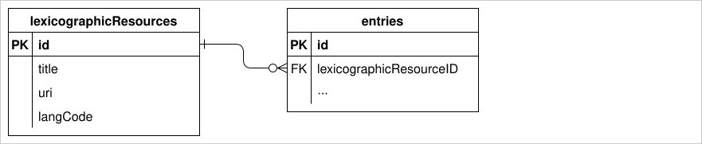

*Example 5. NVH*

```
lexicographicResource: http://example.com/dictionary
  title: An example dictionary
  langCode: en
  entry: ...
  entry: ...
```

## 3.4 `entry` <a id='core_entry'></a>

Represents a dictionary entry. An entry contains information about one headword.

**Property of**

- [`lexicographicResource`](#core_lexicographicResource)

**Properties**

- `headword` REQUIRED (exactly one) and UNIQUE (in combination with other unique properties if present). Normalised string. The entry's headword.

- [`partOfSpeech`](#core_partOfSpeech) OPTIONAL (zero or more) and UNIQUE (in combination with other unique properties if present).

- `homographNumber` OPTIONAL (zero or one) and UNIQUE (in combination with other unique properties if present). Number. The entry's homograph number, as a guide to distinguish entries with the same headword.

- [`label`](#core_label) OPTIONAL (zero or more).

- [`pronunciation`](#core_pronunciation) OPTIONAL (zero or more).

- [`inflectedForm`](#core_inflectedForm) OPTIONAL (zero or more).

- [`sense`](#core_sense) OPTIONAL (zero or more).

> **Note**
>
> DMLex Core does not have a concept of "subentry". To model subentries (i.e. entries inside entries) in a lexicographic resource, object types from the Linking Module should be used.

> **Note**
>
> The headword can be a single word, a multi-word expression, or any expression in the source language which is being described by the entry.

> **Note**
>
> DMLex allows only one headword per entry. Things such as variant headwords do not exist in DMLex. However, the [DMLex Linking Module](#linking) does make it possible to represent the existence of variants by treating them as separate headwords of separate entries, and linking the entries using a type of link which will cause the entries to be placed together when shown to human users. See [Section A.1.16, “Modelling variants”](#ex15) for an example using the English words "colour" and "color".

> **Note**
>
> DMLex allows entries to contain zero senses. An entry with zero senses is an entry which declares the existence of its headword and, optionally, gives some information about the headword's morphosyntactical properties (part of speech, inflected forms etc.) but does not say anything about its semantics, about its meaning. Such entries can exist as entries which are work in progress, or as entries whose only purpose is to serve as members in entry-to-entry relations (defined in the [DMLex Linking Module](#linking)) such as spelling variants (example: [Section A.1.16, “Modelling variants”](#ex15)).

> **Note**
>
> Entries in DMLex do not have an explicit listing order. An application can imply a listing order from a combination of the headword and the homograph number, such that the headword is the primary sorting key and the homograph number (for entries that have one) is the secondary sorting key.

> **Note**
>
> Ideally, each entry should have exactly one part-of-speech label. However, DMLex allows more than one `partOfSpeech` in `entry` in order to allow for exceptional cases when the lexicographer has decided to treat multiple part-of-speech readings of a headword in a single entry. Example: English words which denote nationalities ("Czech", "German") and which can function both as nouns and as adjectives.

*Example 6. XML*

```
<entry homographNumber="...">
    <headword>...</headword>
    <partOfSpeech.../>
    <label.../>
    <pronunciation.../>
    <inflectedForm.../>
    <sense.../>
</entry>
```

*Example 7. JSON*

```
{
    "headword": "...",
    "homographNumber": "...",
    "partsOfSpeech": [...],
    "labels": [...],
    "pronunciations": [...],
    "inflectedForms": [...],
    "senses": [...]
}
```

*Example 8. RDF*

```
<id> a dmlex:Entry ;
  dmlex:headword "..." ;
  dmlex:homographNumber ... ;
  dmlex:partOfSpeech ... ;
  dmlex:label ... ;
  dmlex:pronunciation ... ;
  dmlex:inflectedForm ... ;
  dmlex:sense ... .
```

*Example 9. Relational database*

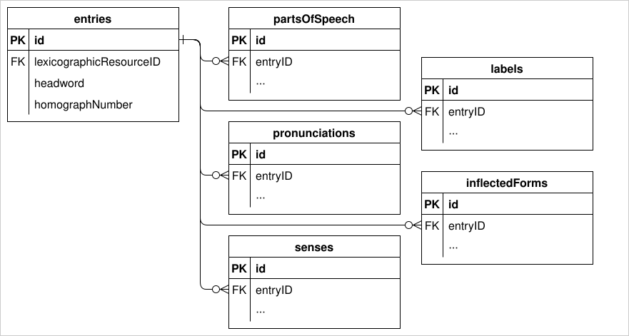

*Example 10. NVH*

```
entry: headword
  homograph: ...
  pos: ...
  label: ...
  pronunciation: ...
  form: ...
  sense: ...
```

## 3.5 `partOfSpeech` <a id='core_partOfSpeech'></a>

Represents a part-of-speech label.

**Property of**

- [`entry`](#core_entry)

**Properties**

- `tag` REQUIRED (exactly one) and UNIQUE. Normalised string. An abbreviation, a code or some other string of text which identifies the part-of-speech label, for example `n` for noun, `v` for verb, `adj` for adjective. The [`partOfSpeechTag`](#values_partOfSpeechTag) object type can be used to explain the meaning of the part-of-speech tags, to constrain which part-of-speech tags are allowed to occur in the lexicographic resource, and to map them onto external inventories and ontologies.

- `listingOrder` REQUIRED (exactly one). Number. The position of this part-of-speech label among other part-of-speech labels of the same entry. This can be implicit from the serialization.

**Comments**

- The way to model other grammatical properties of the headword besides part of speech, such as gender (of nouns) or aspect (of verbs) in DMLex is to combine them with the part of speech into a single part-of-speech tag, for example `noun-masc` and `noun-fem`, or `v-perf` and `v-imperf`.

*Example 11. XML*

```
<partOfSpeech tag="..."/>
```

*Example 12. JSON*

Implemented as a string

```
"..."
```

*Example 13. RDF*

```
<entry> dmlex:partOfSpeech [ 
  a dmlex:PartOfSpeech ;
  dmlex:tag "..." ;
  dmlex:listingOrder 1 ] .
```

*Example 14. Relational database*

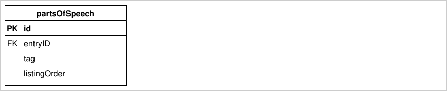

*Example 15. NVH*

```
pos: tag
```

## 3.6 `inflectedForm` <a id='core_inflectedForm'></a>

Represents one (of possibly many) inflected forms of the headword. Example: [Section A.1.2, “How to use inflectedForm”](#ex01).

**Property of**

- [`entry`](#core_entry)

**Properties**

- `text` REQUIRED (exactly one) and UNIQUE (in combination with other unique properties if present). Normalised string. The text of the inflected form.

- `tag` OPTIONAL (zero or one) and UNIQUE (in combination with other unique properties if present). Normalised string. An abbreviation, a code or some other string of text which identifies the inflected form, for example `pl` for plural, `gs` for genitive singular, `com` for comparative. The [`inflectedFormTag`](#values_inflectedFormTag) object type can be used to explain the meaning of the inflection tags, to constrain which inflection tags are allowed to occur in the lexicographic resource, and to map them onto external inventories and ontologies.

- [`label`](#core_label) OPTIONAL (zero or more).

- [`pronunciation`](#core_pronunciation) OPTIONAL (zero or more).

- `listingOrder` REQUIRED (exactly one). Number. The position of this inflected form among other inflected forms of the same entry. This can be implicit from the serialization.

*Example 16. XML*

```
<inflectedForm tag="...">
    <text>...</text>
    <label.../>
    <pronunciation.../>
</inflectedTag>
```

*Example 17. JSON*

```
{
    "tag": "...",
    "text": "...",
    "labels": [...],
    "pronunciations": [...]
}
```

*Example 18. RDF*

```
<entry> dmlex:inflectedForm [
  dmlex:text "..." ;
  dmlex:tag "..." ;
  dmlex:listingOrder 1 ;
  dmlex:label ... ;
  dmlex:pronunciation ... ] .
```

*Example 19. Relational database*

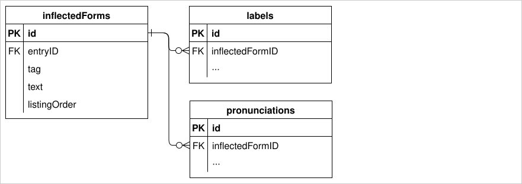

*Example 20. NVH*

```
form: text
  tag: ...
  label: ...
  pronunciation: ...
```

**Comments**

- The `inflectedForm` object type is intended to model the **inflectional morphology** of a headword. To model derivational morphology, for example feminine forms of masculine nouns, the recommended way to do that in DMLex is to create separate entries for the two words, and link them using the [Linking Module](#linking).

## 3.7 `sense` <a id='core_sense'></a>

Represents one of possibly many meanings (or meaning potentials) of the headword.

**Property of**

- [`entry`](#core_entry)

**Properties**

- `listingOrder` REQUIRED (exactly one). Number. The position of this sense among other senses of the same entry. This can be implicit from the serialization.

- `indicator` OPTIONAL (zero or one) and UNIQUE. Normalised string. A short statement, in the same language as the headword, that gives an indication of the meaning of a sense and permits its differentiation from other senses in the entry. Indicators are sometimes used in dictionaries instead of or in addition to definitions.

- [`label`](#core_label) OPTIONAL (zero or more).

- [`definition`](#core_definition) OPTIONAL (zero or more) and UNIQUE.

- [`example`](#core_example) OPTIONAL (zero or more).

**Comments**

- The properties of **entry** are, apart from `sense`, formal properties of the headword such as orthography, morphology, syntax and pronunciation. A **sense** is a container for statements about the headword's semantics. DMLex deliberately makes it impossible to include morphological information at sense level. It is impossible in DMLex to model an entry where each sense has slightly different morphological properties (e.g. a noun has a weak plural in one sense and a strong plural in another). Such phenomena need to be treated as two entries (homographs) and can be linked using the Linking Module to make sure they are always shown together to human users.

*Example 21. XML*

```
<sense>
    <indicator>...</indicator>
    <label.../>
    <definition.../>
    <example.../>
</sense>
```

*Example 22. JSON*

```
{
    "indicator": "...",
    "labels": [...],
    "definitions": [...],
    "examples": [...]
}
```

*Example 23. RDF*

```
<id> a dmlex:Sense ;
  dmlex:listingOrder 1 ;
  dmlex:indicator "..." ;
  dmlex:label ... ;
  dmlex:definition ... ;
  dmlex:example ... .
```

*Example 24. Relational database*

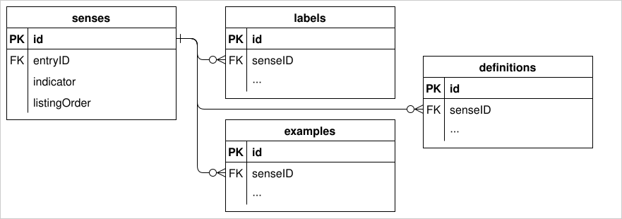

*Example 25. NVH*

```
sense: indicator
  definition: ...
  label: ...
  example: ...
```

## 3.8 `definition` <a id='core_definition'></a>

Represents one of possibly several definitions of a sense.

**Property of**

- [`sense`](#core_sense)

**Properties**

- `text` REQUIRED (exactly one) and UNIQUE. Normalised string. A statement, in the same language as the headword, that describes and/or explains the meaning of a sense. In DMLex, the term definition encompasses not only formal definitions, but also less formal explanations.

- `definitionType` OPTIONAL (zero or one). Normalised string. If a sense contains multiple definitions, indicates the difference between them, for example that they are intended for different audiences. The [`definitionTypeTag`](#values_definitionTypeTag) object type can be used to constrain and/or explain the definition types that occur in the lexicographic resource.

- `listingOrder` REQUIRED (exactly one). Number. The position of this definition among other definitions of the same sense. This can be implicit from the serialization.

*Example 26. XML*

```
<definition definitionType="...">
  <text>...</text>
</definition>
```

*Example 27. JSON*

```
{
    "text": "....",
    "definitionType": "..."
}
```

*Example 28. RDF*

```
<sense> dmlex:definition [
  a dmlex:Definition ;
  dmlex:text "..." ;
  dmlex:definitionType "..." ;
  dmlex:listingOrder 1 ] .
```

*Example 29. Relational database*

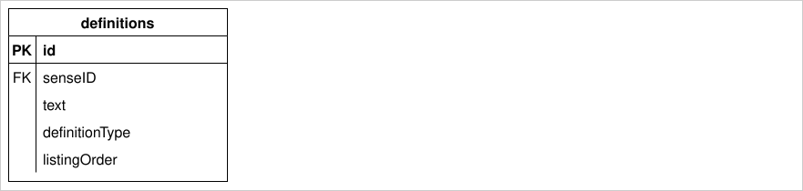

*Example 30. NVH*

```
definition: text
  definitionType: ...
```

## 3.9 `label` <a id='core_label'></a>

Represents a restriction on its parent such as temporal (old-fashioned, neologism), regional (dialect), register (formal, colloquial), domain (medicine, politics) or grammar (singular-only).

**Property of**

- [`entry`](#core_entry)

- [`sense`](#core_sense)

- [`inflectedForm`](#core_inflectedForm)

- [`pronunciation`](#core_pronunciation)

- [`example`](#core_example)

**Properties**

- `tag` REQUIRED (exactly one) and UNIQUE. Normalised string. An abbreviation, a code or some other string of text which identifies the label, for example `neo` for neologism, `colloq` for colloquial, `polit` for politics. The [`labelTag`](#values_labelTag) object type can be used to explain the meaning of the labels, to constrain which labels are allowed to occur in the lexicographic resource, and to map them onto external inventories and ontologies.

- `listingOrder` REQUIRED (exactly one). Number. The position of this label among other labels of the same entry. This can be implicit from the serialization.

**Comments**

- A label applies to the object that it is a child of. When the label is a child of [`entry`](#core_entry), then it applies to the headword in all its senses. When the label is a child of [sense](#core_sense), then it applies to the headword in that sense only (**not** including any subsenses linked to it using the [Linking Module](#linking)). When the label is a child of [inflectedForm](#core_inflectedForm), then it applies only to that inflected form of the headword (in all senses). When the label is a child of [pronunciation](#core_pronunciation), then it applies only to that pronunciation of the headword (in all senses).

*Example 31. XML*

```
<label tag="..."/>
```

*Example 32. JSON*

Implemented as a string

```
"..."
```

*Example 33. RDF*

```
<entry> dmlex:label [
  a dmlex:Label ;
  dmlex:tag "..." ;
  dmlex:listingOrder 1 ] .
```

*Example 34. Relational database*

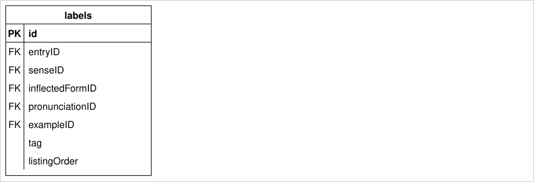

*Example 35. NVH*

```
label: tag
```

## 3.10 `pronunciation` <a id='core_pronunciation'></a>

Represents the pronunciation of its parent. Examples: [Section A.1.3, “Pronunciation given as transcription”](#ex02), [Section A.1.4, “Pronunciation given as a sound file”](#ex03), [Section A.1.5, “Pronunciation given both ways”](#ex04).

**Property of**

- [`entry`](#core_entry)

- [`inflectedForm`](#core_inflectedForm)

**Properties**

- At least one of:

  - `soundFile` OPTIONAL (zero or one) and UNIQUE. An *Internationalized Resource Identifier* ([IRI](#bib_rfc3987)) pointing to a file which contains a sound recording of the pronunciation

  - [`transcription`](#core_transcription) OPTIONAL (zero or more) and UNIQUE.

- `listingOrder` REQUIRED (exactly one). Number. The position of this pronunciation object among other pronunciation objects of the same entry. This can be implicit from the serialization.

- [`label`](#core_label) OPTIONAL (zero or more).

> **Note**
>
> The value of the `soundFile` property is an IRI. This means, among other things, that it can be an internet URL or a relative file path, and can contain non-ASCII characters.

*Example 36. XML*

```
<pronunciation soundFile="...">
    <transcription.../>
    <label.../>
</pronunciation>
```

*Example 37. JSON*

```
{
    "soundFile": "...",
    "transcriptions": [...],
    "labels": [...]
}
```

*Example 38. RDF*

```
<entry> dmlex:pronunciation [
  a dmlex:Pronunciation ;
  dmlex:soundFile <...> ;
  dmlex:transcription ... ;
  dmlex:listingOrder 1 ;
  dmlex:label ...  ] .
```

*Example 39. Relational database*

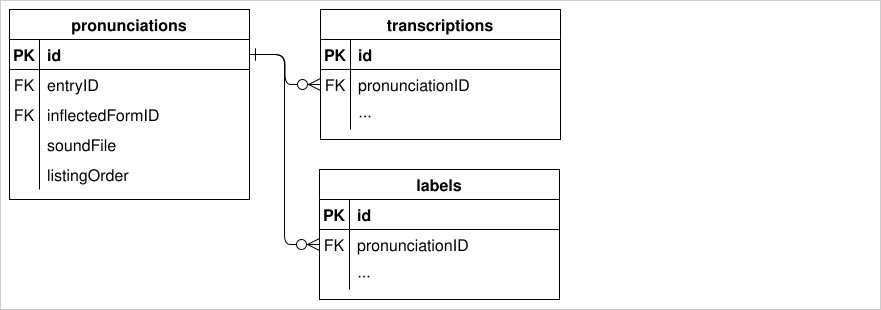

*Example 40. NVH*

```
pronunciation: soundFile
  transcription: ...
  label: ...
```

## 3.11 `transcription` <a id='core_transcription'></a>

Represents the transcription of a pronunciation in some notation such as IPA.

**Property of**

- [`pronunciation`](#core_pronunciation)

**Properties**

- `text` REQUIRED (exactly one) and UNIQUE. Normalised string. The actual transcription.

- `scheme` OPTIONAL (zero or one). IETF language tag. Identifies the transcription scheme used here. Example: `en-fonipa` for English IPA. This can be implicit if the lexicographic resource uses only one transcription scheme throughout. The [`transcriptionSchemeTag`](#values_transcriptionSchemeTag) object type can be used to define which transcription schemes are allowed in the lexicographic resource.

- `listingOrder` REQUIRED (exactly one). Number. The position of this transcription object among transcriptions of the same pronunciation. This can be implicit from the serialization.

*Example 41. XML*

```
<transcription scheme="...">
  <text>...</text>
</transcription>
```

*Example 42. JSON*

```
{
    "text": "...",
    "scheme": "..."
}
```

*Example 43. RDF*

```
<pronunciation> dmlex:transcription [
  a dmlex:Transcription ;
  dmlex:scheme "..." ;
  dmlex:listingOrder 1 ] .
```

*Example 44. Relational database*

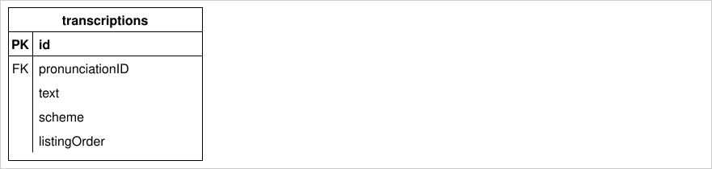

*Example 45. NVH*

```
transcription: text
  scheme: ...
```

## 3.12 `example` <a id='core_example'></a>

Represents a sentence or other text fragment which illustrates the headword being used.

**Property of**

- [`sense`](#core_sense)

**Properties**

- `text` REQUIRED (exactly one) and UNIQUE. Normalised string. The example itself.

- `sourceIdentity` OPTIONAL (zero or one). Normalised string. An abbreviation, a code or some other string of text which identifies the source. The [`sourceIdentityTag`](#values_sourceIdentityTag) object type can be used to explain the meaning of the source identifiers, to constrain which source identifiers are allowed to occur in the lexicographic resource, and to map them onto external inventories and ontologies.

- `sourceElaboration` OPTIONAL (zero or one). Normalised string. A free-form statement about the source of the example. If `sourceIdentity` is present, then `sourceElaboration` can be used for information about where in the source the example can be found: page number, chapter and so on. If `sourceIdentity` is absent then `sourceElaboration` can be used to fully name the source.

- [`label`](#core_label) OPTIONAL (zero or more).

- `soundFile` OPTIONAL (zero or one). An *Internationalized Resource Identifier* ([IRI](#bib_rfc3987)) pointing to a file which contains a sound recording of the example.

- `listingOrder` REQUIRED (exactly one). Number. The position of this example object among examples of the same sense. This can be implicit from the serialization.

*Example 46. XML*

```
<example sourceIdentity="..." sourceElaboration="..." soundFile="...">
    <text>...</text>
    <label.../>
</example>
```

*Example 47. JSON*

```
{
    "text": "...",
    "sourceIdentity": "...",
    "sourceElaboration": "...",
    "labels": [...],
    "soundFile": "..."
}
```

*Example 48. RDF*

```
<sense> dmlex:example [
  a dmlex:Example ;
  dmlex:text "..." ;
  dmlex:sourceIdentity "..." ;
  dmlex:sourceElaboration "..." ;
  dmlex:label ... ;
  dmlex:soundFile <...> ;
  dmlex:listingOrder 1 ] .
```

*Example 49. Relational database*

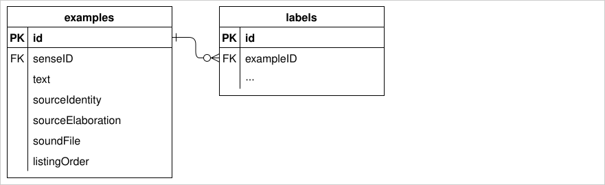

*Example 50. NVH*

```
example: text
  sourceIdentity: ...
  sourceElaboration: ...
  soundFile: ...
  label: ...
```

# 4 DMLex OPTIONAL Modules (Normative) <a id='modules'></a>

## 4.1 DMLex Crosslingual Module <a id='xlingual'></a>

DMLex's Multilingual Module extends the Core and turns a monolingual lexicographic resource into a bilingual or multilingual one. A bilingual or multilingual lexicographic resource is a lexicographic resource with multiple (two or more) languages: the headwords and the examples are in one language (called "the language of the lexicographic resource" in DMLex) and their translations are in one or more other languages (called the *translation languages* in DMLex).

### 4.1.1 Extensions to `lexicographicResource` <a id='xlingual_lexicographicResource'></a>

Extends the [`lexicographicResource`](#core_lexicographicResource) object type from the [Core](#core).

**Additional properties**

- [`translationLanguage`](#xlingual_translationLanguage) REQUIRED (one or more)

*Example 51. XML*

```
<lexicographicResource ...>
    ...
    <translationLanguage.../>
</lexicographicResource>
```

*Example 52. JSON*

```
{
    ...,
    "translationLanguages": [...]
}
```

*Example 53. RDF*

```
<#lexicographicResource> dmlex:translationLanguage ...
```

*Example 54. NVH*

```
lexicographicResource: ...
  translationLanguage: ...
```

### 4.1.2 `translationLanguage` <a id='xlingual_translationLanguage'></a>

Represents one of the languages in which translations are given in this lexicographic resource. Examples: [Section A.1.8, “Defining a bilingual lexicographic resource”](#ex07), [Section A.1.9, “Defining a multilingual lexicographic resource”](#ex10).

**Property of**

- [`lexicographicResource`](#xlingual_lexicographicResource)

**Properties**

- `langCode` REQUIRED (exactly one) and UNIQUE. The IETF language code of the language.

- `listingOrder` REQUIRED (exactly one). Number. Sets the order in which translations (of headwords and examples) should be shown. It outranks the listing order given in [`headwordTranslation`](#xlingual_headwordTranslation), [`headwordExplanation`](#xlingual_headwordExplanation) and [`exampleTranslation`](#xlingual_exampleTranslation) objects.

*Example 55. XML*

```
<translationLanguage langCode=""/>
```

*Example 56. JSON*

Implemented as a string

```
"..."
```

*Example 57. RDF*

```
<#lexicographicResource> dmlex:translationLanguage [
  dmlex:langCode ... ;
  dmlex:listingOrder 0 ] .
```

*Example 58. Relational database*

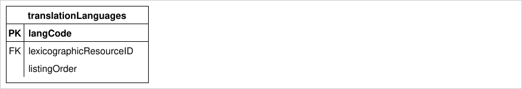

*Example 59. NVH*

```
translationLanguage: langCode
```

### 4.1.3 Extensions to `sense` <a id='xlingual_sense'></a>

Extends the [`sense`](#core_sense) object type from the [Core](#core).

**Additional properties**

- [`headwordExplanation`](#xlingual_headwordExplanation) OPTIONAL (zero or more)

- [`headwordTranslation`](#xlingual_headwordTranslation) OPTIONAL (zero or more)

*Example 60. XML*

```
<sense ...>
    ...
    <headwordExplanation.../>
    <headwordTranslation.../>
    ...
</sense>
```

*Example 61. JSON*

```
{
    ...
    "headwordExplanations": [...],
    "headwordTranslations": [...],
    ...
}
```

*Example 62. RDF*

```
<#sense>
  dmlex:headwordExplanation ... ;
  dmlex:headwordTranslation ... .
```

*Example 63. XML*

```
sense: ...
  explanation: ...
  translation: ...
```

### 4.1.4 `headwordTranslation` <a id='xlingual_headwordTranslation'></a>

Represents one of possibly multiple translations of a headword. Examples: [Section A.1.10, “How to use headwordTranslation in a bilingual lexicographic resource”](#ex08), [Section A.1.11, “How to use headwordTranslation in a multilingual lexicographic resource”](#ex11).

**Property of**

- [`sense`](#xlingual_sense)

**Properties**

- `text` REQUIRED (exactly one) and UNIQUE (in combination with `langCode` if present). Normalised string.

- `langCode` OPTIONAL (zero or one) if only one translation language exists in the lexicographic resource, REQUIRED (exactly one) and UNIQUE (in combination with `text`) otherwise. IETF language tag. Indicates the language of this translation. The [`translationLanguage`](#xlingual_translationLanguage) datatype can be used to explain the meaning of the language codes that appear here and/or to constrain which language codes are allowed.

- `listingOrder` REQUIRED (exactly one). Number. The position of this translation among other translations of the same sense in the same language. This can be implicit from the serialization.

- [`partOfSpeech`](#xlingual_partOfSpeech) OPTIONAL (zero or more).

- [`label`](#xlingual_label) OPTIONAL (zero or more).

- [`pronunciation`](#xlingual_pronunciation) OPTIONAL (zero or more).

- [`inflectedForm`](#xlingual_inflectedForm) OPTIONAL (zero or more).

*Example 64. XML*

```
<headwordTranslation langCode="...">
    <text>...</text>
    <partOfSpeech.../>
    <label.../>
    <pronunciation.../>
    <inflectedForm.../>
</headwordTranslation>
```

*Example 65. JSON*

```
{
    "langCode": "...",
    "text": "...",
    "partsOfSpeech": [...],
    "labels": [...],
    "pronunciations": [...],
    "inflectedForms": [...]
}
```

*Example 66. RDF*

```
<#sense> dmlex:headwordTranslation [
  dmlex:langCode "..." ;
  dmlex:text "..." ;
  dmlex:partOfSpeech ... ;
  dmlex:label ... ;
  dmlex:pronunciation ... ;
  dmlex:inflectedForm ... ] .
```

*Example 67. Relational database*

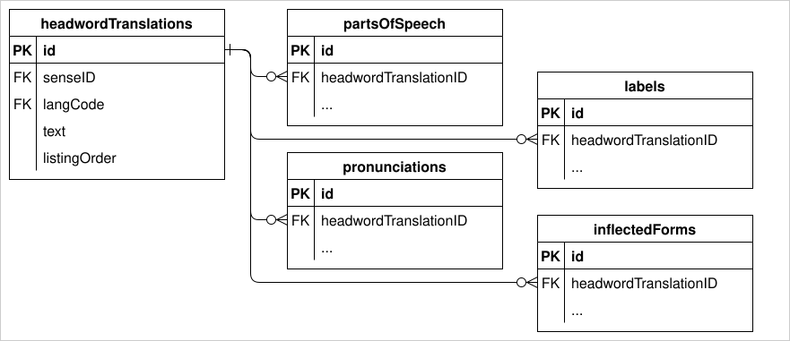

*Example 68. NVH*

```
langCode_translation: text
  pos: ...
  label: ...
  pronunciation: ...
  form: ...
```

### 4.1.5 `headwordExplanation` <a id='xlingual_headwordExplanation'></a>

Represents a statement in the translation language which explains (but does not translate) the meaning of the headword. Example: [Section A.1.12, “How to use headwordExplanation”](#ex09).

**Property of**

- [`sense`](#xlingual_sense)

**Properties**

- `text` REQUIRED (exactly one) and UNIQUE (in combination with `langCode` if present). Normalised string.

- `langCode` OPTIONAL (zero or one) if only one translation language exists in the lexicographic resource, REQUIRED (exactly one) and UNIQUE otherwise (in combination with `text`). IETF language tag. Indicates the language in which this explanation is written. The [`translationLanguage`](#xlingual_translationLanguage) datatype can be used to explain the meaning of the language codes that appear here and/or to constrain which language codes are allowed.

**Comments**

- It is assumed that there will always be a maximum of one `headwordExplanation` per translation language in each sense. For this reason, `headwordExplanation` does not have a `listingOrder`.

*Example 69. XML*

```
<headwordExplanation langCode="...">
  <text>...</text>
</headwordExplanation>
```

*Example 70. JSON*

```
{
    "langCode": "...",
    "text": "...",
}
```

*Example 71. RDF*

```
<#sense> dmlex:headwordExplanation [
  dmlex:langCode "..." ;
  dmlex:text "..." ] .
```

*Example 72. Relational database*

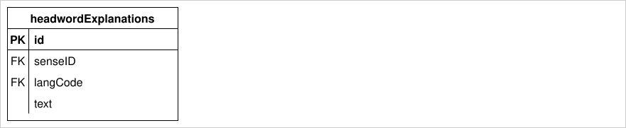

*Example 73. NVH*

```
langCode_explanation: text
```

### 4.1.6 Extensions to `example` <a id='xlingual_example'></a>

Extends the [`example`](#core_example) object type from the [Core](#core).

**Additional properties**

- [`exampleTranslation`](#xlingual_exampleTranslation) OPTIONAL (zero or more)

*Example 74. XML*

```
<example ...>
    ...
    <exampleTranslation.../>
</example>
```

*Example 75. JSON*

```
{
    ...,
    "exampleTranslations": [...]
}
```

*Example 76. RDF*

```
<#example> dmlex:exampleTranslation ... .
```

*Example 77. NVH*

```
example: ...
  ...
  exampleTranslation: ...
```

### 4.1.7 `exampleTranslation` <a id='xlingual_exampleTranslation'></a>

Represents the translation of an example.

**Property of**

- [`example`](#xlingual_example)

**Properties**

- `text` REQUIRED (exactly one) and UNIQUE (in combination with `langCode` if present). Normalised string.

- `langCode` OPTIONAL (zero or one) if only one translation language exists in the lexicographic resource, REQUIRED (exactly one) and UNIQUE (in combination with `text`) otherwise. IETF language tag. Indicates the language of this translation. The [`translationLanguage`](#xlingual_translationLanguage) datatype can be used to explain the meaning of the language codes that appear here and/or to constrain which language codes are allowed.

- [`label`](#xlingual_label) OPTIONAL (zero or more).

- `soundFile` OPTIONAL (zero or one). An *Internationalized Resource Identifier* ([IRI](#bib_rfc3987)) pointing to a file which contains a sound recording of the translation.

- `listingOrder` REQUIRED (exactly one). Number. The position of this translation among other translations of the same example in the same language. This can be implicit from the serialization.

*Example 78. XML*

```
<exampleTranslation langCode="..." soundFile="...">
    <text>...</text>
    <label.../>
</exampleTranslation>
```

*Example 79. JSON*

```
{
    "langCode": "...",
    "text": "...",
    "labels": [...],
    "soundFile": "..."
}
```

*Example 80. RDF*

```
<#example> dmlex:exampleTranslation [
  dmlex:langCode "..." ;
  dmlex:text "..." ;
  dmlex:label ... ;
  dmlex:soundFile "..." ] .
```

*Example 81. Relational database*

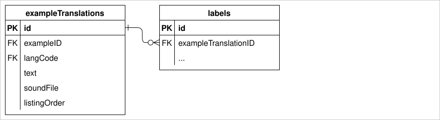

*Example 82. NVH*

```
langCode_exampleTranslation: text
  soundFile: ...
  label: ...
```

### 4.1.8 Extensions to `partOfSpeech` <a id='xlingual_partOfSpeech'></a>

Extends the [`partOfSpeech`](#core_partOfSpeech) object type from the [Core](#core).

**Can additionally be a property of**

- [`headwordTranslation`](#xlingual_headwordTranslation)

*Example 83. Relational database*

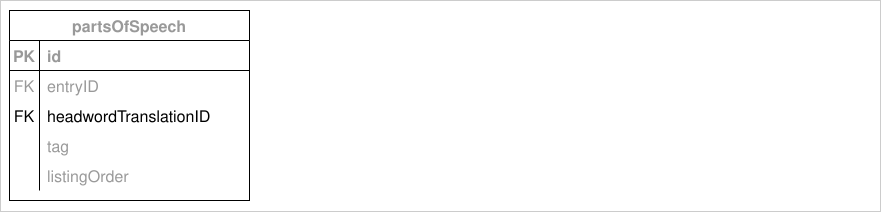

### 4.1.9 Extensions to `label` <a id='xlingual_label'></a>

Extends the [`label`](#core_label) object type from the [Core](#core).

**Can additionally be a property of**

- [`headwordTranslation`](#xlingual_headwordTranslation)

- [`exampleTranslation`](#xlingual_exampleTranslation)

*Example 84. Relational database*

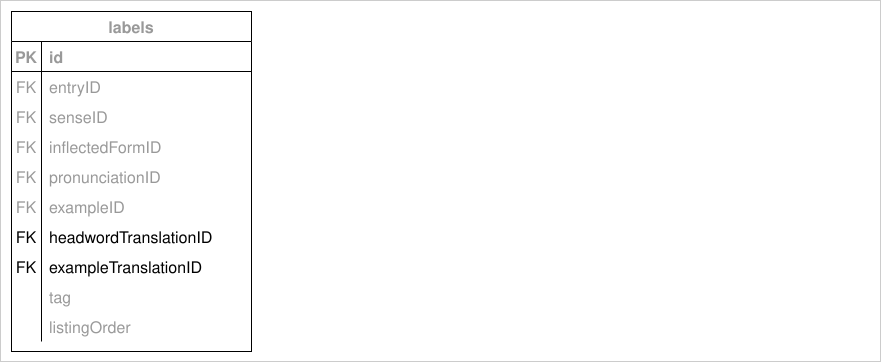

### 4.1.10 Extensions to `pronunciation` <a id='xlingual_pronunciation'></a>

Extends the [`pronunciation`](#core_pronunciation) object type from the [Core](#core).

**Can additionally be a property of**

- [`headwordTranslation`](#xlingual_headwordTranslation)

*Example 85. Relational database*

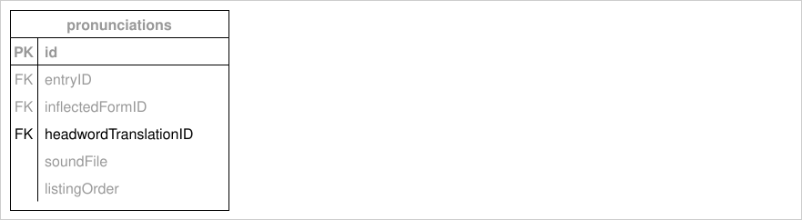

### 4.1.11 Extensions to `inflectedForm` <a id='xlingual_inflectedForm'></a>

Extends the [`inflectedForm`](#core_inflectedForm) object type from the [Core](#core).

**Can additionally be a property of**

- [`headwordTranslation`](#xlingual_headwordTranslation)

*Example 86. Relational database*

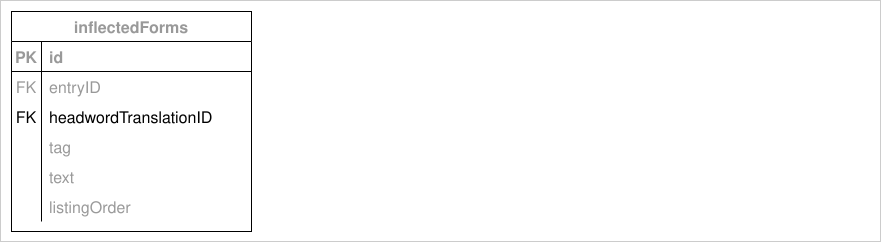

## 4.2 DMLex Controlled Values Module <a id='values'></a>

DMLex's Controlled Values Module extends the Core and makes it possible to represent inventories from which the values of various properties come from, such as [parts of speech](#core_partOfSpeech), [labels](#core_label), [inflected form tags](#core_inflectedForm) and others.

**Comment**

- Treating controlled values as constraints in an implementation of DMLex, for example as business rules in a dictionary-writing system, is OPTIONAL.

### 4.2.1 Extensions to `lexicographicResource` <a id='values_lexicographicResource'></a>

Extends the [`lexicographicResource`](#core_lexicographicResource) object type from the [Core](#core).

**Additional properties**

- [`definitionTypeTag`](#values_definitionTypeTag) OPTIONAL (zero or more)

- [`inflectedFormTag`](#values_inflectedFormTag) OPTIONAL (zero or more)

- [`labelTag`](#values_labelTag) OPTIONAL (zero or more)

- [`labelTypeTag`](#values_labelTypeTag) OPTIONAL (zero or more)

- [`partOfSpeechTag`](#values_partOfSpeechTag) OPTIONAL (zero or more)

- [`sourceIdentityTag`](#values_sourceIdentityTag) OPTIONAL (zero or more)

- [`transcriptionSchemeTag`](#values_transcriptionSchemeTag) OPTIONAL (zero or more)

*Example 87. XML*

```
<lexicographicResource ...>
    ...
    <definitionTypeTag.../>
    <inflectedFormTag.../>
    <labelTag.../>
    <labelTypeTag.../>
    <partOfSpeechTag.../>
    <sourceIdentityTag.../>
    <transcriptionSchemeTag.../>
</lexicographicResource>
```

*Example 88. JSON*

```
{
    ...,
    "definitionTypeTags": [...],
    "inflectedFormTags": [...],
    "labelTags": [...],
    "labelTypeTags": [...],
    "partOfSpeechTags": [...],
    "sourceIdentityTags": [...]
    "transcriptionSchemeTags": [...]
}
```

*Example 89. RDF*

```
<#lexicographicResource>
  dmlex:definitionTypeTag ... ;
  dmlex:inflectedFormTag ... ;
  dmlex:labelTag ... ;
  dmlex:labelTypeTag ... ;
  dmlex:partOfSpeechTag ... ;
  dmlex:sourceIdentityTag ... ;
  dmlex:transcriptionSchemeTag ... .
```

*Example 90. NVH*

```
lexicographicResource: ...
    ...
  definitionTypeTag: ...
  inflectedFormTag: ...
  labelTag: ...
  labelTypeTag: ...
  partOfSpeechTag: ...
  sourceIdentityTag: ...
  transcriptionSchemeTag: ...
```

### 4.2.2 `definitionTypeTag` <a id='values_definitionTypeTag'></a>

Represents one (of many) possible values for `definitionType` of [`definition`](#core_definition).

**Property of**

- [`lexicographicResource`](#core_lexicographicResource)

**Properties**

- `tag` REQUIRED (exactly one) and UNIQUE. Normalised string. An abbreviation, a code or some other string of text.

- `description` OPTIONAL (zero or one). Normalised string. A human-readable description of what the tag means.

- [`sameAs`](#values_sameAs) OPTIONAL (zero or more).

*Example 91. XML*

```
<definitionTypeTag tag="..."
    <description>...</description>
    <sameAs.../>
</definitionTypeTag>
```

*Example 92. JSON*

```
{
    "tag": "...",
    "description": "...",
    "sameAs": [...]
}
```

*Example 93. RDF*

```
<lexicographicResource> dmlex:definitionTypeTag [
  a dmlex:DefinitionTypeTag ;
  dmlex:tag "..." ;
  dmlex:description "..." ;
  dmlex:sameAs ... ] .
```

*Example 94. Relational database*

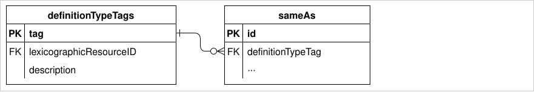

*Example 95. NVH*

```
definitionTypeTag: tag
  description: ...
  sameAs: ...
```

### 4.2.3 `inflectedFormTag` <a id='values_inflectedFormTag'></a>

Represents one (of many) possible values for `tag` of [`inflectedForm`](#core_inflectedForm). Example: [Section A.1.6, “How to use partOfSpeechTag and inflectedFormTag”](#ex05).

**Property of**

- [`lexicographicResource`](#core_lexicographicResource)

**Properties**

- `tag` REQUIRED (exactly one) and UNIQUE. Normalised string. An abbreviation, a code or some other string of text.

- `description` OPTIONAL (zero or one). Normalised string. A human-readable description of what the tag means.

- `for` OPTIONAL (zero or one). Normalised string. A statement about constraints and recommendation on using this tag. This can be a human-readable description such as "for use with German nouns only" or a machine-readable instruction in any format understandable to the DMLex implementation, such as `partOfSpeech=noun AND language=de`.

- [`sameAs`](#values_sameAs) OPTIONAL (zero or more).

*Example 96. XML*

```
<inflectedFormTag tag="..." for="...">
    <description>...</description>
    <sameAs.../>
</inflectedFormTag>
```

*Example 97. JSON*

```
{
    "tag": "...",
    "description": "...",
    "for": "...",
    "sameAs": [...]
}
```

*Example 98. RDF*

```
<lexicographicResource> dmlex:inflectedFormTag [
  a dmlex:InflectedFormTag ;
  dmlex:tag "..." ;
  dmlex:description "..." ;
  dmlex:for "..." ;
  dmlex:sameAs ... ] .
```

*Example 99. Relational database*

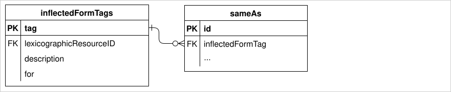

*Example 100. NVH*

```
formTag: tag
  description: ...
  sameAs: ...
  for: ...
```

### 4.2.4 `labelTag` <a id='values_labelTag'></a>

Represents one (of many) possible values for `tag` of [`label`](#core_label).

**Property of**

- [`lexicographicResource`](#core_lexicographicResource)

**Properties**

- `tag` REQUIRED (exactly one) and UNIQUE. Normalised string. An abbreviation, a code or some other string of text.

- `description` OPTIONAL (zero or one). Normalised string. A human-readable description of what the tag means.

- `typeTag` OPTIONAL (zero or one). Normalised string. An abbreviation, a code or some other string of text which identifies the type of the label, for example `temporal` for temporal labels (archaic, neologism etc) or `dialect` for labels of dialects. The [`labelTypeTag`](#values_labelTypeTag) object type can be used to explain the meaning of the type tags, to constrain which type tags are allowed to occur in the lexicographic resource, and to map them onto external inventories and ontologies.

- `for` OPTIONAL (zero or one). Normalised string. A statement about constraints and recommendation on using this tag. This can be a human-readable description such as "for use with German nouns only" or a machine-readable instruction in any format understandable to the DMLex implementation, such as `partOfSpeech=noun AND language=de`.

- [`sameAs`](#values_sameAs) OPTIONAL (zero or more).

*Example 101. XML*

```
<labelTag tag="..." typeTag="..." for="...">
    <description>...</description>
    <sameAs.../>
</labelTag>
```

*Example 102. JSON*

```
{
    "tag": "...",
    "description": "...",
    "typeTag": "...",
    "for": "...",
    "sameAs": [...]
}
```

*Example 103. RDF*

```
<lexicographicResource> dmlex:labelTag [
  a dmlex:LabelTag ;
  dmlex:tag "..." ;
  dmlex:description "..." ;
  dmlex:typeTag "..." ;
  dmlex:for "..." ;
  dmlex:sameAs ... ] .
```

*Example 104. Relational database*

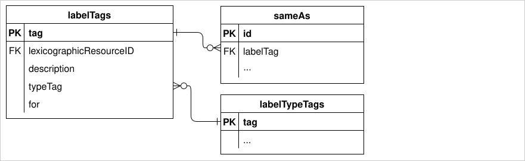

*Example 105. NVH*

```
labelTag: tag
  description: ...
  sameAs: ...
  for: ...
  typeTag: ...
```

### 4.2.5 `labelTypeTag` <a id='values_labelTypeTag'></a>

Represents one (of many) possible values for `typeTag` of [`labelTag`](#values_labelTag).

**Property of**

- [`lexicographicResource`](#core_lexicographicResource)

**Properties**

- `tag` REQUIRED (exactly one) and UNIQUE. Normalised string. An abbreviation, a code or some other string of text.

- `description` OPTIONAL (zero or one). Normalised string. A human-readable description of what the type tag means.

- [`sameAs`](#values_sameAs) OPTIONAL (zero or more).

*Example 106. XML*

```
<labelTypeTag tag="...">
    <description>...</description>
    <sameAs.../>
</labelTypeTag>
```

*Example 107. JSON*

```
{
    "tag": "...",
    "description": "..."
    "sameAs": [...]
}
```

*Example 108. RDF*

```
<lexicographicResource> dmlex:labelTypeTag [
  a dmlex:LabelTypeTag ;
  dmlex:tag "..." ;
  dmlex:description "..." ;
  dmlex:sameAs ... ].
```

*Example 109. Relational database*

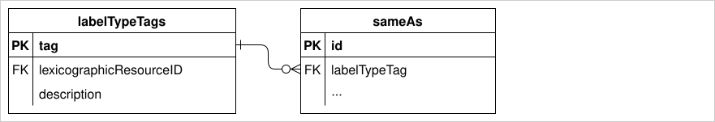

*Example 110. NVH*

```
labelTypeTag: tag
  description: ...
  sameAs: ...
```

### 4.2.6 `partOfSpeechTag` <a id='values_partOfSpeechTag'></a>

Represents one (of many) possible values for `tag` of [`partOfSpeech`](#core_partOfSpeech). Example: [Section A.1.6, “How to use partOfSpeechTag and inflectedFormTag”](#ex05).

**Property of**

- [`lexicographicResource`](#core_lexicographicResource)

**Properties**

- `tag` REQUIRED (exactly one) and UNIQUE. Normalised string. An abbreviation, a code or some other string of text.

- `description` OPTIONAL (zero or one). Normalised string. A human-readable description of what the tag means.

- `for` OPTIONAL (zero or one). Normalised string. A statement about constraints and recommendation on using this tag. This can be a human-readable description such as "for use in German and Czech only" or a machine-readable instruction in any format understandable to the DMLex implementation, such as `language=de OR language=cs`.

- [`sameAs`](#values_sameAs) OPTIONAL (zero or more).

*Example 111. XML*

```
<partOfSpeechTag tag="..." for="...">
    <description>...</description>
    <sameAs.../>
</partOfSpeechTag>
```

*Example 112. JSON*

```
{
    "tag": "...",
    "description": "...",
    "for": "...",
    "sameAs": [...]
}
```

*Example 113. RDF*

```
<lexicographicResource> dmlex:partOfSpeechTag [
  a dmlex:PartOfSpeechTag ;
  dmlex:tag "..." ;
  dmlex:description "..." ;
  dmlex:for "..." ;
  dmlex:sameAs ... ] .
```

*Example 114. Relational database*

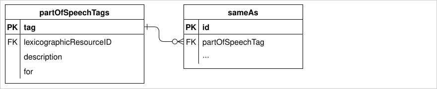

*Example 115. NVH*

```
posTag: tag
  description: ...
  sameAs: ...
  for: ...
```

### 4.2.7 `sourceIdentityTag` <a id='values_sourceIdentityTag'></a>

Represents one (of many) possible values for `sourceIndentity` of [`example`](#core_example).

**Property of**

- [`lexicographicResource`](#core_lexicographicResource)

**Properties**

- `tag` REQUIRED (exactly one) and UNIQUE. Normalised string. An abbreviation, a code or some other string of text.

- `description` OPTIONAL (zero or one). Normalised string. A human-readable description of what the tag means.

- [`sameAs`](#values_sameAs) OPTIONAL (zero or more).

*Example 116. XML*

```
<sourceIdentityTag tag="..."
    <description>...</description>
    <sameAs.../>
</sourceIdentityTag>
```

*Example 117. JSON*

```
{
    "tag": "...",
    "description": "...",
    "sameAs": [...]
}
```

*Example 118. RDF*

```
<lexicographicResource> dmlex:sourceIdentityTag [
  a dmlex:SourceIdentityTag ;
  dmlex:tag "..." ;
  dmlex:description "..." ;
  dmlex:sameAs ... ] .
```

*Example 119. Relational database*

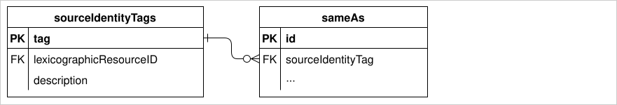

*Example 120. NVH*

```
sourceIdentityTag: tag
  description: ...
  sameAs: ...
```

### 4.2.8 `transcriptionSchemeTag` <a id='values_transcriptionSchemeTag'></a>

Represents one (of many) possible values for `scheme` of [`transcription`](#core_transcription).

**Property of**

- [`lexicographicResource`](#core_lexicographicResource)

**Properties**

- `tag` REQUIRED (exactly one) and UNIQUE. An IETF language tag.

- `description` OPTIONAL (zero or one). Normalised string. A human-readable description of what the tag means.

- `for` OPTIONAL (zero or one). Normalised string. A statement about constraints and recommendation on using this tag. This can be a human-readable description such as "for use in German and Czech only" or a machine-readable instruction in any format understandable to the DMLex implementation, such as `language=de OR language=cs`.

**Comment**

- The `transcriptionSchemeTag` does not have a `sameAs` property because the tag itself - which is an IETF language tag - defines fully what the tag means.

*Example 121. XML*

```
<transcriptionSchemeTag tag="..." for="...">
    <description>...</description>
</transcriptionSchemeTag>
```

*Example 122. JSON*

```
{
    "tag": "...",
    "description": "...",
    "for": "..."
}
```

*Example 123. RDF*

```
<lexicographicResource> dmlex:transcriptionSchemeTag [
  a dmlex:PartOfSpeechTag ;
  dmlex:tag "..." ;
  dmlex:description "..." ;
  dmlex:for "..." ] .
```

*Example 124. Relational database*

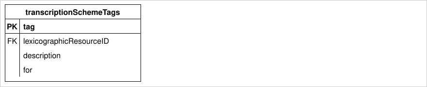

*Example 125. NVH*

```
transcriptionSchemeTag: tag
  description: ...
  sameAs: ...
  for: ...
```

### 4.2.9 `sameAs` <a id='values_sameAs'></a>

Represents the fact that the parent object is equivalent to an item available from an external authority. Example: [Section A.1.7, “Mapping controlled values to external inventories”](#ex06).

**Property of**

- [`definitionTypeTag`](#values_definitionTypeTag)

- [`inflectedFormTag`](#values_inflectedFormTag)

- [`labelTag`](#values_labelTag)

- [`labelTypeTag`](#values_labelTypeTag)

- [`partOfSpeechTag`](#values_partOfSpeechTag)

- [`sourceIdentityTag`](#values_sourceIdentityTag)

**Properties**

- `uri` REQUIRED (exactly one) and UNIQUE. The URI of an item in an external inventory.

*Example 126. XML*

```
<sameAs uri="..."/>
```

*Example 127. JSON*

Implemented as a string

```
"..."
```

*Example 128. Relational database*

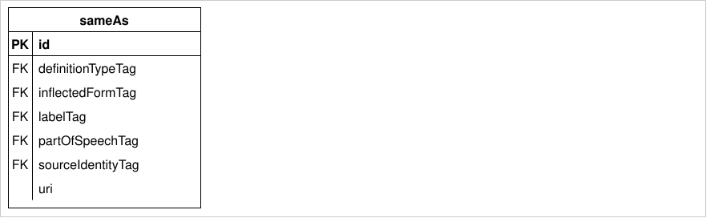

*Example 129. NVH*

```
sameAs: uri
```

## 4.3 DMLex Linking Module <a id='linking'></a>

DMLex's Linking Module can be used to construct *relations* between objects which "break out" of the tree-like parent-and-child hierarchy constructed from datatypes from the Core and from other modules. The Linking Module can be used to create relations between senses which are synonyms or antonyms, between entries whose headwords are homonyms or spelling variants, between senses which represent superordinate and subordinate concepts (eg. hypernyms and hyponyms, holonyms and meronyms), between entries and subentries, between senses and subsenses, and many others.

Each relation is represented in DMLex by an instance of the `relation` datatype. A relation brings two or more *members* together. The fact that an object (such as a sense or an entry) is a member of a relation is represented in DMLex by an instance of the `member` datatype.

The Linking Module can be used to set up relations between objects inside the same lexicographic resource, or between objects residing in different lexicographic resources.

For linking, some type of reference IDs of linked objects are needed (cf. the `ref` property in [Section 4.3.3, “member”](#linking_member)). DMLex does not prescribe the exact form of these IDs, however, a recommended method for creating unique IRIs for DMLex objects is available in [Section 3.2.1, “DMLex fragment identification strings”](#frag_iri), which may be useful especially when linking objects from different lexicographic resources on the Web.

Examples: [Section A.1.13, “Modelling parts and wholes”](#ex12), [Section A.1.14, “Modelling antonyms”](#ex13), [Section A.1.15, “Modelling synonyms”](#ex14), [Section A.1.16, “Modelling variants”](#ex15), [Section A.1.17, “Modelling subsenses”](#ex16), [Section A.1.18, “Modelling subentries (at subsense level)”](#ex17), [Section A.1.19, “Modelling subentries (at sense level)”](#ex18).

### 4.3.1 Extensions to `lexicographicResource` <a id='linking_lexicographicResource'></a>

Extends the [`lexicographicResource`](#core_lexicographicResource) object type from the [Core](#core).

**Additional properties**

- [`relation`](#linking_relation) OPTIONAL (zero or more)

- [`relationType`](#linking_relationType) OPTIONAL (zero or more)

*Example 130. XML*

```
<lexicographicResource ...>
    ...
    <relation.../>
    <relationType.../>
</lexicographicResource>
```

*Example 131. JSON*

```
{
    ...,
    "relations": [...],
    "relationTypes": [...]
}
```

*Example 132. RDF*

```
<#lexicographicResource>
  dmlex:relation ... ;
  dmlex:relationType ... .
```

*Example 133. NVH*

```
lexicographicResource: ...
    ...
  relation: ...
  relationType: ...
```

### 4.3.2 `relation` <a id='linking_relation'></a>

Represents the fact that a relation exists between two or more objects.

**Property of**

- [`lexicographicResource`](#linking_lexicographicResource)

**Properties**

- `type` REQUIRED (exactly one). Normalised string. Specifies what type of relation it is, for example a relation between synonyms or a relation between a sense and a subsense. Optionally, [`relationType`](#linking_relationType) objects can be used to explain those types and to constrain which types of relations are allowed to exist in the lexicographic resource.

- `description` OPTIONAL (zero or one). Normalised string. A human-readable explanation of this relation.

- [`member`](#linking_member) REQUIRED (two or more).

*Example 134. XML*

```
<relation type="...">
    <description>...</description>
    <member.../>
</relation>
```

*Example 135. JSON*

```
{
    "type": "...",
    "description": "...",
    "members": [...]
}
```

*Example 136. RDF*

```
<#lexicographicResource> dmlex:relation [
  a dmlex:Relation ;
  dmlex:type "..." ;
  dmlex:description "..." ;
  dmlex:member ... ] .
```

*Example 137. Relational database*

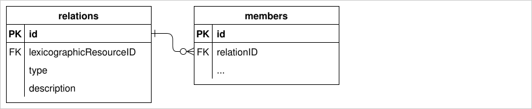

*Example 138. NVH*

```
relation: type
  description: ...
  member: ...
```

### 4.3.3 `member` <a id='linking_member'></a>

Represents the fact that an object, such as an entry or a sense, is a member of a relation.

**Property of**

- [`relation`](#linking_relation)

**Properties**

- `ref` REQUIRED (exactly one) and UNIQUE (in combination with other unique properties if present). Reference to an object, such as an entry or a sense. The IRI addressing mechanism described in [Section 3.2.1, “DMLex fragment identification strings”](#frag_iri) can be used (but is not REQUIRED).

- `role` OPTIONAL (zero or one) and UNIQUE (in combination with other unique properties if present). Normalised string. An indication of the role the member has in this relation: whether it is the hypernym or the hyponym (in a hyperonymy/hyponymy relation), or whether it is one of the synonyms (in a synonymy relation), and so on. You can use [`memberType`](#linking_memberType) objects to explain those roles and to constrain which relations are allowed to contain which roles, what their object types are allowed to be (eg. entries or senses) and how many members with this role each relation is allowed to have.

- `listingOrder` REQUIRED (exactly one). Number. The position of this member among other members of the same relation. When showing members of the relation to human users (for example: when listing the synonyms in a synonymy relation), the members should be listed in this order. This can be implicit from the serialization.

- `obverseListingOrder` OPTIONAL (at most one). Number. The position of this relation among other relations this member is involved in. When an object - such as an entry or a sense - is a member of several relations (for example: when a sense is a member of a synonymy relation and also of an antonymy relation) then, when showing the object (the entry or the sense) to human users, the relations should be listed in this order (for example: the synonyms first, the antonyms second).

*Example 139. XML*

```
<member ref="..." role="..." obverseListingOrder="..."/>
```

*Example 140. JSON*

```
{
    "ref": "...",
    "role": "...",
    "obverseListingOrder": "..."
}
```

*Example 141. RDF*

```
<#relation> dmlex:member [
  a dmlex:Member ;
  dmlex:ref "..." ;
  dmlex:role "..." ;
  dmlex:listingOrder 0 ;
  dmlex:obverseListingOrder 0 ] .
```

*Example 142. Relational database*

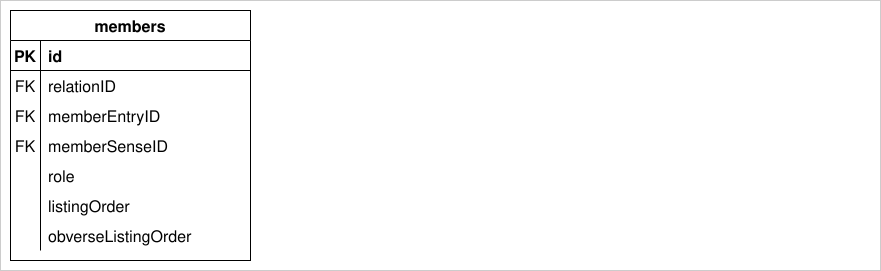

*Example 143. NVH*

```
role_member: ref
  obverseListingOrder: ...
```

### 4.3.4 `relationType` <a id='linking_relationType'></a>

Represents one of possible values for the `type` of [`relation`](#linking_relation).

**Property of**

- [`lexicographicResource`](#linking_lexicographicResource)

**Properties**

- `type` REQUIRED (exactly one) and UNIQUE. Normalised string.

- `description` OPTIONAL (zero or one). Normalised string. A human-readable explanation of this relation type.

- `scopeRestriction` OPTIONAL (zero or one). Specifies restrictions on member of relations of this type. The possible values are:

  - `sameEntry`: members must be within of the same `entry`

  - `sameResource`: members must be within the same `lexicographicResource`

  - `any`: no restriction

- [`memberType`](#linking_memberType) OPTIONAL (zero or more).

- [`sameAs`](#linking_sameAs) OPTIONAL (zero or more).

*Example 144. XML*

```
<relationType type="..." scopeRestriction="...">
    <description>...</description>
    <memberType.../>
    <sameAs.../>
</relationType>
```

*Example 145. JSON*

```
{
    "type": "...",
    "scopeRestriction": "...",
    "memberTypes": [...],
    "sameAs": ["..."]
}
```

*Example 146. RDF*

```
<#lexicographicResource> dmlex:relationType [
  a dmlex:RelationType ;
  dmlex:type "..." ;
  dmlex:scopeRestriction "..." ;
  dmlex:memberType ... ;
  dmlex:sameAs ... ] .
```

*Example 147. Relational database*

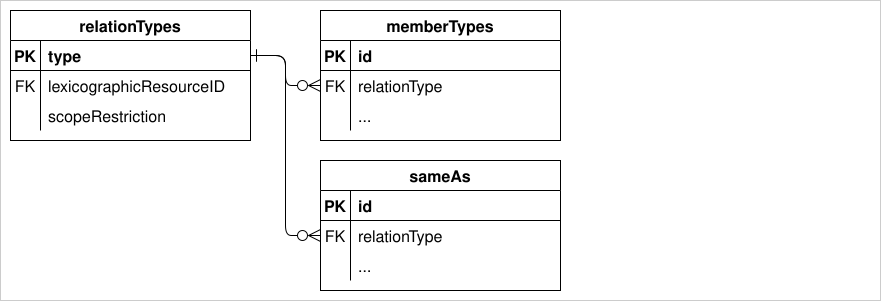

*Example 148. NVH*

```
relationType: type
  scopeRestriction: ...
  description: ...
  memberType: ...
  sameAs: ...
```

### 4.3.5 `memberType` <a id='linking_memberType'></a>

Represents one of possible values for the `role` of [`member`](#linking_member), as well as various restrictions on members having this role.

**Property of**

- [`relationType`](#linking_relationType)

**Properties**

- `role` OPTIONAL (zero or one) and UNIQUE (in combination with other unique properties if present). Normalised string.

- `description` OPTIONAL (zero or one). Normalised string. A human-readable explanation of this member role.

- `type` REQUIRED (exactly one) and UNIQUE (in combination with other unique properties if present). Normalised string. A restriction on the types of objects that can have this role. The possible values are:

  - `sense`: the object that has this role must be a [`sense`](#core_sense).

  - `entry`: the object that has this role must be an [`entry`](#core_entry).

  - `collocate`: the object that has this role must be an [`collocateMarker`](#annotation_collocateMarker) (from the [Linking module](#linking)).

- `min` OPTIONAL (zero or one). Non-negative integer. Says that relations of this type must have at least this many members with this role. If omitted then there is no lower limit (effectively, zero).

- `max` OPTIONAL (zero or one). Non-negative integer. Says that relations of this type may have at most this many members with this role. If omitted then there is no upper limit.

- `hint` OPTIONAL (zero or one). Suggests what machine agents should do when showing this member to a human user (in the context of another member of the same relation). The possible values are:

  - `embed`: Members that have this role should be shown in their entirety, i.e. the entire entry or the entire sense. This is suitable for relations between entries and subentries, or senses and subsenses.

  - `navigate`: Members that have this role should not be shown in their entirety. A navigable (e.g. clickable) link should be provided instead. This is suitable for relations between synonyms, antonyms, holonyms/heteronyms and similar.

  - `none`: Members that have this role should not be shown.

- [`sameAs`](#linking_sameAs) OPTIONAL (zero or more).

*Example 149. XML*

```
<memberType role="..." type="..." min="..." max="..." hint="...">
    <description></description>
    <sameAs.../>
</memberType>
```

*Example 150. JSON*

```
{
    "role": "...",
    "description": "...",
    "type": "...",
    "min": "...",
    "max": "...",
    "hint": "...",
    "sameAs": [...]
}
```

*Example 151. RDF*

```
<#relationType> dmlex:type [
  a dmlex:MemberType ;
  dmlex:role "..." ;
  dmlex:description "..." ;
  dmlex:memberType "..." ;
  dmlex:min 0 ;
  dmlex:max 0 ;
  dmlex:hint "..." ;
  dmlex:sameAs ... ] .
```

*Example 152. Relational database*

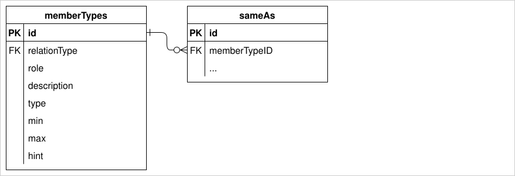

*Example 153. NVH*

```
memberType: type
  role: ...
  min: ...
  max: ...
  hint: ...
  description: ...
  sameAs: ...
```

### 4.3.6 Extensions to `sameAs` <a id='linking_sameAs'></a>

Extends the [`sameAs`](#values_sameAs) object type from the [Controlled Values Module](#values).

**Can additionally be a property of**

- [`relationType`](#linking_relationType)

- [`memberType`](#linking_memberType)

*Example 154. Relational database*

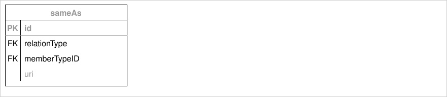

## 4.4 DMLex Annotation Module <a id='annotation'></a>

This module makes it possible to mark up substrings inside the string values of certain objects and to attach properties to them.

It is up to the implementer to decide how to implement annotations, whether as *inline markup* (as XML) or as *stand-off annotations* (for example through start and end indexes).

### 4.4.1 Extensions to `entry` <a id='annotation_entry'></a>

Extends the [`entry`](#core_entry) object type from the [Core](#core).

**Additional properties**

- [`placeholderMarker`](#annotation_placeholderMarker) OPTIONAL (zero or more)

*Example 155. XML*

```
<headword>
    ...<placeholderMarker>...</placeholderMarker>...
</headword>
```

*Example 156. JSON*

```
{
    ...,
    "headword": "...",
    "placeholderMarkers": [...],
    ...
}
```

*Example 157. RDF*

```
<id> a dmlex:Entry ;
  dmlex:headword "..." ;
  dmlex:placeholderMarker ... .
```

*Example 158. NVH*

```
entry: headword
  placeholder: ...
```

### 4.4.2 Extensions to `headwordTranslation` <a id='annotation_headwordTranslation'></a>

Extends the [`headwordTranslation`](#xlingual_headwordTranslation) object type from the [Crosslingual module](#xlingual).

**Additional properties**

- [`placeholderMarker`](#annotation_placeholderMarker) OPTIONAL (zero or more)

*Example 159. XML*

```
<headwordTranslation>
    <text>
        ...<placeholderMarker>...</placeholderMarker>...
    </text>
</headwordTranslation>
```

*Example 160. JSON*

```
{
    "text": "...",
    "placeholderMarkers": [...],
    ...
}
```

*Example 161. RDF*

```
<id> a dmlex:HeadwordTranslation ;
  dmlex:text "..." ;
  dmlex:placeholderMarker ... .
```

*Example 162. NVH*

```
translation: text
  placeholder: ...
```

### 4.4.3 `placeholderMarker` <a id='annotation_placeholderMarker'></a>

Marks up a substring inside a headword or inside a headword translation which is not part of the expression itself but stands for things that can take its place. An application can use the inline markup to format the placeholders differently from the rest of the text, to ignore the placeholder in full-text search, and so on. Examples: [Section A.1.20, “Using placeholderMarker”](#ex19), [Section A.1.21, “Using placeholderMarker in a bilingual lexicographic resource”](#ex20).

**Property of**

- [`entry`](#annotation_entry)

- [`headwordTranslation`](#annotation_headwordTranslation)

**Properties**

- `startIndex` REQUIRED and UNIQUE. Non-negative integer. The index of the first character of the substring according to the number of Unicode code points. The first character of the string has index 0. This property may be implicit if using in-line markup.

- `endIndex` REQUIRED and UNIQUE. Non-negative integer. The index of the last character after the substring according to the number of Unicode code points. This property may be implicit if using in-line markup

*Example 163. XML*

```
<placeholderMarker>...</placeholderMarker>
```

*Example 164. JSON*

```
{
    "startIndex": ...,
    "endIndex": ...
}
```

*Example 165. RDF*

```
<#headword> dmlex:placeholderMarker [
  dmlex:startIndex 0 ;
  dmlex:endIndex 1 ] .
```

*Example 166. Relational databases*

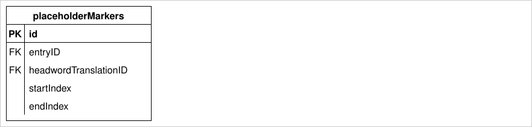

*Example 167. NVH*

```
placeholder: substring
```

### 4.4.4 Extensions to `definition` <a id='annotation_definition'></a>

Extends the [`definition`](#core_definition) object type from the [Core](#core).

**Additional properties**

- [`headwordMarker`](#annotation_headwordMarker) OPTIONAL (zero or more)

- [`collocateMarker`](#annotation_collocateMarker) OPTIONAL (zero or more)

*Example 168. XML*

```
<definition...>
  <text>
    ...
    <headwordMarker>...</headwordMarker>
    ...
    <collocateMarker...>...</collocateMarker>
    ...
  </text>
</definition>
```

*Example 169. JSON*

```
{
    "text": "...",
    "headwordMarkers": [...],
    "collocateMarkers": [...],
    ...
}
```

*Example 170. RDF*

```
<#sense> dmlex:definition [
  dmlex:text "..." ;
  dmlex:headwordMarker ... ;
  dmlex:collocateMarker ... ] .
```

*Example 171. NVH*

```
definition: text
  headword: ...
  collocate: ...
```

### 4.4.5 Extensions to `example` <a id='annotation_example'></a>

Extends the [`example`](#core_example) object type from the [Core](#core).

**Additional properties**

- [`headwordMarker`](#annotation_headwordMarker) OPTIONAL (zero or more)

- [`collocateMarker`](#annotation_collocateMarker) OPTIONAL (zero or more)

*Example 172. XML*

```
<example>
    <text>
        ...
        <headwordMarker>...</headwordMarker>
        ...
        <collocateMarker...>...</collocateMarker>
        ...
    </text>
</example>
```

*Example 173. JSON*

```
{
    "text": "...",
    "headwordMarkers": [...],
    "collocateMarkers": [...],
    ...
}
```

*Example 174. RDF*

```
<#sense> dmlex:example [
  dmlex:text "..." ;
  dmlex:headwordMarker ... ;
  dmlex:collocateMarker ... ] .
```

*Example 175. NVH*

```
example: text
  headword: ...
  collocate: ...
```

### 4.4.6 Extensions to `exampleTranslation` <a id='annotation_exampleTranslation'></a>

Extends the [`exampleTranslation`](#xlingual_exampleTranslation) object type from the [Crosslingual module](#xlingual).

**Additional properties**

- [`headwordMarker`](#annotation_headwordMarker) OPTIONAL (zero or more)

- [`collocateMarker`](#annotation_collocateMarker) OPTIONAL (zero or more)

*Example 176. XML*

```
<exampleTranslation>
    <text>
        ...
        <headwordMarker>...</headwordMarker>
        ...
        <collocateMarker...>...</collocateMarker>
        ...
    </text>
</exampleTranslation>
```

*Example 177. JSON*

```
{
    "text": "...",
    "headwordMarkers": [...],
    "collocateMarkers": [...],
    ...
}
```

*Example 178. RDF*

```
<#example> dmlex:exampleTranslation [
  dmlex:text "..." ;
  dmlex:headwordMarker ... ;
  dmlex:collocateMarker ... ] .
```

*Example 179. NVH*

```
exampleTranslation: text
  headword: ...
  collocate: ...
```

### 4.4.7 `headwordMarker` <a id='annotation_headwordMarker'></a>

Marks up a substring inside an example, inside an example translation or inside a definition which corresponds to the headword (or to a translation of the headword). An application can use the inline markup to highlight the occurrence of the headword for human readers through formatting. Example: [Section A.1.22, “Using headwordMarker”](#ex21).

**Property of**

- [`definition`](#annotation_definition)

- [`example`](#annotation_example)

- [`exampleTranslation`](#annotation_exampleTranslation)

**Properties**

- `startIndex` REQUIRED and UNIQUE. Non-negative integer. The index of the first character of the substring according to the number of Unicode code points. The first character of the string has index 0. This property may be implicit if using in-line markup.

- `endIndex` REQUIRED and UNIQUE. Non-negative integer. The index of the last character after the substring according to the number of Unicode code points. This property may be implicit if using in-line markup

*Example 180. XML*

```
<headwordMarker>...</headwordMarker>
```

*Example 181. JSON*

```
{
    "startIndex": ...,
    "endIndex": ...
}
```

*Example 182. RDF*

```
<#definition> dmlex:headwordMarker [
  dmlex:startIndex 0 ;
  dmlex:endIndex 0 ] .
```

*Example 183. Relational databases*

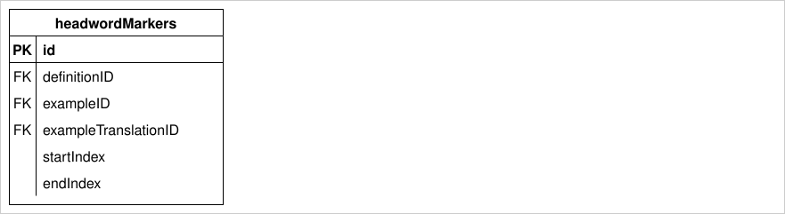

*Example 184. NVH*

```
headword: ...
```

### 4.4.8 `collocateMarker` <a id='annotation_collocateMarker'></a>

Marks up a substring other than the headword inside an example, inside an example translation or inside a definition. An application can use the inline markup to highlight collocates or constituents. Example: [Section A.1.23, “Using collocateMarker”](#ex22).

**Property of**

- [`definition`](#annotation_definition)

- [`example`](#annotation_example)

- [`exampleTranslation`](#annotation_exampleTranslation)

**Properties**

- `startIndex` REQUIRED and UNIQUE. Non-negative integer. The index of the first character of the substring according to the number of Unicode code points. The first character of the string has index 0. This property may be implicit if using in-line markup.

- `endIndex` REQUIRED and UNIQUE. Non-negative integer. The index of the last character after the substring according to the number of Unicode code points. This property may be implicit if using in-line markup

- `lemma` OPTIONAL (zero or one). Normalised string. The lemmatized form of the collocate. An application can use it to provide a clickable link for the user to search for the lemma in the rest of the lexicographic resource or on the web. (If you want to link the collocate explicitly to a specific entry or to a specific sense in your lexicographic resource, or even in an external lexicographic resource, you can use the Linking Module for that.)

- [`label`](#annotation_label) OPTIONAL (zero or more). This can be used to communicate facts about the role or type of the item in the sentence, for example its syntactic role (subject, direct object etc.), its semantic role (agent, affected etc) or its semantic type (human, institution etc.) The [`labelTag`](#values_labelTag) object type can be used to explain and/or constrain the collocate labels that are allowed to appear in the lexicographic resource.

*Example 185. XML*

```
<collocateMarker id="..." lemma="...">...<label tag="..."/></collocateMarker>
```

*Example 186. JSON*

```
{
    "id": "...",
    "startIndex": ...,
    "endIndex": ...,
    "lemma": "...",
    "labels": ["..."]
}
```

*Example 187. RDF*

```
<#definition> dmlex:itemMarker [
  dmlex:id "..." ;
  dmlex:startIndex 0 ;
  dmlex:endIndex 0 ;
  dmlex:lemma "..." ;
  dmlex:label ... ] .
```

*Example 188. Relational database*

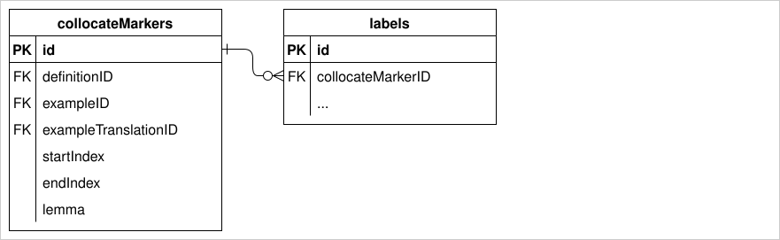

*Example 189. NVH*

```
collocate: ...
```

### 4.4.9 Extensions to `label` <a id='annotation_label'></a>

Extends the [`label`](#core_label) object type from the [Core](#core).

**Can additionally be a property of**

- [`collocateMarker`](#annotation_collocateMarker)

*Example 190. Relational database*

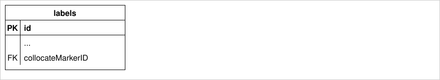

## 4.5 DMLex Etymology Module <a id='etymology'></a>

Extends DMLex Core to support the modelling of etymological information in lexicographic resources.

Example: [Section A.1.24, “Modelling etymology”](#ex23).

### 4.5.1 Extensions to `entry` <a id='etymology_entry'></a>

Extends the [`entry`](#core_entry) object type from the [Core](#core).

**Additional properties**

- [`etymology`](#etymology_etymology) OPTIONAL (zero or more) Represents a chain of historical derivations of the entry's headword.

> **Note**
>
> If an entry can contains more than one etymology object, then the different etymology objects represent different hypotheses about the origin of the headword.

*Example 191. XML*

```
<entry>
  ...
  <etymology>...</etymology>
</entry>
```

*Example 192. JSON*

```
{
  ...,
  "etymologies": [...]
}
```

*Example 193. RDF*

```
<#entry> dmlex:etymology ... ;
  dmlex:etymonType ... .
```

*Example 194. NVH*

```
entry: ...
  etymology: ...
```

### 4.5.2 `etymology` <a id='etymology_etymology'></a>

Represents a chain of historical derivations of a word.

**Property of**

- [`entry`](#etymology_entry)

**Properties**

- At least one of:

  - `description` OPTIONAL (zero or one) and UNIQUE. Normalised string. A plain-text form of the etymology, which may contain notes about the etymology. This may be used instead of or alongside a structured list of origin and etymon objects.

  - [`etymon`](#etymology_etymon) OPTIONAL (zero or more) and UNIQUE.

- `listingOrder` REQUIRED (exactly one). Number. The position of this etymology among other etymologies of the same entry. This can be implicit from the serialization.

*Example 195. XML*

```
<etymology>
  <description>...</description>
  <etymon>...</etymon>
  <etymon>...</etymon>
  <etymon>...</etymon>
  ...
</etymology> 
```

*Example 196. JSON*

```
{
  "description": ... ,
  "etymons": [...]
}
```

*Example 197. RDF*

```
<#entry> dmlex:etymology [
  a dmlex:Etymology ;
  dmlex:description "..." ;
  dmlex:etymon ... ;
  dmlex:listingOrder: ...] .
```

*Example 198. Relational database*

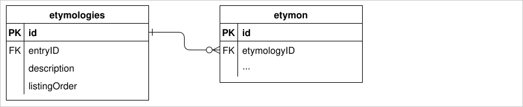

*Example 199. NVH*

```
etymology: description
  etymon:
  etymon:
  etymon:
```

### 4.5.3 `etymon` <a id='etymology_etymon'></a>

Represents one stage (of possibly several) in the etymological history of the headword.

**Property of**

- [`etymology`](#etymology_etymology)

**Properties**

- `when` OPTIONAL (zero or one). Normalised string. Indicates the time period during which this etymological origin is valid. The value is an open-text indication of the time period, in the language of the dictionary.

- `type` OPTIONAL (zero or one). Normalised string. The type of the etymological process that occurred at this stage of the headword's etymological history such as derivation, cognate, borrowing. The values can be explained and constrained using the [`etymonType`](#etymology_etymonType) object type.

- `note` OPTIONAL (zero or one). Normalised string. Any additional information about this stage of the headword's etymological history.

- [`etymonUnit`](#etymology_etymonUnit) REQUIRED (one or more) and UNIQUE.

- `listingOrder` REQUIRED (exactly one). Number. The position of this origin among other origins listed in the etymology. This can be implicit from the serialization.

*Example 200. XML*

```
<etymon when="..." type="...">
  <note>...</note>
  <etymonUnit>...</etymonUnit>
  <etymonUnit>...</etymonUnit>
  ...
</etymon>
```

*Example 201. JSON*

```
{
  "when": "...",
  "type": "...",
  "note": "...",
  "etymonUnits": [...],
}
```

*Example 202. RDF*

```
<#etymon> 
  dmlex:when "..." ;
  dmlex:type "..." ;
  dmlex:note "..." ;
  dmlex:etymonUnit ... ;
  dmlex:listingOrder 0 .
```

*Example 203. Relational database*

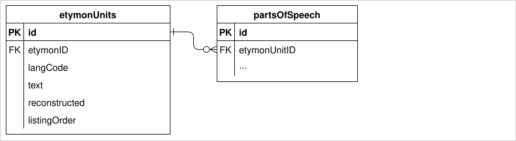

*Example 204. NVH*

```
etymon: type
  when: ...
  note: ...
  etymonUnit: ...
  etymonUnit: ...
```

### 4.5.4 `etymonUnit` <a id='etymology_etymonUnit'></a>

Represents a form (typically a word) which is the etymological origin of the headword, or another etymologically related form.

**Property of**

- [`etymon`](#etymology_etymon)

**Properties**

- `langCode` REQUIRED (exactly one) and UNIQUE (in combination with other unique properties if present). An IETF tag. The tags can be explained and constrained using the [`etymonLanguage`](#etymology_etymonLanguage) object type.

- `text` REQUIRED (exactly one) and UNIQUE (in combination with other unique properties if present). Normalised string. The written form of the etymon.

- `reconstructed` OPTIONAL (zero or one). Boolean. If present and set to true, indicates that the form is reconstructed and not attested in any corpus.

- [`partOfSpeech`](#etymology_partOfSpeech) OPTIONAL (zero or more).

- `translation` OPTIONAL (zero or one). Normalised string. A translation or gloss of the etymon in the language of the lexicographic resource.

- `listingOrder` REQUIRED (exactly one). Number. The position of this etymon among other etymons of the origin. This can be implicit from the serialization.

*Example 205. XML*

```
<etymonUnit langCode="..." reconstructed="true">
  <text>...</text>
  <partOfSpeech tag="..."/>
  <translation>...</translation>
</etymonUnit>
```

*Example 206. JSON*

```
{
  "langCode": "...",
  "text": "...",
  "reconstructed": true,
  "partsOfSpeech": [...],
  "translation": "..."
}
```

*Example 207. RDF*

```
<#etymonUnit> 
  dmlex:langCode "..." ;
  dmlex:text "..." ;
  dmlex:reconstructed true ;
  dmlex:partOfSpeech "..." ;
  dmlex:translation ... ;
  dmlex:listingOrder 0 .
```

*Example 208. Relational database*

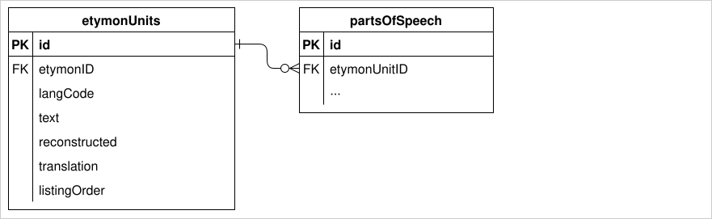

*Example 209. NVH*

```
langCode_etymonUnit: text
  reconstructed: ...
  pos: ...
  translation: ...
```

### 4.5.5 Extensions to `lexicographicResource` <a id='etymology_lexicographicResource'></a>

Extends the [`lexicographicResource`](#core_lexicographicResource) object type from the [Core](#core).

**Additional properties**

- [`etymonLanguage`](#etymology_etymonLanguage) OPTIONAL (zero or more)

- [`etymonType`](#etymology_etymonType) OPTIONAL (zero or more)

*Example 210. XML*

```
<lexicographicResource> 
  <etymonLanguage>...<etymonLanguage/>
  <etymonType>...<etymonType/>
  ...
</lexicographicResource>
```

*Example 211. JSON*

```
{
  "etymonLanguages": [...],
  "etymonTypes": [...],
  ...
}
```

*Example 212. RDF*

```
<#lexicographicResource> dmlex:etymonLanguage ... .
```

*Example 213. NVH*

```
lexicographicResource: ...
  etymonLanguage: ...
  etymonType: ...
```

### 4.5.6 `etymonType` <a id='etymology_etymonType'></a>

Represents one of possible values for the `type` of [`etymon`](#etymology_etymon).

**Property of**

- [`lexicographicResource`](#etymology_lexicographicResource)

**Properties**

- `type` REQUIRED (exactly one) and UNIQUE. Normalised string.

- `description` OPTIONAL (zero or one). Normalised string. A human-readable explanation of this type.

- [`sameAs`](#etymology_sameAs) OPTIONAL (zero or more).

*Example 214. XML*

```
<etymonType type="...">
    <description>...</description>
</etymonType>
```

*Example 215. JSON*

```
{
    "type": "...",
    "description": "..."
}
```

*Example 216. RDF*

```
<#lexicographicResource> dmlex:etymonType [
  dmlex:type "..." ;
  dmlex:description "..." ] .
```

*Example 217. Relational database*

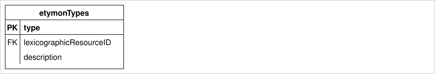

*Example 218. NVH*

```
etymonType: type
  description: ...
```

### 4.5.7 `etymonLanguage` <a id='etymology_etymonLanguage'></a>

Represents one of several allowed values for the `language` property of `etymonUnit` objects.

**Property of**

- [`lexicographicResource`](#etymology_lexicographicResource)

**Properties**

- `langCode` REQUIRED (exactly one) and UNIQUE. The IETF language code of the language.

- `displayName` OPTIONAL (zero or one). Normalised string. The name of the etymon language, in the language of the lexicographic resource.

- [`sameAs`](#etymology_sameAs) OPTIONAL (zero or more).

> **Note**
>
> Etymologies frequently refer to languages that are not covered by ISO standards. It may be necessary to avail of private-use subtags when composing IETF language tags for etymology, and to explain their meaning in the `displayName`.

*Example 219. XML*

```
<etymonLanguage langCode="...">
  <displayName>...<displayName>
  <sameAs.../>
</etymonLanguage>
```

*Example 220. JSON*

```
{
  "langCode": "..." ,
  "displayName": "...",
  "sameAs": [ ... ]
}
```

*Example 221. RDF*

```
<#etymonLanguage> dmlex:langCode "..." ;
  dmlex:displayName "... "  ;
  dmlex:sameAs ... .
```

*Example 222. Relational database*

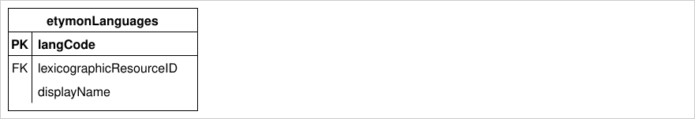

*Example 223. NVH*

```
etymonLanguage: langCode
  displayName: ...
  sameAs: ...
```

### 4.5.8 Extensions to `partOfSpeech` <a id='etymology_partOfSpeech'></a>

Extends the [`partOfSpeech`](#core_partOfSpeech) object type from the [Core](#core).

**Can additionally be a property of**

- [`etymonUnit`](#etymology_etymonUnit)

*Example 224. Relational database*

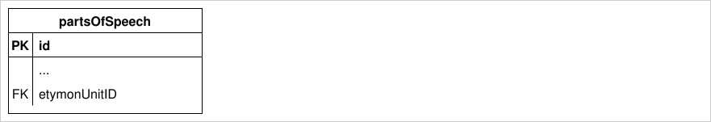

### 4.5.9 Extensions to `sameAs` <a id='etymology_sameAs'></a>

Extends the [`sameAs`](#values_sameAs) object type from the [Controlled Values Module](#values).

**Can additionally be a property of**

- [`etymonLanguage`](#etymology_etymonLanguage)

- [`etymonType`](#etymology_etymonType)

*Example 225. Relational database*

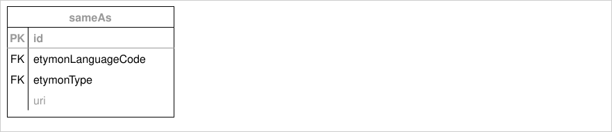

# 5 DMLex REQUIRED Serializations (Normative) <a id='serializations'></a>

## 5.1 DMLex XML serialization (Normative) <a id='xml'></a>

This section specifies a serialization of the DMLex data model in XML (Extensible Markup Language) \[[XML](#bib_XML)\].

For data exchange purposes, a valid DMLex XML document is one where either a `lexicographicResource` or an `entry` is the document element or one with an arbitrary document element other than `lexicographicResource` or `entry` containing a concatenation of one (and only one) of these two element types.

### 5.1.1 Design Principles (Informative) <a id='XMLDesignPrinciples'></a>

The XML serialization of DMLex shown in this document follows these principles:

- The top-level `lexicographicResource` and `entry` object types are implemented as XML elements.

- All other object types and their properties are implemented as XML attributes of their parents, unless:

  - the object has an arity other than `(0..1)` and `(1..1)` in at least one of its parent objects

  - or the object can have child objects

  - or the object's value is human-readable text, such as a headword or a definition (this applies, among other things, to all properties named `text` and `description`).

  In such cases the object or property is implemented as a child XML element of its parent.

### 5.1.2 Whitespace handling (Normative) <a id='XMLWhitespace'></a>

Some XML elements in this serialization are defined as allowed to have text content while other elements are not allowed to have text content.

- Elements which are not allowed to have text content: whitespace inside these elements should be treated as insignificant: any child nodes consisting of whitespace can be ignored when reading the XML.

- Elements which are allowed to have text content (which includes elements implementing object types from the Annotation Module): whitespace inside these elements should be handled as follows when reading the XML:

  1. Completely remove all leading whitespace that immediately follows an opening tag.

  2. Completely remove all trailing whitespace that immediately precedes a closing tag.

  3. Replace all remaining sequences of whitespace with a single space.

  This ensures that whitespace is handled in accordance with DMLex's concept of *normalised strings* defined in [Section 1.3.2, “Properties”](#modelProperties).

### 5.1.3 Element order (Normative) <a id='XMLElementOrder'></a>

The child elements of each parent element must be in the order in which they are listed in this specification.

The only exception is inline markup elements which implement object types from the Anotation Module: `<placeholderMarker>`, `<headwordMarker>` and `<collocateMarker>`. These can appear in any order.

### 5.1.4 DMLex XML serialization elements (Normative) <a id='XMLElements'></a>

#### 5.1.4.1 XML element: `<lexicographicResource>` <a id='xml_lexicographicResource'></a>

Implements the [lexicographicResource](#core_lexicographicResource) object type.

**Attributes**

- `@title` OPTIONAL

- `@uri` OPTIONAL

- `@langCode` REQUIRED

**Child elements**

- [`<entry>`](#xml_entry) OPTIONAL (zero or more)

**Child elements if implementing the Crosslingual Module**

- [`<translationLanguage>`](#xml_translationLanguage) REQUIRED (one or more)

**Child elements if implementing the Controlled Values Module**

- [`<definitionTypeTag>`](#xml_definitionTypeTag) OPTIONAL (zero or more)

- [`<inflectedFormTag>`](#xml_inflectedFormTag) OPTIONAL (zero or more)

- [`<labelTag>`](#xml_labelTag) OPTIONAL (zero or more)

- [`<labelTypeTag>`](#xml_labelTypeTag) OPTIONAL (zero or more)

- [`<partOfSpeechTag>`](#xml_partOfSpeechTag) OPTIONAL (zero or more)

- [`<sourceIdentityTag>`](#xml_sourceIdentityTag) OPTIONAL (zero or more)

- [`<transcriptionSchemeTag>`](#xml_transcriptionSchemeTag) OPTIONAL (zero or more)

**Child elements if implementing the Linking Module**

- [`<relation>`](#xml_relation) OPTIONAL (zero or more)

- [`<relationType>`](#xml_relationType) OPTIONAL (zero or more)

**Child elements if implementing the Etymology Module**

- [`<etymonLanguage>`](#etymology_etymonLanguage) OPTIONAL (zero or more)

- [`<etymonType>`](#etymology_etymonType) OPTIONAL (zero or more)

#### 5.1.4.2 XML element: `<entry>` <a id='xml_entry'></a>

Implements the [entry](#core_entry) object type.

**Attributes**

- `@homographNumber` OPTIONAL

**Attributes if implementing the Linking Module**

- `@id` OPTIONAL. Entries that have an ID may use this ID as object reference instead of the IRI addressing mechanism described in [Section 3.2.1, “DMLex fragment identification strings”](#frag_iri).

**Child elements**

- `<headword>` REQUIRED (exactly one). If implementing the Annotation Module `<headword>` can contain a mixture of plain text and [`<placeholderMarker>`](#xml_placeholderMarker) elements.

- [`<partOfSpeech>`](#xml_partOfSpeech) OPTIONAL (zero or more)

- [`<label>`](#xml_label) OPTIONAL (zero or more)

- [`<pronunciation>`](#xml_pronunciation) OPTIONAL (zero or more)

- [`<inflectedForm>`](#xml_inflectedForm) OPTIONAL (zero or more)

- [`<sense>`](#xml_sense) OPTIONAL (zero or more)

**Child elements if implementing the Etymology Module**

- [`<etymology>`](#xml_etymology) OPTIONAL (zero or more)

#### 5.1.4.3 XML element: `<partOfSpeech>` <a id='xml_partOfSpeech'></a>

Implements the [partOfSpeech](#core_partOfSpeech) object type.

**Attributes**

- `@tag` REQUIRED

#### 5.1.4.4 XML element: `<inflectedForm>` <a id='xml_inflectedForm'></a>

Implements the [inflectedForm](#core_inflectedForm) object type.

**Attributes**

- `@tag` OPTIONAL

**Child elements**

- `<text>` REQUIRED (exactly one)

- [`<label>`](#xml_label) OPTIONAL (zero or more)

- [`<pronunciation>`](#xml_pronunciation) OPTIONAL (zero or more)

#### 5.1.4.5 XML element: `<sense>` <a id='xml_sense'></a>

Implements the [sense](#core_sense) object type.

**Child elements**

- `<indicator>` OPTIONAL (zero or one)

- [`<label>`](#xml_label) OPTIONAL (zero or more)

- [`<definition>`](#xml_definition) OPTIONAL (zero or more)

- [`<example>`](#xml_example) OPTIONAL (zero or more)

**Attributes if implementing the Linking Module**

- `@id` OPTIONAL. Senses that have an ID may use this ID as object reference instead of the IRI addressing mechanism described in [Section 3.2.1, “DMLex fragment identification strings”](#frag_iri).

**Child elements if implementing the Crosslingual Module**

- [`<headwordExplanation>`](#xml_headwordExplanation) OPTIONAL (zero or more)

- [`<headwordTranslation>`](#xml_headwordTranslation) OPTIONAL (zero or more)

#### 5.1.4.6 XML element: `<definition>` <a id='xml_definition'></a>

Implements the [definition](#core_definition) object type.

**Attributes**

- `@definitionType` OPTIONAL

**Child elements**

- `<text>` REQUIRED (exactly one). If implementing the Annotation Module `<text>` can contain a mixture of plain text, [`<headwordMarker>`](#xml_headwordMarker) elements and [`<collocateMarker>`](#xml_collocateMarker) elements.

#### 5.1.4.7 XML element: `<label>` <a id='xml_label'></a>

Implements the [label](#core_label) object type.

**Attributes**

- `@tag` REQUIRED

#### 5.1.4.8 XML element: `<pronunciation>` <a id='xml_pronunciation'></a>

Implements the [pronunciation](#core_pronunciation) object type.

**Attributes**

- `@soundFile` OPTIONAL if `transcription` is present, REQUIRED otherwise

**Child elements**

- [`<transcription>`](#xml_transcription) OPTIONAL (zero or more) if `@soundFile` is present, REQUIRED (one or more) otherwise

- [`<label>`](#xml_label) OPTIONAL (zero or more)

#### 5.1.4.9 XML element: `<transcription>` <a id='xml_transcription'></a>

Implements the [transcription](#core_transcription) object type.

**Attributes**

- `@scheme` OPTIONAL

**Child elements**

- `<text>` REQUIRED (exactly one).

#### 5.1.4.10 XML element: `<example>` <a id='xml_example'></a>

Implements the [example](#core_example) object type.

**Attributes**

- `@sourceIdentity` OPTIONAL

- `@sourceElaboration` OPTIONAL

- `@soundFile` OPTIONAL

**Child elements**

- `<text>` REQUIRED (exactly one). If implementing the Annotation Module `<text>` can contain a mixture of plain text, [`<headwordMarker>`](#xml_headwordMarker) elements and [`<collocateMarker>`](#xml_collocateMarker) elements.

- [`<label>`](#xml_label) OPTIONAL (zero or more)

**Child elements if implementing the Crosslingual Module**

- [`<exampleTranslation>`](#xml_exampleTranslation) OPTIONAL (zero or more)

#### 5.1.4.11 XML element: `<translationLanguage>` <a id='xml_translationLanguage'></a>

Implements the [translationLanguage](#xlingual_translationLanguage) object type from the Crosslingual Module.

**Attributes**

- `@langCode` REQUIRED

#### 5.1.4.12 XML element: `<headwordTranslation>` <a id='xml_headwordTranslation'></a>

Implements the [headwordTranslation](#xlingual_headwordTranslation) object type from the Crosslingual Module.

**Attributes**

- `@langCode` OPTIONAL if the ancestor `<lexicographicResource>` contains exactly one `<translationLanguage>`, REQUIRED otherwise

**Child elements**

- `<text>` REQUIRED (exactly one). If implementing the Annotation Module `<text>` can contain a mixture of plain text and [`<placeholderMarker>`](#xml_placeholderMarker) elements.

- [`<partOfSpeech>`](#xml_partOfSpeech) OPTIONAL (zero or more)

- [`<label>`](#xml_label) OPTIONAL (zero or more)

- [`<pronunciation>`](#xml_pronunciation) OPTIONAL (zero or more)

- [`<inflectedForm>`](#xml_inflectedForm) OPTIONAL (zero or more)

#### 5.1.4.13 XML element: `<headwordExplanation>` <a id='xml_headwordExplanation'></a>

Implements the [headwordExplanation](#xlingual_headwordExplanation) object type from the Crosslingual Module.

**Attributes**

- `@langCode` OPTIONAL if the ancestor `<lexicographicResource>` contains exactly one `<translationLanguage>`, REQUIRED otherwise

**Child elements**

- `<text>` REQUIRED (exactly one).

#### 5.1.4.14 XML element: `<exampleTranslation>` <a id='xml_exampleTranslation'></a>

Implements the [exampleTranslation](#xlingual_exampleTranslation) object type from the Crosslingual Module.

**Attributes**

- `@langCode` OPTIONAL if the ancestor `<lexicographicResource>` contains exactly one `<translationLanguage>`, REQUIRED otherwise

- `@soundFile` OPTIONAL

**Child elements**

- `<text>` REQUIRED (exactly one). If implementing the Annotation Module `<text>` can contain a mixture of plain text, [`<headwordMarker>`](#xml_headwordMarker) elements and [`<collocateMarker>`](#xml_collocateMarker) elements.

- [`<label>`](#xml_label) OPTIONAL (zero or more)

#### 5.1.4.15 XML element: `<partOfSpeechTag>` <a id='xml_partOfSpeechTag'></a>

Implements the [partOfSpeechTag](#values_partOfSpeechTag) object type from the Controlled Values Module.

**Attributes**

- `@tag` REQUIRED

- `@for` OPTIONAL

**Child elements**

- `<description>` OPTIONAL (zero or one)

#### 5.1.4.16 XML element: `<inflectedFormTag>` <a id='xml_inflectedFormTag'></a>

Implements the [inflectedFormTag](#values_inflectedFormTag) object type from the Controlled Values Module.

**Attributes**

- `@tag` REQUIRED

- `@for` OPTIONAL

**Child elements**

- `<description>` OPTIONAL (zero or one)

- [`<sameAs>`](#xml_sameAs) OPTIONAL (zero or more)

#### 5.1.4.17 XML element: `<definitionTypeTag>` <a id='xml_definitionTypeTag'></a>

Implements the [definitionTypeTag](#values_definitionTypeTag) object type from the Controlled Values Module.

**Attributes**

- `@tag` REQUIRED

**Child elements**

- `<description>` OPTIONAL (zero or one)

- [`<sameAs>`](#xml_sameAs) OPTIONAL (zero or more)

#### 5.1.4.18 XML element: `<labelTag>` <a id='xml_labelTag'></a>

Implements the [labelTag](#values_labelTag) object type from the Controlled Values Module.

**Attributes**

- `@tag` REQUIRED

- `@typeTag` OPTIONAL

- `@for` OPTIONAL

**Child elements**

- `<description>` OPTIONAL (zero or one)

- [`<sameAs>`](#xml_sameAs) OPTIONAL (zero or more)

#### 5.1.4.19 XML element: `<labelTypeTag>` <a id='xml_labelTypeTag'></a>

Implements the [labelTypeTag](#values_labelTypeTag) object type from the Controlled Values Module.

**Attributes**

- `@tag` REQUIRED

**Child elements**

- `<description>` OPTIONAL (zero or one)

- [`<sameAs>`](#xml_sameAs) OPTIONAL (zero or more)

#### 5.1.4.20 XML element: `<sourceIdentityTag>` <a id='xml_sourceIdentityTag'></a>

Implements the [sourceIdentityTag](#values_sourceIdentityTag) object type from the Controlled Values Module.

**Attributes**

- `@tag` REQUIRED

**Child elements**

- `<description>` OPTIONAL (zero or one)

- [`<sameAs>`](#xml_sameAs) OPTIONAL (zero or more)

#### 5.1.4.21 XML element: `<transcriptionSchemeTag>` <a id='xml_transcriptionSchemeTag'></a>

Implements the [transcriptionSchemeTag](#values_transcriptionSchemeTag) object type from the Controlled Values Module.

**Attributes**

- `@tag` REQUIRED

- `@for` OPTIONAL

**Child elements**

- `<description>` OPTIONAL (zero or one)

#### 5.1.4.22 XML element: `<sameAs>` <a id='xml_sameAs'></a>

Implements the [sameAs](#values_sameAs) object type from the Controlled Values Module.

**Attributes**

- `@uri` REQUIRED

#### 5.1.4.23 XML element: `<relation>` <a id='xml_relation'></a>

Implements the [relation](#linking_relation) object type from the Linking Module.

**Attributes**

- `@type` REQUIRED

**Child elements**

- `<description>` OPTIONAL (zero or one)

- [`<member>`](#xml_member) REQUIRED (two or more)

#### 5.1.4.24 XML element: `<member>` <a id='xml_member'></a>

Implements the [member](#linking_member) object type from the Linking Module.

**Attributes**

- `@ref` REQUIRED: the `id` of an `entry`, a `sense` or a `collocateMarker`

- `@role` OPTIONAL

- `@obverseListingOrder` OPTIONAL

#### 5.1.4.25 XML element: `<relationType>` <a id='xml_relationType'></a>

Implements the [relationType](#linking_relationType) object type from the Linking Module.

**Attributes**

- `@type` REQUIRED

- `@scopeRestriction` REQUIRED

**Child elements**

- `<description>` OPTIONAL (zero or one)

- [`<memberType>`](#xml_memberType) OPTIONAL (zero or more)

- [`<sameAs>`](#xml_sameAs) OPTIONAL (zero or more)

#### 5.1.4.26 XML element: `<memberType>` <a id='xml_memberType'></a>

Implements the [memberType](#linking_memberType) object type from the Linking Module.

**Attributes**

- `@role` OPTIONAL

- `@type` REQUIRED

- `@min` OPTIONAL

- `@max` OPTIONAL

- `@hint` OPTIONAL

**Child elements**

- `<description>` OPTIONAL (zero or one)

- [`<sameAs>`](#xml_sameAs) OPTIONAL (zero or more)

#### 5.1.4.27 XML element: `<placeholderMarker>` <a id='xml_placeholderMarker'></a>

Implements the [placeholderMarker](#annotation_placeholderMarker) object type from the Annotation module. Contains the text which it marks up.

#### 5.1.4.28 XML element: `<headwordMarker>` <a id='xml_headwordMarker'></a>

Implements the [headwordMarker](#annotation_headwordMarker) object type from the Annotation module. Contains the text which it marks up.

#### 5.1.4.29 XML element: `<collocateMarker>` <a id='xml_collocateMarker'></a>

Implements the [collocateMarker](#annotation_collocateMarker) object type from the Annotation module. Contains the text which it marks up, optionally followed by one or more [`<label>`](#xml_label) elements.

**Attributes**

- `@lemma` OPTIONAL

**Attributes if implementing the Linking Module**

- `@id` OPTIONAL. Collocate markers that have an ID may use this ID as object reference instead of the IRI addressing mechanism described in [Section 3.2.1, “DMLex fragment identification strings”](#frag_iri).

**Child elements**

- [`<label>`](#xml_label) OPTIONAL (zero or more)

#### 5.1.4.30 XML element: `<etymology>` <a id='xml_etymology'></a>

Implements the [etymology](#etymology_etymology) object type from the Etymology Module.

**Child elements**

- `<description>` OPTIONAL (zero or one)

- [`<etymon>`](#xml_etymon) OPTIONAL (zero or more)

#### 5.1.4.31 XML element: `<etymon>` <a id='xml_etymon'></a>

Implements the [etymon](#etymology_etymon) object type from the Etymology Module.

**Attributes**

- `@when` OPTIONAL

- `@type` OPTIONAL

**Child elements**

- `<note>` OPTIONAL (zero or one)

- [`<etymonUnit>`](#xml_etymonUnit) REQUIRED (one or more)

#### 5.1.4.32 XML element: `<etymonUnit>` <a id='xml_etymonUnit'></a>

Implements the [etymonUnit](#etymology_etymonUnit) object type from the Etymology Module.

**Attributes**

- `@langCode` REQUIRED

- `@reconstructed` OPTIONAL

**Child elements**

- `<text>` REQUIRED (exactly one)

- [`<partOfSpeech>`](#etymology_partOfSpeech) OPTIONAL (zero or more)

- `<translation>` OPTIONAL (zero or one)

#### 5.1.4.33 XML element: `<etymonType>` <a id='xml_etymonType'></a>

Implements the [etymonType](#etymology_etymonType) object type from the Etymology Module.

**Attributes**

- `@type` REQUIRED

**Child elements**

- `<description>` OPTIONAL (zero or one)

- [`<sameAs>`](#xml_sameAs) OPTIONAL (zero or more)

#### 5.1.4.34 XML element: `<etymonLanguage>` <a id='xml_etymonLanguage'></a>

Implements the [etymonLanguage](#etymology_etymonLanguage) object type from the Etymology Module.

**Attributes**

- `@langCode` REQUIRED

**Child elements**

- `<displayName>` OPTIONAL (zero or one)

- [`<sameAs>`](#xml_sameAs) OPTIONAL (zero or more)

## 5.2 DMLex JSON serialization (Normative) <a id='json'></a>

This section specifies a serialization of the DMLex data model in JSON (JavaScript Object Notation) \[[JSON](#bib_json)\].

For data exchange purposes, a valid DMLex JSON file contains either a `lexicographicResource` object or an `entry` object or a concatenation of one (and only one) of these two object types in the JSON Lines format (i.e. separated by a system-specific newline delimiter).

### 5.2.1 Design principles <a id='5-2-1-design-principles'></a>

The JSON serialization of DMLex shown in this document follows these principles:

- The top-level `lexicographicResource` object is implemented as a JSON object: `{...}`.

- All other objects are implemented as JSON name-value pairs inside their parent JSON object: `{"name": ...}`.

- The values of objects are implemented:

  - If the object has an arity of `(0..1)` or `(1..1)`:

    - If the object cannot have any child objects: as a string or number.

    - If the object can have child objects: as a JSON object.

  - If the object has any other arity:

    - If the object cannot have any child objects: as an array of strings or numbers.

    - If the object can have child objects: as an array of JSON objects.

  The names of objects are:

  - plural if the value is an array, for example `labels`, `partsOfSpeech`

  - singular if the value is anything else, for example `headword`, `indicator`

### 5.2.2 DMLex JSON serialization objects (Normative) <a id='JSONClasses'></a>

#### 5.2.2.1 JSON object: `lexicographicResource` <a id='json_lexicographicResource'></a>

Implements the [lexicographicResource](#core_lexicographicResource) object type.

**Members**

- `"title"` OPTIONAL, string

- `"uri"` OPTIONAL, string

- `"langCode"` REQUIRED, string

- `"entries"` OPTIONAL, array of zero or more [`entry`](#json_entry) instances

**Members if implementing the Crosslingual Module**

- `"translationLanguages"` REQUIRED, array of one or more strings implementing the [translationLanguage](#xlingual_translationLanguage) object type

**Members if implementing the Controlled Values Module**

- `"definitionTypeTags"` OPTIONAL, array of zero or more [`definitionTypeTag`](#json_definitionTypeTag) instances

- `"inflectedFormTags"` OPTIONAL, array of zero or more [`inflectedFormTag`](#json_inflectedFormTag) instances

- `"labelTags"` OPTIONAL, array of zero or more [`labelTag`](#json_labelTag) instances

- `"labelTypeTags"` OPTIONAL, array of zero or more [`labelTypeTag`](#json_labelTypeTag) instances

- `"partOfSpeechTags"` OPTIONAL, array of zero or more [`partOfSpeechTag`](#json_partOfSpeechTag) instances

- `"sourceIdentityTags"` OPTIONAL, array of zero or more [`sourceIdentityTag`](#json_sourceIdentityTag) instances

**Members if implementing the Linking Module**

- `"relations"` OPTIONAL, array of zero or more [`relation`](#json_relation) instances

- `"relationTypes"` OPTIONAL, array of zero or more [`relationType`](#json_relationType) instances

**Members if implementing the Etymology Module**

- `"etymonLanguages"` OPTIONAL, array of zero or more [`etymonLanguage`](#json_etymonLanguage) instances

- `"etymonTypes"` OPTIONAL, array of zero or more [`etymonType`](#json_etymonType) instances

#### 5.2.2.2 JSON object: `entry` <a id='json_entry'></a>

Implements the [entry](#core_entry) object type.

**Members**

- `"headword"` REQUIRED, string

- `"homographNumber"` OPTIONAL, string

- `"partsOfSpeech"` OPTIONAL, array of zero or more strings implementing the [partOfSpeech](#core_partOfSpeech) object type

- `"labels"` OPTIONAL, array of zero or more strings implementing the [label](#core_label) object type

- `"pronunciations"` OPTIONAL, array of zero or more [`pronunciation`](#json_pronunciation) instances

- `"inflectedForms"` OPTIONAL, array of zero or more [`inflectedForm`](#json_inflectedForm) instances

- `"senses"` OPTIONAL, array of zero or more [`sense`](#json_sense) instances

**Members if implementing the Linking Module**

- `"id"` OPTIONAL, string. Entries that have an ID may use this ID as object reference instead of the IRI addressing mechanism described in [Section 3.2.1, “DMLex fragment identification strings”](#frag_iri).

**Members if implementing the Annotation Module**

- `"placeholderMarkers"` OPTIONAL, array of zero or more [`placeholderMarker`](#json_placeholderMarker) instances

**Members if implementing the Etymology Module**

- `"etymologies"` OPTIONAL, array of zero or more [`etymology`](#json_etymology) instances

#### 5.2.2.3 JSON object: `inflectedForm` <a id='json_inflectedForm'></a>

Implements the [inflectedForm](#core_inflectedForm) object type.

**Members**

- `"tag"` OPTIONAL, string

- `"text"` REQUIRED, string

- `"labels"` OPTIONAL, array of zero or more strings implementing the [label](#core_label) object type

- `"pronunciations"` OPTIONAL, array of zero or more [`pronunciation`](#json_pronunciation) instances

#### 5.2.2.4 JSON object: `sense` <a id='json_sense'></a>

Implements the [sense](#core_sense) object type.

**Members**

- `"indicator"` OPTIONAL, string

- `"labels"` OPTIONAL, array of zero or more strings implementing the [label](#core_label) object type

- `"definitions"` OPTIONAL, array of zero or more [`definition`](#json_definition) instances

- `"examples"` OPTIONAL, array of zero or more [`example`](#json_example) instances

**Members if implementing the Linking Module**

- `"id"` OPTIONAL, string. Senses that have an ID may use this ID as object reference instead of the IRI addressing mechanism described in [Section 3.2.1, “DMLex fragment identification strings”](#frag_iri).

**Members if implementing the Crosslingual Module**

- `"headwordExplanations"` OPTIONAL, array of zero or more [`headwordExplanation`](#json_headwordExplanation) instances

- `"headwordTranslations"` OPTIONAL, array of zero or more [`headwordTranslation`](#json_headwordTranslation) instances

#### 5.2.2.5 JSON object: `definition` <a id='json_definition'></a>

Implements the [definition](#core_definition) object type.

**Members**

- `"definitionType"` OPTIONAL, string

- `"text"` REQUIRED, string

**Members if implementing the Annotation Module**

- `"headwordMarkers"` OPTIONAL, array of zero or more [`headwordMarker`](#json_headwordMarker) instances

- `"collocateMarkers"` OPTIONAL, array of zero or more [`collocateMarker`](#json_collocateMarker) instances

#### 5.2.2.6 JSON object: `pronunciation` <a id='json_pronunciation'></a>

Implements the [pronunciation](#core_pronunciation) object type.

**Members**

- `"soundFile"` OPTIONAL if `"transcriptions"` is present and non-empty, REQUIRED otherwise; string

- `"transcriptions"` OPTIONAL if `"soundFile"` is present, REQUIRED otherwise; array of zero or more [`transcription`](#json_transcription) instances

- `"labels"` OPTIONAL, array of zero or more strings implementing the [label](#core_label) object type

#### 5.2.2.7 JSON object: `transcription` <a id='json_transcription'></a>

Implements the [transcription](#core_transcription) object type.

**Members**

- `"scheme"` OPTIONAL, string

- `"text"` REQUIRED, string

#### 5.2.2.8 JSON object: `example` <a id='json_example'></a>

Implements the [example](#core_example) object type.

**Members**

- `"sourceIdentity"` OPTIONAL, string

- `"sourceElaboration"` OPTIONAL, string

- `"soundFile"` OPTIONAL, string

- `"text"` REQUIRED, string

- `"labels"` OPTIONAL, array of zero or more strings implementing the [label](#core_label) object type

**Members if implementing the Annotation Module**

- `"headwordMarkers"` OPTIONAL, array of zero or more [`headwordMarker`](#json_headwordMarker) instances

- `"collocateMarkers"` OPTIONAL, array of zero or more [`collocateMarker`](#json_collocateMarker) instances

**Members if implementing the Crosslingual Module**

- `"exampleTranslations"` OPTIONAL, array of zero or more [`exampleTranslation`](#json_exampleTranslation) instances

#### 5.2.2.9 JSON object: `headwordTranslation` <a id='json_headwordTranslation'></a>

Implements the [headwordTranslation](#xlingual_headwordTranslation) object type from the Crosslingual Module.

**Members**

- `"langCode"` OPTIONAL if the `lexicographicResource` contains exactly one `translationLanguage`, REQUIRED otherwise; string

- `"text"` REQUIRED, string

- `"partsOfSpeech"` OPTIONAL, array of zero or more strings implementing the [partOfSpeech](#core_partOfSpeech) object type

- `"labels"` OPTIONAL, array of zero or more strings implementing the [label](#core_label) object type

- `"pronunciations"` OPTIONAL, array of zero or more [`pronunciation`](#json_pronunciation) instances

- `"inflectedForms"` OPTIONAL, array of zero or more [`inflectedForm`](#json_inflectedForm) instances

**Members if implementing the Annotation Module**

- `"placeholderMarkers"` OPTIONAL, array of zero or more [`placeholderMarker`](#json_placeholderMarker) instances

#### 5.2.2.10 JSON object: `headwordExplanation` <a id='json_headwordExplanation'></a>

Implements the [headwordExplanation](#xlingual_headwordExplanation) object type from the Crosslingual Module.

**Members**

- `"langCode"` OPTIONAL if the `lexicographicResource` contains exactly one `translationLanguage`, REQUIRED otherwise; string

- `"text"` REQUIRED, string

#### 5.2.2.11 JSON object: `exampleTranslation` <a id='json_exampleTranslation'></a>

Implements the [exampleTranslation](#xlingual_exampleTranslation) object type from the Crosslingual Module.

**Members**

- `"langCode"` OPTIONAL if the `lexicographicResource` contains exactly one `translationLanguage`, REQUIRED otherwise; string

- `"text"` REQUIRED, string

- `"labels"` OPTIONAL, array of zero or more strings implementing the [label](#core_label) object type

**Members if implementing the Annotation Module**

- `"headwordMarkers"` OPTIONAL, array of zero or more [`headwordMarker`](#json_headwordMarker) instances

- `"collocateMarkers"` OPTIONAL, array of zero or more [`collocateMarker`](#json_collocateMarker) instances

#### 5.2.2.12 JSON object: `partOfSpeechTag` <a id='json_partOfSpeechTag'></a>

Implements the [partOfSpeechTag](#values_partOfSpeechTag) object type from the Controlled Values Module.

**Members**

- `"tag"` REQUIRED, string

- `"description"` OPTIONAL, string

- `"for"` OPTIONAL, string

- `"sameAs"` OPTIONAL, array of zero or more strings implementing the [sameAs](#values_sameAs) object type

#### 5.2.2.13 JSON object: `inflectedFormTag` <a id='json_inflectedFormTag'></a>

Implements the [inflectedFormTag](#values_inflectedFormTag) object type from the Controlled Values Module.

**Members**

- `"tag"` REQUIRED, string

- `"description"` OPTIONAL, string

- `"for"` OPTIONAL, string

- `"sameAs"` OPTIONAL, array of zero or more strings implementing the [sameAs](#values_sameAs) object type

#### 5.2.2.14 JSON object: `definitionTypeTag` <a id='json_definitionTypeTag'></a>

Implements the [definitionTypeTag](#values_definitionTypeTag) object type from the Controlled Values Module.

**Members**

- `"tag"` REQUIRED, string

- `"description"` OPTIONAL, string

- `"sameAs"` OPTIONAL, array of zero or more strings implementing the [sameAs](#values_sameAs) object type

#### 5.2.2.15 JSON object: `labelTag` <a id='json_labelTag'></a>

Implements the [labelTag](#values_labelTag) object type from the Controlled Values Module.

**Members**

- `"tag"` REQUIRED, string

- `"typeTag"` OPTIONAL, string

- `"description"` OPTIONAL, string

- `"for"` OPTIONAL, string

- `"sameAs"` OPTIONAL, array of zero or more strings implementing the [sameAs](#values_sameAs) object type

#### 5.2.2.16 JSON object: `labelTypeTag` <a id='json_labelTypeTag'></a>

Implements the [labelTypeTag](#values_labelTypeTag) object type from the Controlled Values Module.

**Members**

- `"tag"` REQUIRED, string

- `"description"` OPTIONAL, string

- `"sameAs"` OPTIONAL, array of zero or more strings implementing the [sameAs](#values_sameAs) object type

#### 5.2.2.17 JSON object: `sourceIdentityTag` <a id='json_sourceIdentityTag'></a>

Implements the [sourceIdentityTag](#values_sourceIdentityTag) object type from the Controlled Values Module.

**Members**

- `"tag"` REQUIRED, string

- `"description"` OPTIONAL, string

- `"sameAs"` OPTIONAL, array of zero or more strings implementing the [sameAs](#values_sameAs) object type

#### 5.2.2.18 JSON object: `transcriptionSchemeTag` <a id='json_transcriptionSchemeTag'></a>

Implements the [transcriptionSchemeTag](#values_transcriptionSchemeTag) object type from the Controlled Values Module.

**Members**

- `"tag"` REQUIRED, string

- `"description"` OPTIONAL, string

- `"for"` OPTIONAL, string

#### 5.2.2.19 JSON object: `relation` <a id='json_relation'></a>

Implements the [relation](#linking_relation) object type from the Linking Module.

**Members**

- `"type"` REQUIRED, string

- `"description"` OPTIONAL, string

- `"members"` OPTIONAL, array of two or more [`member`](#json_member) instances

#### 5.2.2.20 JSON object: `member` <a id='json_member'></a>

Implements the [member](#linking_member) object type from the Linking Module.

**Members**

- `"ref"` REQUIRED, string: the `id` of an `entry`, a `sense` or a `collocateMarker`.

- `"role"` OPTIONAL, string

- `"obverseListingOrder"` OPTIONAL, number

#### 5.2.2.21 JSON object: `relationType` <a id='json_relationType'></a>

Implements the [relationType](#linking_relationType) object type from the Linking Module.

**Members**

- `"type"` REQUIRED, string

- `"scopeRestriction"` OPTIONAL, string

- `"description"` OPTIONAL, string

- `"memberTypes"` OPTIONAL, array of zero or more [`memberType`](#json_memberType) instances

- `"sameAs"` OPTIONAL, array of zero or more strings implementing the [sameAs](#values_sameAs) object type

#### 5.2.2.22 JSON object: `memberType` <a id='json_memberType'></a>

Implements the [memberType](#linking_memberType) object type from the Linking Module.

**Members**

- `"role"` OPTIONAL, string

- `"type"` REQUIRED, string

- `"min"` OPTIONAL, number

- `"max"` OPTIONAL, number

- `"hint"` OPTIONAL, string

- `"description"` OPTIONAL, string

- `"sameAs"` OPTIONAL, array of zero or more strings implementing the [sameAs](#values_sameAs) object type

#### 5.2.2.23 JSON object: `placeholderMarker` <a id='json_placeholderMarker'></a>

Implements the [placeholderMarker](#annotation_placeholderMarker) object type from the Annotation Module.

**Members**

- `"startIndex"` REQUIRED, number

- `"endIndex"` REQUIRED, number

#### 5.2.2.24 JSON object: `headwordMarker` <a id='json_headwordMarker'></a>

Implements the [headwordMarker](#annotation_headwordMarker) object type from the Annotation Module.

**Members**

- `"startIndex"` REQUIRED, number

- `"endIndex"` REQUIRED, number

#### 5.2.2.25 JSON object: `collocateMarker` <a id='json_collocateMarker'></a>

Implements the [collocateMarker](#annotation_collocateMarker) object type from the Annotation Module.

**Members**

- `"startIndex"` REQUIRED, number

- `"endIndex"` REQUIRED, number

- `"lemma"` OPTIONAL, string

- `"labels"` OPTIONAL, array of zero or more strings implementing the [label](#core_label) object type

**Members if implementing the Linking Module**

- `"id"` OPTIONAL, string. Collocate markers that have an ID may use this ID as object reference instead of the IRI addressing mechanism described in [Section 3.2.1, “DMLex fragment identification strings”](#frag_iri).

#### 5.2.2.26 JSON object: `etymology` <a id='json_etymology'></a>

Implements the [etymology](#etymology_etymology) object type from the Etymology Module.

**Members**

- `"description"` OPTIONAL, string

- `"etymons"` OPTIONAL, array of zero or more [`etymon`](#json_etymon) instances

#### 5.2.2.27 JSON object: `etymon` <a id='json_etymon'></a>

Implements the [etymon](#etymology_etymon) object type from the Etymology Module.

**Members**

- `"when"` OPTIONAL, string

- `"type"` OPTIONAL, string

- `"note"` OPTIONAL, string

- `"etymonUnits"` REQUIRED, array of one or more [`etymonUnit`](#json_etymonUnit) instances

#### 5.2.2.28 JSON object: `etymonUnit` <a id='json_etymonUnit'></a>

Implements the [etymonUnit](#etymology_etymonUnit) object type from the Etymology Module.

**Members**

- `"langCode"` REQUIRED, string

- `"reconstructed"` OPTIONAL, boolean

- `"text"` REQUIRED, string

- `"partsOfSpeech"` OPTIONAL, array of zero or more strings implementing the [partOfSpeech](#core_partOfSpeech) object type

- `"translation"` OPTIONAL, string

#### 5.2.2.29 JSON object: `etymonType` <a id='json_etymonType'></a>

Implements the [etymonType](#etymology_etymonType) object type from the Etymology Module.

**Members**

- `"type"` REQUIRED, string

- `"description"` OPTIONAL, string

- `"sameAs"` OPTIONAL, array of zero or more strings implementing the [sameAs](#values_sameAs) object type

#### 5.2.2.30 JSON object: `etymonLanguage` <a id='json_etymonLanguage'></a>

Implements the [etymonLanguage](#etymology_etymonLanguage) object type from the Etymology Module.

**Members**

- `"langCode"` REQUIRED, string

- `"displayName"` OPTIONAL, string

- `"sameAs"` OPTIONAL, array of zero or more strings implementing the [sameAs](#values_sameAs) object type

## 5.3 DMLex RDF serialization (Normative) <a id='rdf'></a>

### 5.3.1 Design principles <a id='5-3-1-design-principles'></a>

The RDF serialization used in this document follows the following principles

- The RDF serialization uses an vocabulary defined at the namespace `https://docs.oasis-open.org/lexidma/dmlex/v1.0/schemas/RDF/dmlex.ttl#`, al elements of the vocabulary are in this namespace

- The vocabulary file provides RDF Schema and OWL axioms which implement the restrictions described by the data model. It also provides a linking to the [OntoLex-Lemon](https://www.w3.org/2016/05/ontolex/) model. The ontology provides rules to infer an OntoLex-lemon model from DMLex data. This is achieved by means of subclass and subproperty axioms and so conversion can be performed by an OWL reasoner.

- All elements of the modules are modelled as individuals with an appropriate class definitions

- Each other object type is associated with a property (with a lowercase initial letter) and a class (with an uppercase initial letter. In all case the range of this property is the class

- Arity of properties is implemented by means of OWL class restrictions.

- Listing order can be specified with the property `dmlex:listingOrder` with values starting from 1 and ascending

- There is not a specific `id` property, instead the URI of the entity acts as the ID

- There is no property for [`sameAs`](#values_sameAs) in the controlled values module. Instead you can use OWL's `sameAs` property

- The implementation is not aware of which modules are in use, to enable publishing on the web. As such cardinality constraints that are only required in a module are not implemented.

- The domain of some properties is given as a `HasProperty` class when it can be used with multiple classes. As such, classes may be subclasses of several different `HasProperty` classes

### 5.3.2 DMLex RDF serialization elements <a id='5-3-2-dmlex-rdf-serialization-elements'></a>

#### 5.3.2.1 RDF element: `dmlex:LexicographicResource` <a id='rdf_LexicographicResource'></a>

Represents a dictionary

**Superclasses**

- `http://www.w3.org/ns/lemon/lime#Lexicon`

**Properties**

- `dmlex:title` OPTIONAL (at most 1) of type `http://www.w3.org/2000/01/rdf-schema#Literal`

- `dmlex:uri` OPTIONAL (at most 1) of type `http://www.w3.org/2001/XMLSchema#anyURI`

- `dmlex:entry` OPTIONAL reference to [Entry](#rdf_Entry) (subproperty of `http://www.w3.org/ns/lemon/lime#entry`)

- `dmlex:translationLanguage` OPTIONAL reference to [TranslationLanguage](#rdf_TranslationLanguage)

- `dmlex:definitionTypeTag` OPTIONAL reference to [DefinitionTypeTag](#rdf_DefinitionTypeTag)

- `dmlex:inflectedFormTag` OPTIONAL reference to [InflectedFormTag](#rdf_InflectedFormTag)

- `dmlex:labelTypeTag` OPTIONAL reference to [LabelTypeTag](#rdf_LabelTypeTag)

- `dmlex:partOfSpeechTag` OPTIONAL reference to [PartOfSpeechTag](#rdf_PartOfSpeechTag)

- `dmlex:sourceIdentityTag` OPTIONAL reference to [SourceIdentityTag](#rdf_SourceIdentityTag)

- `dmlex:transcriptionSchemeTag` OPTIONAL reference to [TranscriptionSchemeTag](#rdf_TranscriptionSchemeTag)

- `dmlex:relation` OPTIONAL reference to [Relation](#rdf_Relation)

- `dmlex:relationType` OPTIONAL reference to [RelationType](#rdf_RelationType)

- `dmlex:etymonType` OPTIONAL reference to [EtymonType](#rdf_EtymonType)

- `dmlex:etymonLanguage` OPTIONAL reference to [EtymonLanguage](#rdf_EtymonLanguage)

- `dmlex:langCode` REQUIRED (exactly 1) of type `http://www.w3.org/2001/XMLSchema#language` (subproperty of `http://www.w3.org/ns/lemon/lime#language`)

#### 5.3.2.2 RDF element: `dmlex:Entry` <a id='rdf_Entry'></a>

Represents a dictionary entry

**Superclasses**

- `http://www.w3.org/ns/lemon/ontolex#LexicalEntry`

**Properties**

- `dmlex:headword` REQUIRED (exactly 1) of type `http://www.w3.org/2000/01/rdf-schema#Literal`

- `dmlex:homographNumber` OPTIONAL (at most 1) of type `http://www.w3.org/2001/XMLSchema#nonNegativeInteger`

- `dmlex:sense` OPTIONAL reference to [Sense](#rdf_Sense) (subproperty of `http://www.w3.org/ns/lemon/ontolex#evokes`)

- `dmlex:etymology` OPTIONAL reference to [Etymology](#rdf_Etymology)

- `dmlex:partOfSpeech` OPTIONAL reference to [PartOfSpeech](#rdf_PartOfSpeech)

- `dmlex:label` OPTIONAL reference to [Label](#rdf_Label)

- `dmlex:pronunciation` OPTIONAL reference to [Pronunciation](#rdf_Pronunciation)

- `dmlex:inflectedForm` OPTIONAL reference to [InflectedForm](#rdf_InflectedForm) (subproperty of `http://www.w3.org/ns/lemon/ontolex#otherForm`)

- `dmlex:placeholderMarker` OPTIONAL reference to [PlaceholderMarker](#rdf_PlaceholderMarker)

#### 5.3.2.3 RDF element: `dmlex:PartOfSpeech` <a id='rdf_PartOfSpeech'></a>

Represents a part of speech label

**Properties**

- `dmlex:listingOrder` REQUIRED (exactly 1) of type `http://www.w3.org/2001/XMLSchema#nonNegativeInteger`

- `dmlex:tag` REQUIRED (exactly 1)

#### 5.3.2.4 RDF element: `dmlex:InflectedForm` <a id='rdf_InflectedForm'></a>

Represents one (of possibly many) inflected forms of the headword

**Superclasses**

- `http://www.w3.org/ns/lemon/ontolex#Form`

**Properties**

- `dmlex:listingOrder` REQUIRED (exactly 1) of type `http://www.w3.org/2001/XMLSchema#nonNegativeInteger`

- `dmlex:label` OPTIONAL reference to [Label](#rdf_Label)

- `dmlex:pronunciation` OPTIONAL reference to [Pronunciation](#rdf_Pronunciation)

- `dmlex:tag` OPTIONAL (at most 1)

- `dmlex:text` REQUIRED (exactly 1) of type `http://www.w3.org/2000/01/rdf-schema#Literal`

#### 5.3.2.5 RDF element: `dmlex:Sense` <a id='rdf_Sense'></a>

Represents one of possibly many meanings (or meaning potentials) of the headword.

**Superclasses**

- `http://www.w3.org/ns/lemon/ontolex#LexicalConcept`

**Properties**

- `dmlex:listingOrder` REQUIRED (exactly 1) of type `http://www.w3.org/2001/XMLSchema#nonNegativeInteger`

- `dmlex:label` OPTIONAL reference to [Label](#rdf_Label)

- `dmlex:indicator` OPTIONAL (at most 1) of type `http://www.w3.org/2000/01/rdf-schema#Literal`

- `dmlex:definition` OPTIONAL reference to [Definition](#rdf_Definition)

- `dmlex:example` OPTIONAL reference to [Example](#rdf_Example)

- `dmlex:headwordExplanation` OPTIONAL reference to [HeadwordExplanation](#rdf_HeadwordExplanation)

- `dmlex:headwordTranslation` OPTIONAL reference to [HeadwordTranslation](#rdf_HeadwordTranslation)

#### 5.3.2.6 RDF element: `dmlex:Definition` <a id='rdf_Definition'></a>

Represents one of possibly several definitions of a sense.

**Properties**

- `dmlex:listingOrder` REQUIRED (exactly 1) of type `http://www.w3.org/2001/XMLSchema#nonNegativeInteger`

- `dmlex:text` REQUIRED (exactly 1) of type `http://www.w3.org/2000/01/rdf-schema#Literal`

- `dmlex:definitionType` OPTIONAL (at most 1) reference to [DefinitionTypeTag](#rdf_DefinitionTypeTag)

- `dmlex:headwordMarker` OPTIONAL reference to [HeadwordMarker](#rdf_HeadwordMarker)

- `dmlex:collocateMarker` OPTIONAL reference to [CollocateMarker](#rdf_CollocateMarker)

#### 5.3.2.7 RDF element: `dmlex:Label` <a id='rdf_Label'></a>

Represents a restriction on its parent such as temporal (old-fashioned, neologism), regional (dialect), register (formal, colloquial), domain (medicine, politics) or grammar (singular-only).

**Properties**

- `dmlex:listingOrder` REQUIRED (exactly 1) of type `http://www.w3.org/2001/XMLSchema#nonNegativeInteger`

- `dmlex:tag` REQUIRED (exactly 1)

#### 5.3.2.8 RDF element: `dmlex:Pronunciation` <a id='rdf_Pronunciation'></a>

Represents the pronunciation of its parent. Pronunciations must have either a sound file or a transcription.

**Properties**

- `dmlex:listingOrder` REQUIRED (exactly 1) of type `http://www.w3.org/2001/XMLSchema#nonNegativeInteger`

- `dmlex:label` OPTIONAL reference to [Label](#rdf_Label)

- `dmlex:soundFile` OPTIONAL (at most 1) of type `http://www.w3.org/2001/XMLSchema#anyURI`

- `dmlex:transcription` OPTIONAL reference to [Transcription](#rdf_Transcription)

#### 5.3.2.9 RDF element: `dmlex:Transcription` <a id='rdf_Transcription'></a>

Represents the transcription of a pronunciation in some notation such as IPA.

**Properties**

- `dmlex:listingOrder` REQUIRED (exactly 1) of type `http://www.w3.org/2001/XMLSchema#nonNegativeInteger`

- `dmlex:text` REQUIRED (exactly 1) of type `http://www.w3.org/2000/01/rdf-schema#Literal`

- `dmlex:scheme` OPTIONAL (at most 1) of type `http://www.w3.org/2001/XMLSchema#language`

#### 5.3.2.10 RDF element: `dmlex:Example` <a id='rdf_Example'></a>

Represents a sentence or other text fragment which illustrates the headword being used.

**Properties**

- `dmlex:listingOrder` REQUIRED (exactly 1) of type `http://www.w3.org/2001/XMLSchema#nonNegativeInteger`

- `dmlex:label` OPTIONAL reference to [Label](#rdf_Label)

- `dmlex:text` REQUIRED (exactly 1) of type `http://www.w3.org/2000/01/rdf-schema#Literal`

- `dmlex:soundFile` OPTIONAL (at most 1) of type `http://www.w3.org/2001/XMLSchema#anyURI`

- `dmlex:sourceIdentity` OPTIONAL (at most 1) of type `http://www.w3.org/2000/01/rdf-schema#Literal`

- `dmlex:sourceElaboration` OPTIONAL (at most 1) of type `http://www.w3.org/2000/01/rdf-schema#Literal`

- `dmlex:exampleTranslation` OPTIONAL reference to [ExampleTranslation](#rdf_ExampleTranslation)

- `dmlex:headwordMarker` OPTIONAL reference to [HeadwordMarker](#rdf_HeadwordMarker)

- `dmlex:collocateMarker` OPTIONAL reference to [CollocateMarker](#rdf_CollocateMarker)

#### 5.3.2.11 RDF element: `dmlex:TranslationLanguage` <a id='rdf_TranslationLanguage'></a>

Represents one of the languages in which translations are given in this lexicographic resource

**Properties**

- `dmlex:listingOrder` REQUIRED (exactly 1) of type `http://www.w3.org/2001/XMLSchema#nonNegativeInteger`

- `dmlex:langCode` REQUIRED (exactly 1) of type `http://www.w3.org/2001/XMLSchema#language` (subproperty of `http://www.w3.org/ns/lemon/lime#language`)

#### 5.3.2.12 RDF element: `dmlex:HeadwordTranslation` <a id='rdf_HeadwordTranslation'></a>

Represents one of possibly multiple translations of a headword

**Properties**

- `dmlex:listingOrder` REQUIRED (exactly 1) of type `http://www.w3.org/2001/XMLSchema#nonNegativeInteger`

- `dmlex:langCode` OPTIONAL of type `http://www.w3.org/2001/XMLSchema#language` (subproperty of `http://www.w3.org/ns/lemon/lime#language`)

- `dmlex:partOfSpeech` OPTIONAL reference to [PartOfSpeech](#rdf_PartOfSpeech)

- `dmlex:label` OPTIONAL reference to [Label](#rdf_Label)

- `dmlex:pronunciation` OPTIONAL reference to [Pronunciation](#rdf_Pronunciation)

- `dmlex:inflectedForm` OPTIONAL reference to [InflectedForm](#rdf_InflectedForm) (subproperty of `http://www.w3.org/ns/lemon/ontolex#otherForm`)

- `dmlex:text` REQUIRED (exactly 1) of type `http://www.w3.org/2000/01/rdf-schema#Literal`

- `dmlex:placeholderMarker` OPTIONAL reference to [PlaceholderMarker](#rdf_PlaceholderMarker)

#### 5.3.2.13 RDF element: `dmlex:HeadwordExplanation` <a id='rdf_HeadwordExplanation'></a>

Represents a statement in the translation language which explains (but does not translate) the meaning of the headword.

**Properties**

- `dmlex:langCode` OPTIONAL of type `http://www.w3.org/2001/XMLSchema#language` (subproperty of `http://www.w3.org/ns/lemon/lime#language`)

- `dmlex:text` REQUIRED (exactly 1) of type `http://www.w3.org/2000/01/rdf-schema#Literal`

#### 5.3.2.14 RDF element: `dmlex:ExampleTranslation` <a id='rdf_ExampleTranslation'></a>

Represents the translation of an example.

**Properties**

- `dmlex:listingOrder` OPTIONAL of type `http://www.w3.org/2001/XMLSchema#nonNegativeInteger`

- `dmlex:langCode` OPTIONAL of type `http://www.w3.org/2001/XMLSchema#language` (subproperty of `http://www.w3.org/ns/lemon/lime#language`)

- `dmlex:label` OPTIONAL reference to [Label](#rdf_Label)

- `dmlex:text` REQUIRED (exactly 1) of type `http://www.w3.org/2000/01/rdf-schema#Literal`

- `dmlex:soundFile` OPTIONAL of type `http://www.w3.org/2001/XMLSchema#anyURI`

- `dmlex:headwordMarker` OPTIONAL reference to [HeadwordMarker](#rdf_HeadwordMarker)

- `dmlex:collocateMarker` OPTIONAL reference to [CollocateMarker](#rdf_CollocateMarker)

#### 5.3.2.15 RDF element: `dmlex:DefinitionTypeTag` <a id='rdf_DefinitionTypeTag'></a>

Represents one (of many) possible values for definitionType of definition.

**Properties**

- `dmlex:tag` REQUIRED (exactly 1)

- `dmlex:description` OPTIONAL (at most 1) of type `http://www.w3.org/2000/01/rdf-schema#Literal`

- `dmlex:sameAs` OPTIONAL

#### 5.3.2.16 RDF element: `dmlex:InflectedFormTag` <a id='rdf_InflectedFormTag'></a>

Represents one (of many) possible values for tag of inflectedForm

**Properties**

- `dmlex:inflectedForm` OPTIONAL reference to [InflectedForm](#rdf_InflectedForm) (subproperty of `http://www.w3.org/ns/lemon/ontolex#otherForm`)

- `dmlex:tag` REQUIRED (exactly 1)

- `dmlex:description` OPTIONAL (at most 1) of type `http://www.w3.org/2000/01/rdf-schema#Literal`

- `dmlex:forPartOfSpeech` OPTIONAL of type `http://www.w3.org/2000/01/rdf-schema#Literal`

- `dmlex:sameAs` OPTIONAL

#### 5.3.2.17 RDF element: `dmlex:LabelTag` <a id='rdf_LabelTag'></a>

Represents one (of many) possible values for tag of label.

**Properties**

- `dmlex:inflectedForm` OPTIONAL reference to [InflectedForm](#rdf_InflectedForm) (subproperty of `http://www.w3.org/ns/lemon/ontolex#otherForm`)

- `dmlex:tag` REQUIRED (exactly 1)

- `dmlex:description` OPTIONAL (at most 1) of type `http://www.w3.org/2000/01/rdf-schema#Literal`

- `dmlex:forPartOfSpeech` OPTIONAL of type `http://www.w3.org/2000/01/rdf-schema#Literal`

- `dmlex:forCollocates` OPTIONAL (at most 1) of type `http://www.w3.org/2001/XMLSchema#boolean`

- `dmlex:sameAs` OPTIONAL

#### 5.3.2.18 RDF element: `dmlex:LabelTypeTag` <a id='rdf_LabelTypeTag'></a>

Represents one (of many) possible values for typeTag of labelTag.

**Properties**

- `dmlex:tag` REQUIRED (exactly 1)

- `dmlex:description` REQUIRED (exactly 1) of type `http://www.w3.org/2000/01/rdf-schema#Literal`

#### 5.3.2.19 RDF element: `dmlex:PartOfSpeechTag` <a id='rdf_PartOfSpeechTag'></a>

Represents one (of many) possible values for tag of partOfSpeech.

**Properties**

- `dmlex:inflectedForm` OPTIONAL reference to [InflectedForm](#rdf_InflectedForm) (subproperty of `http://www.w3.org/ns/lemon/ontolex#otherForm`)

- `dmlex:tag` REQUIRED (exactly 1)

- `dmlex:description` OPTIONAL (at most 1) of type `http://www.w3.org/2000/01/rdf-schema#Literal`

- `dmlex:forEtymology` OPTIONAL (at most 1) of type `http://www.w3.org/2001/XMLSchema#boolean`

- `dmlex:sameAs` OPTIONAL

#### 5.3.2.20 RDF element: `dmlex:SourceIdentityTag` <a id='rdf_SourceIdentityTag'></a>

Represents one (of many) possible values for sourceIdentity of example.

**Properties**

- `dmlex:tag` REQUIRED (exactly 1)

- `dmlex:description` OPTIONAL (at most 1) of type `http://www.w3.org/2000/01/rdf-schema#Literal`

- `dmlex:sameAs` OPTIONAL

#### 5.3.2.21 RDF element: `dmlex:TranscriptionSchemeTag` <a id='rdf_TranscriptionSchemeTag'></a>

Represents one (of many) possible values for scheme of transcription.

**Properties**

- `dmlex:inflectedForm` OPTIONAL reference to [InflectedForm](#rdf_InflectedForm) (subproperty of `http://www.w3.org/ns/lemon/ontolex#otherForm`)

- `dmlex:tag` REQUIRED (exactly 1)

- `dmlex:description` OPTIONAL (at most 1) of type `http://www.w3.org/2000/01/rdf-schema#Literal`

#### 5.3.2.22 RDF element: `dmlex:Relation` <a id='rdf_Relation'></a>

Represents the fact that a relation exists between two or more objects.

**Properties**

- `dmlex:description` OPTIONAL (at most 1) of type `http://www.w3.org/2000/01/rdf-schema#Literal`

- `dmlex:type` REQUIRED (exactly 1) of type `http://www.w3.org/2001/XMLSchema#string`

- `dmlex:member` REQUIRED (at least 2) reference to [Member](#rdf_Member)

#### 5.3.2.23 RDF element: `dmlex:Member` <a id='rdf_Member'></a>

Represents the fact that an object, such as an entry or a sense, is a member of a relation.

**Properties**

- `dmlex:listingOrder` REQUIRED (exactly 1) of type `http://www.w3.org/2001/XMLSchema#nonNegativeInteger`

- `dmlex:ref` REQUIRED (exactly 1) of type `http://www.w3.org/2001/XMLSchema#string`

- `dmlex:obverseListingOrder` OPTIONAL (at most 1) of type `http://www.w3.org/2001/XMLSchema#integer`

- `dmlex:role` OPTIONAL (at most 1) of type `http://www.w3.org/2001/XMLSchema#string`

#### 5.3.2.24 RDF element: `dmlex:RelationType` <a id='rdf_RelationType'></a>

Represents one of possible values for the type of relation.

**Properties**

- `dmlex:description` OPTIONAL (at most 1) of type `http://www.w3.org/2000/01/rdf-schema#Literal`

- `dmlex:sameAs` OPTIONAL

- `dmlex:type` REQUIRED (exactly 1) of type `http://www.w3.org/2001/XMLSchema#string`

- `dmlex:scope` OPTIONAL (at most 1) of type `http://www.w3.org/2001/XMLSchema#string`

- `dmlex:memberType` OPTIONAL reference to [MemberType](#rdf_MemberType)

#### 5.3.2.25 RDF element: `dmlex:MemberType` <a id='rdf_MemberType'></a>

Represents one of possible values for the role of member, as well as various restrictions on members having this role.

**Properties**

- `dmlex:description` OPTIONAL (at most 1) of type `http://www.w3.org/2000/01/rdf-schema#Literal`

- `dmlex:sameAs` OPTIONAL

- `dmlex:type` REQUIRED (exactly 1) of type `http://www.w3.org/2001/XMLSchema#string`

- `dmlex:role` OPTIONAL (at most 1) of type `http://www.w3.org/2001/XMLSchema#string`

- `dmlex:min` OPTIONAL (at most 1) of type `http://www.w3.org/2001/XMLSchema#nonNegativeInteger`

- `dmlex:max` OPTIONAL (at most 1) of type `http://www.w3.org/2001/XMLSchema#nonNegativeInteger`

- `dmlex:action` OPTIONAL (at most 1) of type `http://www.w3.org/2001/XMLSchema#string`

#### 5.3.2.26 RDF element: `dmlex:PlaceholderMarker` <a id='rdf_PlaceholderMarker'></a>

Marks up a substring inside a headword or inside a headword translation which is not part of the expression itself but stands for things that can take its place.

**Properties**

- `dmlex:startIndex` REQUIRED (exactly 1) of type `http://www.w3.org/2001/XMLSchema#string`

- `dmlex:endIndex` REQUIRED (exactly 1) of type `http://www.w3.org/2001/XMLSchema#string`

#### 5.3.2.27 RDF element: `dmlex:HeadwordMarker` <a id='rdf_HeadwordMarker'></a>

Marks up a substring inside an example, inside an example translation or inside a definition which corresponds to the headword (or to a translation of the headword)

**Properties**

- `dmlex:startIndex` REQUIRED (exactly 1) of type `http://www.w3.org/2001/XMLSchema#string`

- `dmlex:endIndex` REQUIRED (exactly 1) of type `http://www.w3.org/2001/XMLSchema#string`

#### 5.3.2.28 RDF element: `dmlex:CollocateMarker` <a id='rdf_CollocateMarker'></a>

Marks up a substring other than the headword inside an example, inside an example translation or inside a definition.

**Properties**

- `dmlex:label` OPTIONAL reference to [Label](#rdf_Label)

- `dmlex:lemma` OPTIONAL (at most 1) of type `http://www.w3.org/2001/XMLSchema#string`

#### 5.3.2.29 RDF element: `dmlex:Etymology` <a id='rdf_Etymology'></a>

Represents a chain of historical derivations of a word.

**Properties**

- `dmlex:listingOrder` REQUIRED (exactly 1) of type `http://www.w3.org/2001/XMLSchema#nonNegativeInteger`

- `dmlex:description` OPTIONAL (at most 1) of type `http://www.w3.org/2000/01/rdf-schema#Literal`

- `dmlex:etymon` OPTIONAL reference to [Etymon](#rdf_Etymon)

#### 5.3.2.30 RDF element: `dmlex:Etymon` <a id='rdf_Etymon'></a>

Represents one stage (of possibly several) in the etymological history of the headword.

**Properties**

- `dmlex:listingOrder` REQUIRED (exactly 1) of type `http://www.w3.org/2001/XMLSchema#nonNegativeInteger`

- `dmlex:type` OPTIONAL (at most 1) of type `http://www.w3.org/2001/XMLSchema#string`

- `dmlex:when` OPTIONAL (at most 1) of type `http://www.w3.org/2001/XMLSchema#string`

- `dmlex:note` OPTIONAL (at most 1) of type `http://www.w3.org/2001/XMLSchema#string`

- `dmlex:etymonUnit` REQUIRED (at least 1) reference to [EtymonUnit](#rdf_EtymonUnit)

#### 5.3.2.31 RDF element: `dmlex:EtymonUnit` <a id='rdf_EtymonUnit'></a>

Represents a form (typically a word) which is the etymological origin of the headword, or another etymologically related form

**Properties**

- `dmlex:listingOrder` REQUIRED (exactly 1) of type `http://www.w3.org/2001/XMLSchema#nonNegativeInteger`

- `dmlex:langCode` OPTIONAL of type `http://www.w3.org/2001/XMLSchema#language` (subproperty of `http://www.w3.org/ns/lemon/lime#language`)

- `dmlex:partOfSpeech` OPTIONAL reference to [PartOfSpeech](#rdf_PartOfSpeech)

- `dmlex:text` REQUIRED (exactly 1) of type `http://www.w3.org/2000/01/rdf-schema#Literal`

- `dmlex:translation` OPTIONAL (at most 1) of type `http://www.w3.org/2001/XMLSchema#string`

- `dmlex:reconstructed` OPTIONAL (at most 1) of type `http://www.w3.org/2001/XMLSchema#boolean`

#### 5.3.2.32 RDF element: `dmlex:EtymonType` <a id='rdf_EtymonType'></a>

Represents one of possible values for the type of etymon.

**Properties**

- `dmlex:description` OPTIONAL (at most 1) of type `http://www.w3.org/2000/01/rdf-schema#Literal`

- `dmlex:type` REQUIRED (exactly 1) of type `http://www.w3.org/2001/XMLSchema#string`

- `dmlex:sameAs` OPTIONAL

#### 5.3.2.33 RDF element: `dmlex:EtymonLanguage` <a id='rdf_EtymonLanguage'></a>

Represents one of several allowed values for the language property of etymonUnit objects.

**Properties**

- `dmlex:langCode` REQUIRED (exactly 1) of type `http://www.w3.org/2001/XMLSchema#language` (subproperty of `http://www.w3.org/ns/lemon/lime#language`)

- `dmlex:displayName` OPTIONAL (at most 1) of type `http://www.w3.org/2001/XMLSchema#string`

- `dmlex:sameAs` OPTIONAL

## 5.4 DMLex relational database serialization (Normative) <a id='rdb'></a>

This section specifies a serialization of the DMLex data model as a relational database, using conventional database modelling concepts (tables with columns and rows, primary keys, relationships, foreign keys) and data types from the ISO SQL (Structured Query Language) Standard \[[SQL](#bib_sql)\].

### 5.4.1 Design principles (Informative) <a id='5-4-1-design-principles-informative'></a>

The relational database serialization of DMLex shown in this document follows these principles:

- The `lexicographicResource` object is implemented as table. (Alternatively, it can left unimplemented if the database is going to contain only one lexicographic resource.)

- Other objects with an arity other than `(0..1)` and `(1..1)` are implemented as tables.

- The values of objects, and objects with an arity of `(0..1)` or `(1..1)` are implemented as columns in those tables.

- The parent-child relation is implemented as a one-to-many relation between tables.

### 5.4.2 Database diagrams (Informative) <a id='5-4-2-database-diagrams-informative'></a>

The following diagrams provide a high-level overview of the relational database serialization of DMLex. Each diagram presents a "view" of the database from the perspective of one of the modules or from the perspective of the DMLex Core. The diagrams shown here follow the usual conventions used in relational database diagrams:

- Each box represents a database table and contains a list of its column headings. The abbreviation PK next to a column name indicates that the column is a primary key. The abbreviation FK next to a column name indicates that the column is a foreign key.

- Lines between the boxes represent relationships between tables, with the conventional "crow's feet" symbols at the ends of the lines to indicate the relation's arity (one-to-many etc.).

In addition to that, the following non-standard conventions are used in the diagrams:

- A curly bracket surrounding a group of foreign keys in a table indicates the constraint that exactly one of the foreign keys in this group must be non-empty while all the other ones must be null.

- Tables and columns shown in grey are tables are defined in another module (or in the core) and are shown only for information.

- The dashed outline on the table `lexicographicResources` indicates that the table is optional. If a database contains only one lexicographic resource, then this table, as well as any foreign-key columns in other tables that reference it, can be left unimplemented.

- Any relationships indicated by a dashed line and/or labelled with the lower-case abbreviation "fk" (as opposed to upper case "FK") are optional: they can be implemented as constraints (if the implementor wishes to have a high degree of referential integrity) or left unimplemented (for example if referential integrity cannot be assumed when importing data from an untrusted tree-structured serialization of DMLex).

#### 5.4.2.1 Database diagram: DMLex Core <a id='5-4-2-1-database-diagram-dmlex-core'></a>

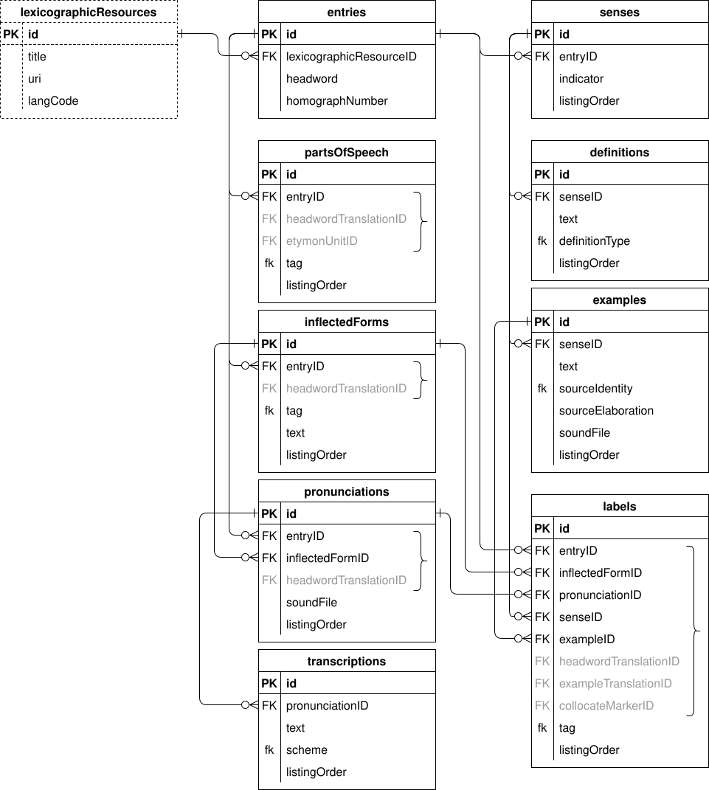

#### 5.4.2.2 Database diagram: DMLex Crosslingual Module <a id='5-4-2-2-database-diagram-dmlex-crosslingual-module'></a>

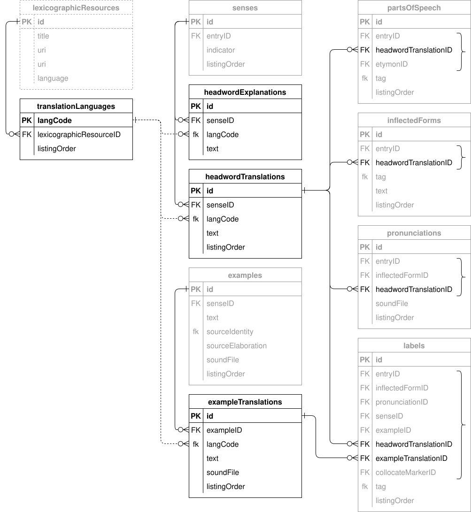

#### 5.4.2.3 Database diagram: DMLex Controlled Values Module <a id='5-4-2-3-database-diagram-dmlex-controlled-values-module'></a>

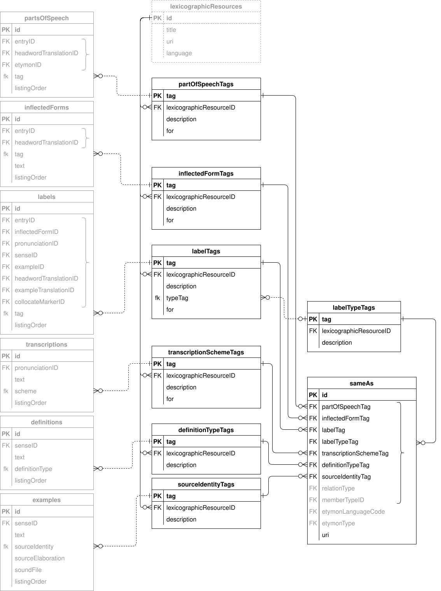

#### 5.4.2.4 Database diagram: DMLex Linking Module <a id='5-4-2-4-database-diagram-dmlex-linking-module'></a>

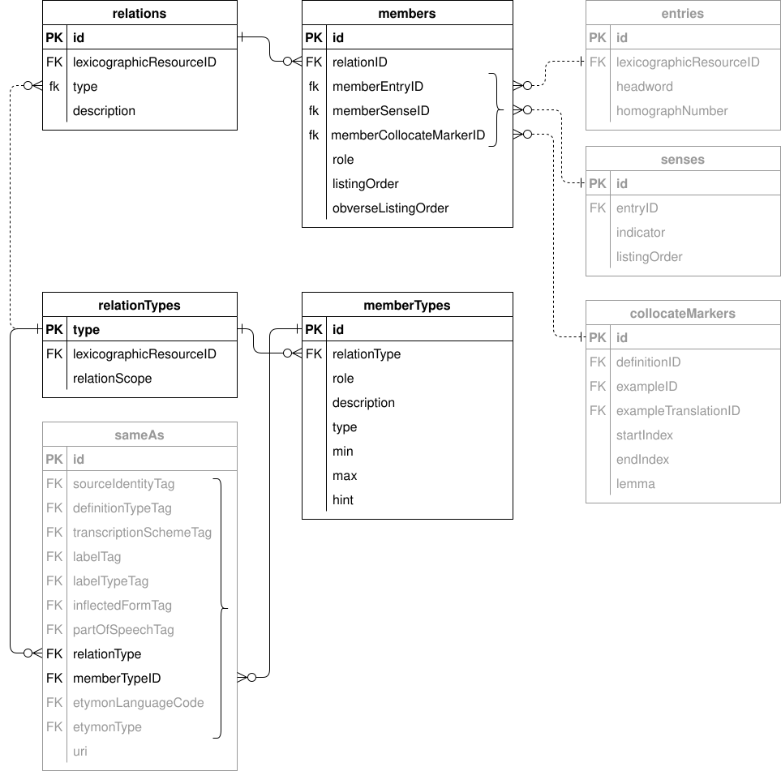

#### 5.4.2.5 Database diagram: DMLex Annotation Module <a id='5-4-2-5-database-diagram-dmlex-annotation-module'></a>

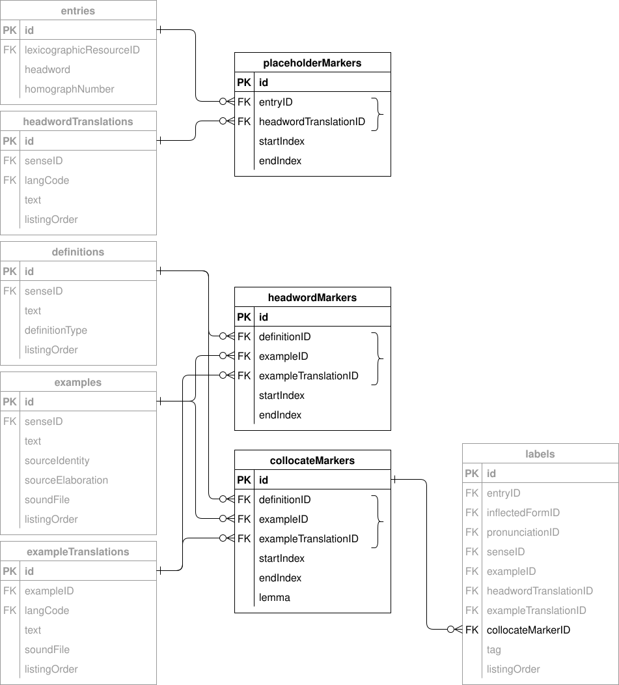

#### 5.4.2.6 Database diagram: DMLex Etymology Module <a id='5-4-2-6-database-diagram-dmlex-etymology-module'></a>

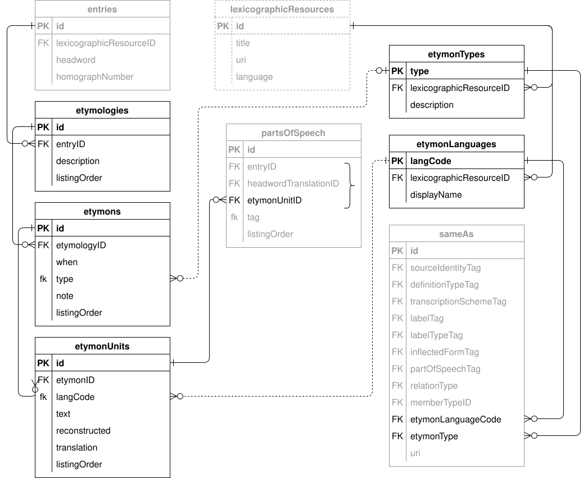

### 5.4.3 DMLex relational database serialization tables (Normative) <a id='RDBTables'></a>

#### 5.4.3.1 Database table: `lexicographicResources` <a id='rdb_lexicographicResources'></a>

Implements the [lexicographicResource](#core_lexicographicResource) object type.

**Columns**

- `id: int`, primary key

- `title: nvarchar`

- `uri: nvarchar`

- `langCode: varchar`

**Comment**

- If the database is designed to contain only one lexicographic resource then this table, including all foreign keys in other tables that reference it, is not REQUIRED to be implemented.

#### 5.4.3.2 Database table: `entries` <a id='rdb_entries'></a>

Implements the [entry](#core_entry) object type.

**Columns**

- `id: int`, primary key

- `lexicographicResourceID: int`, foreign key, references column `id` of table [`lexicographicResources`](#rdb_lexicographicResources)

- `headword: nvarchar`

- `homographNumber: int`

#### 5.4.3.3 Database table: `partsOfSpeech` <a id='rdb_partsOfSpeech'></a>

Implements the [partOfSpeech](#core_partOfSpeech) object type.

**Columns**

- `id: int`, primary key

- `entryID: int`, foreign key, references column `id` of table [`entries`](#rdb_entries)

- `tag: nvarchar`, optionally a foreign key referencing column `tag` of table [`partOfSpeechTags`](#rdb_partOfSpeechTags)

- `listingOrder: int`

**Columns if implementing the Crosslingual Module**

- `headwordTranslationID: int`, foreign key, references column `id` of table [`headwordTranslations`](#rdb_headwordTranslations)

**Columns if implementing the Etymology Module**

- `etymonUnitID: int`, foreign key, references column `id` of table [`etymonUnits`](#rdb_etymonUnits)

**Constraint**

- Exactly one of the foreign keys `entryID`, `headwordTranslationID` and `etymonID` is REQUIRED to be non-empty.

#### 5.4.3.4 Database table: `inflectedForms` <a id='rdb_inflectedForms'></a>

Implements the [inflectedForm](#core_inflectedForm) object type.

**Columns**

- `id: int`, primary key

- `entryID: int`, foreign key, references column `id` of table [`entries`](#rdb_entries)

- `tag: nvarchar`, optionally a foreign key referencing column `tag` of table [`inflectedFormTags`](#rdb_inflectedFormTags)

- `text: nvarchar`

- `listingOrder: int`

**Columns if implementing the Crosslingual Module**

- `headwordTranslationID: int`, foreign key, references column `id` of table [`headwordTranslations`](#rdb_headwordTranslations)

**Constraint**

- Exactly one of the foreign keys `entryID` and `headwordTranslationID` is REQUIRED to be non-empty.

#### 5.4.3.5 Database table: `senses` <a id='rdb_senses'></a>

Implements the [sense](#core_sense) object type.

**Columns**

- `id: int`, primary key

- `entryID: int`, foreign key, references column `id` of table [`entries`](#rdb_entries)

- `indicator: nvarchar`

- `listingOrder: int`

#### 5.4.3.6 Database table: `definitions` <a id='rdb_definitions'></a>

Implements the [definition](#core_definition) object type.

**Columns**

- `id: int`, primary key

- `senseID: int`, foreign key, references column `id` of table [`senses`](#rdb_senses)

- `text: nvarchar`

- `definitionType: nvarchar`, optionally a foreign key referencing column `tag` of table [`definitionTypeTags`](#rdb_definitionTypeTags)

- `listingOrder: int`

#### 5.4.3.7 Database table: `labels` <a id='rdb_labels'></a>

Implements the [label](#core_label) object type.

**Columns**

- `id: int`, primary key

- `entryID: int`, foreign key, references column `id` of table [`entries`](#rdb_entries)

- `inflectedFormID: int`, foreign key, references column `id` of table [`inflectedForms`](#rdb_inflectedForms)

- `pronunciationID: int`, foreign key, references column `id` of table [`pronunciations`](#rdb_pronunciations)

- `senseID: int`, foreign key, references column `id` of table [`senses`](#rdb_senses)

- `exampleID: int`, foreign key, references column `id` of table [`examples`](#rdb_examples)

- `tag: nvarchar`, optionally a foreign key referencing column `tag` of table [`labelTags`](#rdb_labelTags)

- `listingOrder: int`

**Columns if implementing the Crosslingual Module**

- `headwordTranslationID: int`, foreign key, references column `id` of table [`headwordTranslations`](#rdb_headwordTranslations)

- `exampleTranslationID: int`, foreign key, references column `id` of table [`exampleTranslations`](#rdb_exampleTranslations)

**Columns if implementing the Annotation Module**

- `collocateMarkerID: int`, foreign key, references column `id` of table [`collocateMarkers`](#rdb_collocateMarkers)

**Constraint**

- Exactly one of the foreign keys `entryID`, `inflectedFormID`, `pronunciationID`, `senseID`, `exampleID`, `headwordTranslationID`, `exampleTranslationID` and `collocateMarkerID` is REQUIRED to be non-empty.

#### 5.4.3.8 Database table: `pronunciations` <a id='rdb_pronunciations'></a>

Implements the [pronunciation](#core_pronunciation) object type.

**Columns**

- `id: int`, primary key

- `entryID: int`, foreign key, references column `id` of table [`entries`](#rdb_entries)

- `inflectedFormID: int`, foreign key, references column `id` of table [`inflectedForms`](#rdb_inflectedForms)

- `soundFile: nvarchar`

- `listingOrder: int`

**Columns if implementing the Crosslingual Module**

- `headwordTranslationID: int`, foreign key, references column `id` of table [`headwordTranslations`](#rdb_headwordTranslations)

**Constraint**

- Exactly one of the foreign keys `entryID`, `inflectedFormID` and `headwordTranslationID` is REQUIRED to be non-empty.

#### 5.4.3.9 Database table: `transcriptions` <a id='rdb_transcriptions'></a>

Implements the [transcription](#core_transcription) object type.

**Columns**

- `id: int`, primary key

- `pronunciationID: int`, foreign key, references column `id` of table [`pronunciations`](#rdb_pronunciations)

- `text: nvarchar`

- `scheme: nvarchar`, optionally a foreign key referencing column `tag` of table [`transcriptionSchemeTags`](#rdb_transcriptionSchemeTags)

- `listingOrder: int`

#### 5.4.3.10 Database table: `examples` <a id='rdb_examples'></a>

Implements the [example](#core_example) object type.

**Columns**

- `id: int`, primary key

- `senseID: int`, foreign key, references column `id` of table [`senses`](#rdb_senses)

- `text: nvarchar`

- `sourceIdentity: nvarchar`, optionally a foreign key referencing column `tag` of table [`sourceIdentityTags`](#rdb_sourceIdentityTags)

- `sourceElaboration: nvarchar`

- `soundFile: nvarchar`

- `listingOrder: int`

#### 5.4.3.11 Database table: `translationLanguages` <a id='rdb_translationLanguages'></a>

Implements the [translationLanguage](#xlingual_translationLanguage) object type from the Crosslingual Module.

**Columns**

- `langCode: varchar`, primary key

- `lexicographicResourceID: int`, foreign key, references column `id` of table [`lexicographicResources`](#rdb_lexicographicResources)

- `listingOrder: int`

#### 5.4.3.12 Database table: `headwordTranslations` <a id='rdb_headwordTranslations'></a>

Implements the [headwordTranslation](#xlingual_headwordTranslation) object type from the Crosslingual Module.

**Columns**

- `id: int`, primary key

- `senseID: int`, foreign key, references column `id` of table [`senses`](#rdb_senses)

- `langCode: varchar`, optionally a foreign key referencing column `langCode` of table [`translationLanguages`](#rdb_translationLanguages)

- `text: nvarchar`

- `listingOrder: int`

#### 5.4.3.13 Database table: `headwordExplanations` <a id='rdb_headwordExplanations'></a>

Implements the [headwordExplanation](#xlingual_headwordExplanation) object type from the Crosslingual Module.

**Columns**

- `id: int`, primary key

- `senseID: int`, foreign key, references column `id` of table [`senses`](#rdb_senses)

- `langCode: varchar`, optionally a foreign key referencing column `langCode` of table [`translationLanguages`](#rdb_translationLanguages)

- `text: nvarchar`

#### 5.4.3.14 Database table: `exampleTranslations` <a id='rdb_exampleTranslations'></a>

Implements the [exampleTranslation](#xlingual_exampleTranslation) object type from the Crosslingual Module.

**Columns**

- `id: int`, primary key

- `exampleID: int`, foreign key, references column `id` of table [`examples`](#rdb_examples)

- `langCode: varchar`, foreign key, references column `langCode` of table [`translationLanguages`](#rdb_translationLanguages)

- `text: nvarchar`

- `soundFile: nvarchar`

- `listingOrder: int`

#### 5.4.3.15 Database table: `definitionTypeTags` <a id='rdb_definitionTypeTags'></a>

Implements the [definitionTypeTag](#values_definitionTypeTag) object type from the Controlled Values Module.

**Columns**

- `tag: nvarchar`, primary key

- `lexicographicResourceID: int`, foreign key, references column `id` of table [`lexicographicResources`](#rdb_lexicographicResources)

- `description: nvarchar`

#### 5.4.3.16 Database table: `inflectedFormTags` <a id='rdb_inflectedFormTags'></a>

Implements the [inflectedFormTags](#values_inflectedFormTag) object type from the Controlled Values Module.

**Columns**

- `tag: nvarchar`, primary key

- `lexicographicResourceID: int`, foreign key, references column `id` of table [`lexicographicResources`](#rdb_lexicographicResources)

- `description: nvarchar`

- `for: nvarchar`

#### 5.4.3.17 Database table: `labelTags` <a id='rdb_labelTags'></a>

Implements the [labelTag](#values_labelTag) object type from the Controlled Values Module.

**Columns**

- `tag: nvarchar`, primary key

- `lexicographicResourceID: int`, foreign key, references column `id` of table [`lexicographicResources`](#rdb_lexicographicResources)

- `description: nvarchar`

- `typeTag: nvarchar`, optionally a foreign key referencing column `tag` of table [`labelTypeTags`](#rdb_lexicographicResources)

- `for: nvarchar`

#### 5.4.3.18 Database table: `labelTypeTags` <a id='rdb_labelTypeTags'></a>

Implements the [labelTypeTag](#values_labelTypeTag) object type from the Controlled Values Module.

**Columns**

- `tag: nvarchar`, primary key

- `lexicographicResourceID: int`, foreign key, references column `id` of table [`lexicographicResources`](#rdb_lexicographicResources)

- `description: nvarchar`

#### 5.4.3.19 Database table: `partOfSpeechTags` <a id='rdb_partOfSpeechTags'></a>

Implements the [partOfSpeechTag](#values_partOfSpeechTag) object type from the Controlled Values Module.

**Columns**

- `tag: nvarchar`, primary key

- `lexicographicResourceID: int`, foreign key, references column `id` of table [`lexicographicResources`](#rdb_lexicographicResources)

- `description: nvarchar`

- `for: nvarchar`

#### 5.4.3.20 Database table: `sourceIdentityTags` <a id='rdb_sourceIdentityTags'></a>

Implements the [sourceIdentityTag](#values_sourceIdentityTag) object type from the Controlled Values Module.

**Columns**

- `tag: nvarchar`, primary key

- `lexicographicResourceID: int`, foreign key, references column `id` of table [`lexicographicResources`](#rdb_lexicographicResources)

- `description: nvarchar`

#### 5.4.3.21 Database table: `transcriptionSchemeTags` <a id='rdb_transcriptionSchemeTags'></a>

Implements the [transcriptionSchemeTag](#values_transcriptionSchemeTag) object type from the Controlled Values Module.

**Columns**

- `tag: nvarchar`, primary key

- `lexicographicResourceID: int`, foreign key, references column `id` of table [`lexicographicResources`](#rdb_lexicographicResources)

- `description: nvarchar`

- `for: nvarchar`

#### 5.4.3.22 Database table: `sameAs` <a id='rdb_sameAs'></a>

Implements the [sameAs](#values_sameAs) object type from the Controlled Values Module.

**Columns**

- `id: int`, primary key

- `sourceIdentityTag: nvarchar`, foreign key, references column `tag` of table [`sourceIdentityTags`](#rdb_sourceIdentityTags)

- `definitionTypeTag: nvarchar`, foreign key, references column `tag` of table [`definitionTypeTags`](#rdb_definitionTypeTags)

- `transcriptionSchemeTag: nvarchar`, foreign key, references column `tag` of table [`transcriptionSchemeTags`](#rdb_transcriptionSchemeTags)

- `labelTag: nvarchar`, foreign key, references column `tag` of table [`labelTags`](#rdb_labelTags)

- `labelTypeTag: nvarchar`, foreign key, references column `tag` of table [`labelTypeTags`](#rdb_labelTypeTags)

- `inflectedFormTag: nvarchar`, foreign key, references column `tag` of table [`inflectedFormTags`](#rdb_inflectedFormTags)

- `partOfSpeechTag: nvarchar`, foreign key, references column `tag` of table [`partOfSpeechTags`](#rdb_partOfSpeechTags)

- `uri: nvarchar`

**Columns if implementing the Linking Module**

- `relationType: nvarchar`, foreign key, references column `type` of table [`relationTypes`](#rdb_relationTypes)

- `memberTypeID: int`, foreign key, references column `id` of table [`memberTypes`](#rdb_relationTypes)

**Columns if implementing the Etymology Module**

- `etymonLanguageCode: nvarchar`, foreign key, references column `langCode` of table [`etymonLanguages`](#rdb_etymonLanguages)

- `etymonType: nvarchar`, foreign key, references column `type` of table [`etymonTypes`](#rdb_etymonTypes)

**Constraint**

- Exactly one of the foreign keys `sourceIdentityTag`, `definitionTypeTag`, `transcriptionSchemeTag`, `labelTag`, `labelTypeTag`, `inflectedFormTag`, `partOfSpeechTag`, `relationType`, `memberTypeID` `etymonLanguageCode` and `etymonType` is REQUIRED to be non-empty.

#### 5.4.3.23 Database table: `relations` <a id='rdb_relations'></a>

Implements the [relation](#linking_relation) object type from the Linking Module.

**Columns**

- `id: int`, primary key

- `lexicographicResourceID: int`, foreign key, references column `id` of table [`lexicographicResources`](#rdb_lexicographicResources)

- `type: nvarchar`, optionally a foreign key referencing column `type` of table [`relationTypes`](#rdb_relationTypes)

- `description: nvarchar`

#### 5.4.3.24 Database table: `members` <a id='rdb_members'></a>

Implements the [member](#linking_member) object type from the Linking Module.

**Columns**

- `id: int`, primary key

- `relationID: int`, foreign key, references column `id` of table [`relations`](#rdb_relations)

- `memberEntryID: int`, foreign key, references column `id` of table [`entries`](#rdb_entries)

- `memberSenseID: int`, foreign key, references column `id` of table [`senses`](#rdb_senses)

- `role: nvarchar`

- `listingOrder: int`

- `obverseListingOrder: int`

**Columns if implementing the Annotation Module**

- `memberCollocateMarkerID: int`, foreign key, references column `id` of table [`entries`](#rdb_entries)

**Constraint**

- Exactly one of the foreign keys `memberEntryID`, `memberSenseID` and `memberCollocateMakerID` is REQUIRED to be non-empty.

#### 5.4.3.25 Database table: `relationTypes` <a id='rdb_relationTypes'></a>

Implements the [relationType](#linking_relationType) object type from the Linking Module.

**Columns**

- `type: nvarchar`, primary key

- `lexicographicResourceID: int`, foreign key, references column `id` of table [`lexicographicResources`](#rdb_lexicographicResources)

- `relationScope: nvarchar`

#### 5.4.3.26 Database table: `memberTypes` <a id='rdb_memberTypes'></a>

Implements the [memberType](#linking_memberType) object type from the Linking Module.

**Columns**

- `id: int`, primary key

- `relationType: nvarchar`, foreign key, references column `type` of table [`relationType`](#rdb_relationTypes)

- `role: nvarchar`

- `description: nvarchar`

- `type: nvarchar`

- `min: int`

- `max: int`

- `hint: varchar`

#### 5.4.3.27 Database table: `placeholderMarkers` <a id='rdb_placeholderMarkers'></a>

Implements the [placeholderMarker](#annotation_placeholderMarker) object type from the Annotation Module.

**Columns**

- `id: int`, primary key

- `entryID: int`, foreign key, references column `id` of table [`entries`](#rdb_entries)

- `startIndex: int`

- `endIndex: int`

**Columns if implementing the Crosslingual Module**

- `headwordTranslationID: int`, foreign key, references column `id` of table [`headwordTranslations`](#rdb_headwordTranslations)

**Constraint**

- Exactly one of the foreign keys `entryID` and `headwordTranslationID`, is REQUIRED to be non-empty.

#### 5.4.3.28 Database table: `headwordMarkers` <a id='rdb_headwordMarkers'></a>

Implements the [headwordMarker](#annotation_headwordMarker) object type from the Annotation Module.

**Columns**

- `id: int`, primary key

- `definitionID: int`, foreign key, references column `id` of table [`definitions`](#rdb_definitions)

- `exampleID: int`, foreign key, references column `id` of table [`examples`](#rdb_examples)

- `startIndex: int`

- `endIndex: int`

**Columns if implementing the Crosslingual Module**

- `exampleTranslationID: int`, foreign key, references column `id` of table [`exampleTranslations`](#rdb_exampleTranslations)

**Constraint**

- Exactly one of the foreign keys `definitionID`, `exampleID` and `exampleTranslationID`, is REQUIRED to be non-empty.

#### 5.4.3.29 Database table: `collocateMarkers` <a id='rdb_collocateMarkers'></a>

Implements the [collocateMarker](#annotation_collocateMarker) object type from the Annotation Module.

**Columns**

- `id: int`, primary key

- `definitionID: int`, foreign key, references column `id` of table [`definitions`](#rdb_definitions)

- `exampleID: int`, foreign key, references column `id` of table [`examples`](#rdb_examples)

- `startIndex: int`

- `endIndex: int`

- `lemma: nvarchar`

**Columns if implementing the Crosslingual Module**

- `exampleTranslationID: int`, foreign key, references column `id` of table [`exampleTranslations`](#rdb_exampleTranslations)

**Constraint**

- Exactly one of the foreign keys `definitionID`, `exampleID` and `exampleTranslationID`, is REQUIRED to be non-empty.

#### 5.4.3.30 Database table: `etymologies` <a id='rdb_etymologies'></a>

Implements the [etymology](#etymology_etymology) object type from the Etymology Module.

**Columns**

- `id: int`, primary key

- `entryID: int`, foreign key, references column `id` of table [`entries`](#rdb_entries)

- `description: nvarchar`

- `listingOrder: int`

#### 5.4.3.31 Database table: `etymons` <a id='rdb_etymons'></a>

Implements the [etymon](#etymology_etymon) object type from the Etymology Module.

**Columns**

- `id: int`, primary key

- `etymologyID: int`, foreign key, references column `id` of table [`etymologies`](#rdb_etymologies)

- `when: nvarchar`

- `type: nvarchar`, optionally a foreign key referencing column `type` of table [`etymonTypes`](#rdb_etymonTypes)

- `note: nvarchar`

- `listingOrder: int`

#### 5.4.3.32 Database table: `etymonUnits` <a id='rdb_etymonUnits'></a>

Implements the [etymonUnit](#etymology_etymonUnit) object type from the Etymology Module.

**Columns**

- `id: int`, primary key

- `etymonID: int`, foreign key, references column `id` of table [`etymons`](#rdb_etymons)

- `langCode: nvarchar`, optionally a foreign key referencing column `langCode` of table [`etymonLanguages`](#rdb_etymonLanguages)

- `text: nvarchar`

- `reconstructed: bit`

- `translation: nvarchar`

- `listingOrder: int`

#### 5.4.3.33 Database table: `etymonTypes` <a id='rdb_etymonTypes'></a>

Implements the [etymonType](#etymology_etymonType) object type from the Etymology Module.

**Columns**

- `type: nvarchar`, primary key

- `lexicographicResourceID: int`, foreign key, references column `id` of table [`lexicographicResources`](#rdb_lexicographicResources)

- `description: nvarchar`

#### 5.4.3.34 Database table: `etymonLanguages` <a id='rdb_etymonLanguages'></a>

Implements the [etymonLanguage](#etymology_etymonLanguage) object type from the Etymology Module.

**Columns**

- `langCode: nvarchar`, primary key

- `lexicographicResourceID: int`, foreign key, references column `id` of table [`lexicographicResources`](#rdb_lexicographicResources)

- `displayName: nvarchar`

# Appendix A Informative material on serializations (Informative) <a id='appendix-a-informative-material-on-serializations-informative'></a>

## A.1 Examples (Informative) <a id='examples'></a>

This section gives examples which show how to use DMLex to model lexicographic resources. Each example is shown in pseudocode first to demonstrate the object model at an abstract level. After that, each example is shown in XML and JSON. The XML and JSON encoding shown here follows DMLex’s own implementation guidance for XML and JSON.

In the pseudocode, `relation` objects use alphanumeric IDs to indicate which entries or senses they point to, for example `microscope-1` and `der-ozean-1`. These IDs are used here instead of [fragment identification strings](#fragid) for easier readibility.

### A.1.1 A basic entry <a id='ex00'></a>

This is a basic, beginner-level example of how to use DMLex to represent a simple monolingual lexicographic resource consisting of one entry with two senses. It demonstrates some of the basic features of DMLex Core: how to subdivide a entry into senses, how attach various data such as definition, part-of-speech labels to entries and senses, and how to add labels to various objects such as senses and examples.

*Example A.1. Pseudocode*

```
- lexicographicResource (uri: http://example.com, langCode: en)
    - entry (headword: abandon)
        - partOfSpeech (tag: verb)
        - sense
            - definition (text: to suddenly leave a place or a person)
            - example (text: I'm sorry I abandoned you like that.)
            - example (text: Abandon ship!)
                - label (tag: idiom)
        - sense
            - label (tag: mostly-passive)
            - definition (text: to stop supporting an idea)
            - example (text: That theory has been abandoned.)
```

*Example A.2. XML*

```xml
<lexicographicResource title="Example Dictionary" 
    uri="http://example.com" langCode="en"
    xmlns="http://docs.oasis-open.org/lexidma/ns/dmlex-1.0">
    <entry id="abandon-verb">
        <headword>abandon</headword>
            <partOfSpeech tag="verb"/>
        <sense id="abandon-verb-1">
            <definition>
                <text>to suddenly leave a place or a person</text>
            </definition>
            <example>
                <text>I'm sorry I abandoned you like that.</text>
            </example>
            <example>
                <text>Abandon ship!</text>
                <label tag="idiom"/>
            </example>
        </sense>
        <sense id="abandon-verb-2">
            <label tag="mostly-passive"/>
            <definition>
                <text>to stop supporting an idea</text>
            </definition>
            <example>
                <text>That theory has been abandoned.</text>
            </example>
        </sense>
    </entry>
</lexicographicResource>
```

*Example A.3. JSON*

```json
{
    "uri": "http://example.com",
    "langCode": "en",
    "title": "Example Dictionary",
    "entries": [{
        "id": "abandon-verb",
        "headword": "abandon",
        "partsOfSpeech": ["verb"],
        "senses": [{
            "id": "abandon-verb-1",
            "definitions": [{
                "text": "to suddenly leave a place or a person"
            }],
            "examples": [{
                "text": "I'm sorry I abandoned you like that."
            }, {
            "text": "Abandon ship!",
            "labels": ["idiom"]
            }]
        }, {
            "id": "abandon-verb-2",
            "labels": ["mostly-passive"],
            "definitions": [{"text":"to stop supporting an idea"}],
            "examples": [{
                "text": "That theory has been abandoned."
            }]
        }]
    }]
}
```

*Example A.4. RDF*

```xml
ex:lexicon a dmlex:LexicographicResource;
  dmlex:title "Example Dictionary";
  dmlex:uri "http://example.com";
  dmlex:langCode "en";
  dmlex:entry ex:abandon-verb.
ex:abandon-verb a dmlex:Entry;
  dmlex:sense ex:abandon-verb-1,
    ex:abandon-verb-2;
  dmlex:partOfSpeech [ 
      dmlex:tag "verb";
      dmlex:listingOrder "1"^^xsd:unsignedInt ];
  dmlex:headword "abandon".
ex:abandon-verb-1 a dmlex:Sense;
  dmlex:definition [ a dmlex:Definition;
      dmlex:text "to suddenly leave a place or a person";
      dmlex:listingOrder "1"^^xsd:unsignedInt ];
  dmlex:example [ a dmlex:Example;
      dmlex:text "I'm sorry I abandoned you like that.";
      dmlex:listingOrder "1"^^xsd:unsignedInt ],
    [ a dmlex:Example;
      dmlex:text "Abandon ship!";
      dmlex:label [ 
          dmlex:listingOrder "1"^^xsd:unsignedInt;
          dmlex:tag "idiom" ];
      dmlex:listingOrder "2"^^xsd:unsignedInt ];
  dmlex:listingOrder "1"^^xsd:unsignedInt.
ex:abandon-verb-2 a dmlex:Sense;
  dmlex:listingOrder "2"^^xsd:unsignedInt;
  dmlex:label [ 
      dmlex:tag "mostly-passive";
      dmlex:listingOrder "1"^^xsd:unsignedInt ];
  dmlex:example [ a dmlex:Example;
      dmlex:listingOrder "1"^^xsd:unsignedInt;
      dmlex:text "That theory has been abandoned." ];
  dmlex:definition [ a dmlex:Definition;
      dmlex:listingOrder "1"^^xsd:unsignedInt;
      dmlex:text "to stop supporting an idea" ].
```

*Example A.5. NVH*

```xml
lexicographicResource: http://example.com
  langCode: en
  entry: abandon
    pos: verb
    sense:
      definition: to suddenly leave a place or a person
      example: I'm sorry I abandoned you like that.
      example: Abandon ship!
        label: idiom
    sense:
      label: mostly-passive
      definition: to stop supporting an idea
      example: That theory has been abandoned.
```

### A.1.2 How to use `inflectedForm` <a id='ex01'></a>

This is an entry from a hypothetical Irish dictionary for the headword "folúsghlantóir" ("vacuum cleaner") which gives its two inflected forms, the singular genitive and the plural.

*Example A.6. Pseudocode*

```
- entry (headword: folúsghlantóir)
    - partOfSpeech (tag: n-masc)
    - inflectedForm (tag: sg-gen, text: folúsghlantóra)
    - inflectedForm (tag: pl, text: folúsghlantóirí)
    - sense...
```

*Example A.7. XML*

```xml
<entry id="folúsghlantóir-n"
    xmlns="http://docs.oasis-open.org/lexidma/ns/dmlex-1.0">
    <headword>folúsghlantóir</headword>
    <partOfSpeech tag="n-masc"/>
    <inflectedForm tag="sg-gen">
        <text>folúsghlantóra</text>
    </inflectedForm>
    <inflectedForm tag="pl">
        <text>folúsghlantóirí</text>
    </inflectedForm>
</entry>
```

*Example A.8. JSON*

```json
{
    "id": "folúsghlantóir-n",
    "headword": "folúsghlantóir",
    "partsOfSpeech": ["n-masc"],
    "inflectedForms": [{
        "tag": "sg-gen",
        "text": "folúsghlantóra"
        }, {
        "tag": "pl",
        "text": "folúsghlantóirí"
    }],
    "senses": []
}
```

*Example A.9. RDF*

```xml
ex:folúsghlantóir-n a dmlex:Entry;
  dmlex:headword "folúsghlantóir";
  dmlex:partOfSpeech [ 
      dmlex:listingOrder "1"^^xsd:unsignedInt;
      dmlex:tag "n-masc" ].
```

*Example A.10. NVH*

```xml
entry: folúsghlantóir
  pos: n-masc
  form: folúsghlantóra
    tag: sg-gen
  form: folúsghlantóirí
    tag: pl
  sense: ...
```

### A.1.3 Pronunciation given as transcription <a id='ex02'></a>

*Example A.11. Pseudocode*

```
- entry (headword: aardvark)
    - pronunciation
        - transcription (text: a:rdva:rk)
    - sense...
```

*Example A.12. XML*

```xml
<entry id="aardvark-noun"
    xmlns="http://docs.oasis-open.org/lexidma/ns/dmlex-1.0">
    <headword>aardvark</headword>
    <pronunciation>
        <transcription>
            <text>a:rdva:rk</text>
        </transcription>
    </pronunciation>
</entry>
```

*Example A.13. JSON*

```json
{
    "id": "aardvark-noun",
    "headword": "aardvark",
    "pronunciations": [{
        "transcriptions": [{"text": "a:rdva:rk"}]
    }],
    "senses": []
}
```

*Example A.14. RDF*

```xml
ex:aardvark-noun a dmlex:Entry;
  dmlex:headword "aardvark";
  dmlex:pronunciation [ a dmlex:Pronunciation;
      dmlex:transcription [ a dmlex:Transcription;
          dmlex:text "a:rdva:rk";
          dmlex:listingOrder "1"^^xsd:unsignedInt ];
      dmlex:listingOrder "1"^^xsd:unsignedInt ].
```

*Example A.15. NVH*

```xml
entry: aardvark
  pronunciation:
    transcription: a:rdva:rk
  sense: ...
```

### A.1.4 Pronunciation given as a sound file <a id='ex03'></a>

*Example A.16. Pseudocode*

```
- entry (headword: aardvark)
    - pronunciation (soundFile: aardvark.mp3)
    - sense: ...
```

*Example A.17. XML*

```xml
<entry id="aardvark-noun"
    xmlns="http://docs.oasis-open.org/lexidma/ns/dmlex-1.0">
    <headword>aardvark</headword>
    <pronunciation soundFile="aardvark.mp3"/>
</entry>
```

*Example A.18. JSON*

```json
{
    "id": "aardvark-noun",
    "headword": "aardvark",
    "pronunciations": [{
        "soundFile": "aardvark.mp3"
    }],
    "senses": []
}
```

*Example A.19. RDF*

```xml
ex:aardvark-noun a dmlex:Entry;
  dmlex:pronunciation [ a dmlex:Pronunciation;
      dmlex:listingOrder "1"^^xsd:unsignedInt;
      dmlex:soundFile "aardvark.mp3" ];
  dmlex:headword "aardvark".
```

*Example A.20. NVH*

```xml
entry: aardvark
  pronunciation: aardvark.mp3
  sense: ...
```

### A.1.5 Pronunciation given both ways <a id='ex04'></a>

*Example A.21. Pseudocode*

```
- entry (headword: aardvark)
    - pronunciation (soundFile: aardvark.mp3)
        - transcription (text: a:rdva:rk)
    - sense: ...
```

*Example A.22. XML*

```xml
<entry id="aardvark-noun"
    xmlns="http://docs.oasis-open.org/lexidma/ns/dmlex-1.0">
    <headword>aardvark</headword>
    <pronunciation soundFile="aardvark.mp3">
        <transcription>
            <text>a:rdva:rk</text>
        </transcription>
    </pronunciation>
</entry>
```

*Example A.23. JSON*

```json
{
    "id": "aardvark-noun",
    "headword": "aardvark",
    "pronunciations": [{
        "soundFile": "aardvark.mp3",
        "transcriptions": [{"text": "a:rdva:rk"}]
    }],
    "senses": []
}
```

*Example A.24. RDF*

```xml
ex:aardvark-noun a dmlex:Entry;
  dmlex:pronunciation [ a dmlex:Pronunciation;
      dmlex:soundFile "aardvark.mp3";
      dmlex:listingOrder "1"^^xsd:unsignedInt;
      dmlex:transcription [ a dmlex:Transcription;
          dmlex:listingOrder "1"^^xsd:unsignedInt;
          dmlex:text "a:rdva:rk" ] ];
  dmlex:headword "aardvark".
```

*Example A.25. NVH*

```xml
entry: aardvark
  pronunciation: aardvark.mp3
    transcription: a:rdva:rk
  sense: ...
```

### A.1.6 How to use `partOfSpeechTag` and `inflectedFormTag` <a id='ex05'></a>

This is an entry from a hypothetical Irish dictionary for the headword "folúsghlantóir" ("vacuum cleaner"). The meaning of the various tags used in this entry is explained in the `partOfSpeechTag` and `inflectedFormTag` objects.

*Example A.26. Pseudocode*

```
- lexicographicResource (uri: http://example.com, langCode: ga)
    - entry (headword: folúsghlantóir)
        - partOfSpeech (tag: n-masc)
        - inflectedForm (tag: sg-gen, text: folúsghlantóra)
        - inflectedForm (tag: pl, text: folúsghlantóirí)
        - sense: ...
    - partOfSpeechTag (tag: n-masc, description: masculine noun)
    - partOfSpeechTag (tag: n-fem, description: feminine noun)
    - inflectedFormTag (tag: sg-gen, description: singular genitive)
    - inflectedFormTag (tag: pl, description: plural)
```

*Example A.27. XML*

```xml
<lexicographicResource uri="http://example.com" langCode="ga"
    xmlns="http://docs.oasis-open.org/lexidma/ns/dmlex-1.0">
    <entry id="folúsghlantóir-n">
        <headword>folúsghlantóir</headword>
        <partOfSpeech tag="n-masc"/>
        <inflectedForm tag="sg-gen">
            <text>folúsghlantóra</text>
        </inflectedForm>
        <inflectedForm tag="pl">
            <text>folúsghlantóirí</text>
        </inflectedForm>
    </entry>
    <inflectedFormTag tag="sg-gen" for="n-masc n-fem">
        <description>singular genitive</description>
    </inflectedFormTag>
    <inflectedFormTag tag="pl" for="n-masc n-fem">
        <description>plural</description>
    </inflectedFormTag>
    <partOfSpeechTag tag="n-masc">
        <description>masculine noun</description>
    </partOfSpeechTag>
    <partOfSpeechTag tag="n-fem">
        <description>feminine noun</description>
    </partOfSpeechTag>
</lexicographicResource>
```

*Example A.28. JSON*

```json
{
    "uri": "http://example.com",
    "langCode": "ga",
    "entries": [{
        "id": "folúsghlantóir-n",
        "headword": "folúsghlantóir",
        "partsOfSpeech": ["n-masc"],
        "inflectedForms": [{
            "tag": "sg-gen",
            "text": "folúsghlantóra"
        }, {
            "tag": "pl",
            "text": "folúsghlantóirí"
        }],
        "senses": []
    }],
    "partOfSpeechTags": [{
        "tag": "n-masc",
        "description": "masculine noun"
    }, {
    "tag": "n-fem",
    "description": "feminine noun"
    }],
    "inflectedFormTags": [{
        "tag": "sg-gen",
        "description": "singular genitive",
        "for": "n-masc n-fem"
    }, {
        "tag": "pl",
        "description": "plural",
        "for": "n-masc n-fem"
    }]
}
```

*Example A.29. RDF*

```xml
ex:lexicon a dmlex:LexicographicResource;
  dmlex:inflectedFormTag [ a dmlex:InflectedFormTag;
      dmlex:description "singular genitive";
      dmlex:for "n-masc n-fem" ;
      dmlex:tag "sg-gen" ],
    [ a dmlex:InflectedFormTag;
      dmlex:tag "pl";
      dmlex:for "n-masc n-fem" ;
      dmlex:description "plural" ];
  dmlex:partOfSpeechTag [ a dmlex:PartOfSpeechTag;
      dmlex:tag "n-fem";
      dmlex:description "feminine noun" ],
    [ a dmlex:PartOfSpeechTag;
      dmlex:description "masculine noun";
      dmlex:tag "n-masc" ];
  dmlex:uri "http://example.com";
  dmlex:langCode "ga";
  dmlex:entry ex:folúsghlantóir-n.
ex:folúsghlantóir-n a dmlex:Entry;
  dmlex:partOfSpeech [ 
      dmlex:listingOrder "1"^^xsd:unsignedInt;
      dmlex:tag "n-masc" ];
  dmlex:headword "folúsghlantóir".
```

*Example A.30. NVH*

```xml
lexicographicResource: http://example.com
  langCode: ga
  entry: folúsghlantóir
    pos: n-masc
    form: folúsghlantóra
      tag: sg-gen
    form: folúsghlantóirí
      tag: pl
    sense: ...
  posTag: n-masc
    description: masculine noun
  posTag: n-fem
    description: feminine noun
  formTag: sg-gen
    description: singular genitive
  formTag: pl
    description: plural
```

### A.1.7 Mapping controlled values to external inventories <a id='ex06'></a>

This shows how to map the value of a tag such as `n-masc` and `n-fem` to items in an external inventory such as LexInfo.

*Example A.31. Pseudocode*

```
- partOfSpeechTag (tag: n-masc, description: masculine noun)
    - sameAs (uri: http://www.lexinfo.net/ontology/3.0/lexinfo#noun)
    - sameAs (uri: http://www.lexinfo.net/ontology/3.0/lexinfo#masculine)
- partOfSpeechTag (tag: n-fem, description: feminine noun)
    - sameAs (uri: http://www.lexinfo.net/ontology/3.0/lexinfo#noun)
    - sameAs (uri: http://www.lexinfo.net/ontology/3.0/lexinfo#feminine)
```

*Example A.32. XML*

```xml
<lexicographicResource langCode="en"
    xmlns="http://docs.oasis-open.org/lexidma/ns/dmlex-1.0">
    <partOfSpeechTag tag="n-masc">
        <description>masculine noun</description>
        <sameAs 
            uri="http://www.lexinfo.net/ontology/3.0/lexinfo#noun"/>
        <sameAs 
            uri="http://www.lexinfo.net/ontology/3.0/lexinfo#masculine"/>
    </partOfSpeechTag>
    <partOfSpeechTag tag="n-fem">
        <description>feminine noun</description>
        <sameAs 
            uri="http://www.lexinfo.net/ontology/3.0/lexinfo#noun"/>
        <sameAs 
            uri="http://www.lexinfo.net/ontology/3.0/lexinfo#feminine"/>
    </partOfSpeechTag>
</lexicographicResource>
```

*Example A.33. JSON*

```json
{
    "langCode": "en",
    "partOfSpeechTags": [{
        "tag": "n-masc",
        "description": "masculine noun",
        "sameAs": [
            "http://www.lexinfo.net/ontology/3.0/lexinfo#noun",
            "http://www.lexinfo.net/ontology/3.0/lexinfo#masculine"
        ]
        }, {
        "tag": "n-fem",
        "description": "feminine noun",
        "sameAs": [
            "http://www.lexinfo.net/ontology/3.0/lexinfo#noun",
            "http://www.lexinfo.net/ontology/3.0/lexinfo#feminine"
        ]
    }]
}
```

*Example A.34. RDF*

```xml
ex:lexicon a dmlex:LexicographicResource;
  dmlex:langCode "en";
  dmlex:partOfSpeechTag [ a dmlex:PartOfSpeechTag;
      dmlex:tag "n-masc";
      dmlex:description "masculine noun";
      dmlex:sameAs
        <http://www.lexinfo.net/ontology/3.0/lexinfo#noun>,
        <http://www.lexinfo.net/ontology/3.0/lexinfo#masculine> ],
    [ a dmlex:PartOfSpeechTag;
      dmlex:sameAs
        <http://www.lexinfo.net/ontology/3.0/lexinfo#feminine>,
        <http://www.lexinfo.net/ontology/3.0/lexinfo#noun>;
      dmlex:tag "n-fem";
      dmlex:description "feminine noun" ].
```

*Example A.35. NVH*

```xml
posTag: n-masc
  description: masculine noun
  sameAs: http://www.lexinfo.net/ontology/3.0/lexinfo#noun
  sameAs: uri: http://www.lexinfo.net/ontology/3.0/lexinfo#masculine
posTag: n-fem
  description: feminine noun
  sameAs: http://www.lexinfo.net/ontology/3.0/lexinfo#noun
  sameAs: http://www.lexinfo.net/ontology/3.0/lexinfo#feminine
```

### A.1.8 Defining a bilingual lexicographic resource <a id='ex07'></a>

This defines a lexicographic resource where the source language is German and the translation language is English and the English translations are going to come with pronunciation transcriptions in English IPA.

*Example A.36. Pseudocode*

```
- lexicographicResource (title: My German-English Dictionary, 
            uri: http://example.com, langCode: de)
    - translationLanguage (langCode: en)
```

*Example A.37. XML*

```xml
<lexicographicResource title="My German-English Dictionary" 
    uri="http://example.com" langCode="de"
    xmlns="http://docs.oasis-open.org/lexidma/ns/dmlex-1.0">
    <translationLanguage langCode="en"/>
</lexicographicResource>
```

*Example A.38. JSON*

```json
{
    "title": "My German-English Dictionary",
    "uri": "http://example.com",
    "langCode": "de",
    "translationLanguages": ["en"]
}
```

*Example A.39. RDF*

```xml
ex:lexicon a dmlex:LexicographicResource;
  dmlex:uri "http://example.com";
  dmlex:translationLanguage [
    dmlex:langCode "en" ;
    dmlex:listingOrder 1 ] ;
  dmlex:title "My German-English Dictionary";
  dmlex:langCode "de".
```

*Example A.40. NVH*

```xml
lexicographicResource: http://example.com
  title: My German-English Dictionary
  langCode: de
  translationLanguage: en
```

### A.1.9 Defining a multilingual lexicographic resource <a id='ex10'></a>

This defines a lexicographic resource where the source language is Irish and the translation languages are English, German and Czech.

*Example A.41. Pseudocode*

```
- lexicographicResource (title: My Irish-Multilingual Dictionary, 
            uri: http://example.com, langCode: ga)
    - translationLanguage (langCode: en)
    - translationLanguage (langCode: de)
    - translationLanguage (langCode: cs)
```

*Example A.42. XML*

```xml
<lexicographicResource title="My Irish-Multilingual Dictionary" 
    uri="http://example.com" langCode="ga"
    xmlns="http://docs.oasis-open.org/lexidma/ns/dmlex-1.0">
    <translationLanguage langCode="en"/>
    <translationLanguage langCode="de"/>
    <translationLanguage langCode="cs"/>
</lexicographicResource>
```

*Example A.43. JSON*

```json
{
    "title": "My Irish-Multilingual Dictionary",
    "uri": "http://example.com",
    "langCode": "ga",
    "translationLanguages": ["en", "de", "cs"]
}
```

*Example A.44. RDF*

```xml
ex:lexicon a dmlex:LexicographicResource;
  dmlex:title "My Irish-Multilingual Dictionary";
  dmlex:uri "http://example.com";
  dmlex:translationLanguage [
    dmlex:langCode "cs" ;
    dmlex:listingOrder 1
  ] , [
    dmlex:langCode "en" ;
    dmlex:listingOrder 2
  ] , [
    dmlex:langCode "de" ;
    dmlex:listingOrder 3 ] ;
  dmlex:langCode "ga".
```

*Example A.45. NVH*

```xml
lexicographicResource: http://example.com
  title: My Irish-Multilingual Dictionary
  langCode: ga
  translationLanguage: en
  translationLanguage: de
  translationLanguage: cs
```

### A.1.10 How to use `headwordTranslation` in a bilingual lexicographic resource <a id='ex08'></a>

This is an entry from a hypothetical English-German dictionary for English-speaking learners of German.

*Example A.46. Pseudocode*

```
- entry (headword: doctor)
    - sense (indicator: medical doctor)
        - headwordTranslation (text: Arzt)
            - partOfSpeech (tag: n-masc)
        - headwordTranslation (text: Ärztin)
            - partOfSpeech (tag: n-fem)
    - sense (indicator: academic title)
        - headwordTranslation (text: Doktor)
            - partOfSpeech (tag: n-masc)
        - headwordTranslation (text: Doktorin)
            - partOfSpeech (tag: n-fem)
```

*Example A.47. XML*

```xml
<entry id="doctor-n"
    xmlns="http://docs.oasis-open.org/lexidma/ns/dmlex-1.0">
    <headword>doctor</headword>
    <sense id="doctor-n-1">
        <indicator>medical doctor</indicator>
        <headwordTranslation langCode="de">
            <text>Arzt</text>
            <partOfSpeech tag="n-masc"/>
        </headwordTranslation>
        <headwordTranslation langCode="de">
            <text>Ärztin</text>
            <partOfSpeech tag="n-fem"/>
        </headwordTranslation>
    </sense>
    <sense id="doctor-n-2">
        <indicator>academic title</indicator>
        <headwordTranslation langCode="de">
            <text>Doktor</text>
            <partOfSpeech tag="n-masc"/>
        </headwordTranslation>
        <headwordTranslation langCode="de">
            <text>Doktorin</text>
            <partOfSpeech tag="n-fem"/>
        </headwordTranslation>
    </sense>
</entry>
```

*Example A.48. JSON*

```json
{
    "id": "doctor-n",
    "headword": "doctor",
    "senses": [{
        "id": "doctor-n-1",
        "indicator": "medical doctor",
        "headwordTranslations": [{
            "text": "Arzt",
            "partsOfSpeech": ["n-masc"],
            "langCode": "de"
        }, {
            "text": "Ärztin",
            "partsOfSpeech": ["n-fem"],
            "langCode": "de"
        }]
    }, {
        "id": "doctor-n-2",
        "indicator": "academic title",
        "headwordTranslations": [{
            "text": "Doktor",
            "partsOfSpeech": ["n-masc"],
            "langCode": "de"
        }, {
            "text": "Doktorin",
            "partsOfSpeech": ["n-fem"],
            "langCode": "de"
        }]
    }]
}
```

*Example A.49. RDF*

```xml
ex:doctor-n a dmlex:Entry;
  dmlex:sense ex:doctor-n-1,
    ex:doctor-n-2;
  dmlex:headword "doctor".
ex:doctor-n-1 a dmlex:Sense;
  dmlex:headwordTranslation [ a dmlex:HeadwordTranslation;
      dmlex:text "Ärztin";
      dmlex:listingOrder "2"^^xsd:unsignedInt;
      dmlex:langCode "de" ;
      dmlex:partOfSpeech [ 
          dmlex:tag "n-fem";
          dmlex:listingOrder "1"^^xsd:unsignedInt ] ],
    [ a dmlex:HeadwordTranslation;
      dmlex:listingOrder "1"^^xsd:unsignedInt;
      dmlex:langCode "de";
      dmlex:text "Arzt";
      dmlex:partOfSpeech [ 
          dmlex:listingOrder "1"^^xsd:unsignedInt;
          dmlex:tag "n-masc" ] ];
  dmlex:indicator "medical doctor";
  dmlex:listingOrder "1"^^xsd:unsignedInt.
ex:doctor-n-2 a dmlex:Sense;
  dmlex:headwordTranslation [ a dmlex:HeadwordTranslation;
      dmlex:partOfSpeech [ 
          dmlex:listingOrder "1"^^xsd:unsignedInt;
          dmlex:tag "n-masc" ];
      dmlex:langCode "de";
      dmlex:text "Doktor";
      dmlex:listingOrder "1"^^xsd:unsignedInt ],
    [ a dmlex:HeadwordTranslation;
      dmlex:partOfSpeech [ 
          dmlex:listingOrder "1"^^xsd:unsignedInt;
          dmlex:tag "n-fem" ];
      dmlex:langCode "de";
      dmlex:listingOrder "2"^^xsd:unsignedInt;
      dmlex:text "Doktorin" ];
  dmlex:listingOrder "2"^^xsd:unsignedInt;
  dmlex:indicator "academic title".
```

*Example A.50. NVH*

```xml
entry: doctor
  sense: medical doctor
    translation: Arzt
      pos: n-masc
    translation: Ärztin
      pos: n-fem
  sense: academic title
    translation: Doktor
      pos: n-masc
    translation: Doktorin
      pos: n-fem
```

### A.1.11 How to use `headwordTranslation` in a multilingual lexicographic resource <a id='ex11'></a>

This is an entry from a hypothetical Irish-multilingual dictionary.

*Example A.51. Pseudocode*

```
- entry (headword: fómhar)
    - sense
        - headwordTranslation (langCode: en, text: autumn)
        - headwordTranslation (langCode: en, text: fall)
        - headwordTranslation (langCode: de, text: Herbst)
        - headwordTranslation (langCode: cs, text: podzim)
    - sense
        - headwordTranslation (langCode: en, text: harvest)
        - headwordTranslation (langCode: de, text: Ernte)
        - headwordTranslation (langCode: cs, text: sklizeň)
```

*Example A.52. XML*

```xml
<entry id="fómhar-n"
    xmlns="http://docs.oasis-open.org/lexidma/ns/dmlex-1.0">
    <headword>fómhar</headword>
    <sense id="fómhar-n-1">
        <headwordTranslation langCode="en">
            <text>autumn</text>
        </headwordTranslation>
        <headwordTranslation langCode="en">
            <text>fall</text>
        </headwordTranslation>
        <headwordTranslation langCode="de">
            <text>Herbst</text>
        </headwordTranslation>
        <headwordTranslation langCode="cs">
            <text>podzim</text>
        </headwordTranslation>
    </sense>
    <sense id="fómhar-n-2">
        <headwordTranslation langCode="en">
            <text>harvest</text>
        </headwordTranslation>
        <headwordTranslation langCode="de">
            <text>Ernte</text>
        </headwordTranslation>
        <headwordTranslation langCode="cs">
            <text>sklizeň</text>
        </headwordTranslation>
    </sense>
</entry>
```

*Example A.53. JSON*

```json
{
    "id": "fómhar-n",
    "headword": "fómhar",
    "senses": [{
        "id": "fómhar-n-1",
        "headwordTranslations": [{
            "langCode": "en",
            "text": "autumn"
        }, {
            "langCode": "en",
            "text": "fall"
        }, {
            "langCode": "de",
            "text": "Herbst"
        }, {
            "langCode": "cs",
            "text": "podzim"
        }]
    }, {
        "id": "fómhar-n-2",
        "headwordTranslations": [{
            "langCode": "en",
            "text": "harvest"
        }, {
            "langCode": "de",
            "text": "Ernte"
        }, {
            "langCode": "cs",
            "text": "sklizeň"
        }]
    }]
}
```

*Example A.54. RDF*

```xml
ex:fómhar-n-1 a dmlex:Sense;
  dmlex:headwordTranslation [ a dmlex:HeadwordTranslation;
      dmlex:listingOrder "3"^^xsd:unsignedInt;
      dmlex:text "Herbst";
      dmlex:langCode "de" ],
    [ a dmlex:HeadwordTranslation;
      dmlex:langCode "en";
      dmlex:listingOrder "1"^^xsd:unsignedInt;
      dmlex:text "autumn" ],
    [ a dmlex:HeadwordTranslation;
      dmlex:listingOrder "2"^^xsd:unsignedInt;
      dmlex:langCode "en";
      dmlex:text "fall" ],
    [ a dmlex:HeadwordTranslation;
      dmlex:text "podzim";
      dmlex:listingOrder "4"^^xsd:unsignedInt;
      dmlex:langCode "cs" ];
  dmlex:listingOrder "1"^^xsd:unsignedInt.
ex:fómhar-n-2 a dmlex:Sense;
  dmlex:headwordTranslation [ a dmlex:HeadwordTranslation;
      dmlex:langCode "en";
      dmlex:listingOrder "1"^^xsd:unsignedInt;
      dmlex:text "harvest" ],
    [ a dmlex:HeadwordTranslation;
      dmlex:text "sklizeň";
      dmlex:langCode "cs";
      dmlex:listingOrder "3"^^xsd:unsignedInt ],
    [ a dmlex:HeadwordTranslation;
      dmlex:text "Ernte";
      dmlex:langCode "de";
      dmlex:listingOrder "2"^^xsd:unsignedInt ];
  dmlex:listingOrder "2"^^xsd:unsignedInt.
ex:fómhar-n a dmlex:Entry;
  dmlex:headword "fómhar";
  dmlex:sense ex:fómhar-n-1,
    ex:fómhar-n-2.
```

*Example A.55. NVH*

```xml
entry: fómhar
  sense:
    en_translation: autumn
    en_translation: fall
    de_translation: Herbst
    cs_translation: podzim
  sense:
    en_translation: harvest
    de_translation: Ernte
    cs_translation: sklizeň
```

### A.1.12 How to use `headwordExplanation` <a id='ex09'></a>

*Example A.56. Pseudocode*

```
- entry (headword: Treppenwitz)
    - partOfSpeech (tag: n-masc)
    - sense
        - headwordExplanation (text: belated realisation of 
            what one could have said)
        - headwordTranslation (text: staircase wit)
```

*Example A.57. XML*

```xml
<entry id="treppenwitz"
    xmlns="http://docs.oasis-open.org/lexidma/ns/dmlex-1.0">
    <headword>Treppenwitz</headword>
    <partOfSpeech tag="n-masc"/>
    <sense id="treppenwitz-1">
        <headwordExplanation langCode="en">
            <text>
                belated realisation of what one
                could have said
            </text>
        </headwordExplanation>
        <headwordTranslation langCode="en">
            <text>staircase wit</text>
        </headwordTranslation>
    </sense>
</entry>
```

*Example A.58. JSON*

```json
{
    "id": "treppenwitz",
    "headword": "Treppenwitz",
    "partsOfSpeech": ["n-masc"],
    "senses": [{
        "id": "treppenwitz-1",
        "headwordExplanations": [{
            "text": "belated realisation of what one could have said",
            "langCode": "en"
        }],
        "headwordTranslations": [{
            "text": "staircase wit",
            "langCode": "en"
        }]
    }]
}
```

*Example A.59. RDF*

```xml
ex:treppenwitz a dmlex:Entry;
  dmlex:partOfSpeech [ 
      dmlex:tag "n-masc";
      dmlex:listingOrder "1"^^xsd:unsignedInt ];
  dmlex:sense ex:treppenwitz-1;
  dmlex:headword "Treppenwitz".
ex:treppenwitz-1 a dmlex:Sense;
  dmlex:headwordExplanation [ a dmlex:HeadwordExplanation;
      dmlex:text "belated realisation of what one could have said";
      dmlex:langCode "en" ];
  dmlex:headwordTranslation [ a dmlex:HeadwordTranslation;
      dmlex:text "staircase wit";
      dmlex:langCode "en";
      dmlex:listingOrder "1"^^xsd:unsignedInt ];
  dmlex:listingOrder "1"^^xsd:unsignedInt.
```

*Example A.60. NVH*

```xml
entry: Treppenwitz
  pos: n-masc
  sense:
    explanation: belated realisation of what one could have said
    translation: staircase wit
```

### A.1.13 Modelling parts and wholes <a id='ex12'></a>

We have three entries with one sense each: "glasses", "microscope" and "lens". We want to represent the fact that "lens" is a meronym of both "glasses" and "microscope", and simultaneously that "glasses" and "microscope" are both holonyms of "lens".

*Example A.61. Pseudocode*

```
- lexicographicResource (uri: http://example.com, langCode: en)
    - entry (id: glasses, headword: glasses)
        - sense (id: glasses-1)
            - definition (text: an optical seeing aid)
    - entry (id: microscope, headword: microscope)
        - sense (id: microscope-1)
            - definition (text: equipment for looking at very small things)
    - entry (id: lens, headword: lens)
        - sense (id: lens-1)
            - definition (text: curved glass that makes things seem bigger)
    - relation (type: meronymy)
        - member (ref: glasses-1, role: whole)
        - member (ref: lens-1, role: part)
    - relation (type: meronymy)
        - member (ref: microscrope-1, role: whole)
        - member (ref: lens-1, role: part)
    - relationType (type: meronomy, description: part-whole relationship)
        - memberType (role: whole, type: sense, min: 1, max: 1, 
			hint: navigate)
        - memberType (role: part, type: sense, min: 1, max: 1, 
			hint: navigate)
```

*Example A.62. XML*

```xml
<lexicographicResource uri="http://example.com" langCode="en"
    xmlns="http://docs.oasis-open.org/lexidma/ns/dmlex-1.0">
    <entry id="glasses">
        <headword>glasses</headword>
        <sense id="glasses-1">
            <definition>
                <text>an optical seeing aid</text>
            </definition>
        </sense>
    </entry>
    <entry id="microscope">
        <headword>microscope</headword>
        <sense id="microscope-1">
            <definition>
                <text>equipment for looking at very small things</text>
            </definition>
        </sense>
    </entry>
    <entry id="lens">
        <headword>lens</headword>
        <sense id="lens-1">
            <definition>
                <text>curved glass that makes things seem bigger</text>
            </definition>
        </sense>
    </entry>
    <relation type="meronymy">
        <member ref="glasses-1" role="whole"/>
        <member ref="lens-1" role="part"/>
    </relation>
    <relation type="meronymy">
        <member ref="microscope-1" role="whole"/>
        <member ref="lens-1" role="part"/>
    </relation>
    <relationType type="meronymy">
        <description>part-whole relationship</description>
        <memberType role="whole" type="sense" min="1" max="1" 
            hint="navigate"/>
        <memberType role="part" type="sense" min="1" max="1" 
            hint="navigate"/>
    </relationType>
</lexicographicResource>
```

*Example A.63. JSON*

```json
{
    "uri": "http://example.com",
    "langCode": "en",
    "entries": [{
        "id": "glasses",
        "headword": "glasses",
        "senses": [{
            "id": "glasses-1",
            "definitions": [{"text": "an optical seeing aid"}]
        }]}, {
        "id": "microscope",
        "headword": "microscope",
        "senses": [{
            "id": "microscope-1",
            "definitions": [{"text": 
                "equipment for looking at very small things"}]
        }]}, {
        "id": "lens",
        "headword": "lens",
        "senses": [{
            "id": "lens-1",
            "definitions": [{"text": 
                "curved glass that makes things seem bigger"}]
        }]
    }],
    "relations": [{
        "type": "meronymy",
        "members": [{
            "ref": "glasses-1",
            "role": "whole"
        }, {
            "ref": "lens-1",
            "role": "part"
        }]
    }, {
        "type": "meronymy",
        "members": [{
            "ref": "microscope-1",
            "role": "whole"
        }, {
            "ref": "lens-1",
            "role": "part"
        }]
    }],
    "relationTypes": [{
        "type": "meronymy",
        "description": "part-whole relationship",
        "memberTypes": [{
            "role": "whole",
            "type": "sense",
            "min": 1,
            "max": 1,
            "hint": "navigate"
        }, {
            "role": "part",
            "type": "sense",
            "min": 1,
            "max": 1,
            "hint": "navigate"
        }]
    }]
}
```

*Example A.64. RDF*

```xml
ex:lexicon a dmlex:LexicographicResource;
  dmlex:entry ex:microscope,
    ex:lens,
    ex:glasses;
  dmlex:relationType [ a dmlex:RelationType;
      dmlex:memberType [ a dmlex:MemberType;
          dmlex:min "1"^^xsd:unsignedInt;
          dmlex:type dmlex:sense;
          dmlex:hint dmlex:navigate;
          dmlex:max "1"^^xsd:unsignedInt;
          dmlex:role "part" ],
        [ a dmlex:MemberType;
          dmlex:max "1"^^xsd:unsignedInt;
          dmlex:type dmlex:sense;
          dmlex:role "whole";
          dmlex:min "1"^^xsd:unsignedInt;
          dmlex:hint dmlex:navigate ];
      dmlex:description "part-whole relationship";
      dmlex:type "meronymy" ];
  dmlex:relation [ a dmlex:Relation;
      dmlex:member [ a dmlex:Member;
          dmlex:listingOrder "1"^^xsd:unsignedInt;
          dmlex:ref "microscope-1";
          dmlex:role "whole" ],
        [ a dmlex:Member;
          dmlex:role "part";
          dmlex:listingOrder "2"^^xsd:unsignedInt;
          dmlex:ref "lens-1" ];
      dmlex:type "meronymy";
      dmlex:listingOrder "2"^^xsd:unsignedInt ],
    [ a dmlex:Relation;
      dmlex:type "meronymy";
      dmlex:member [ a dmlex:Member;
          dmlex:ref "glasses-1";
          dmlex:listingOrder "1"^^xsd:unsignedInt;
          dmlex:role "whole" ],
        [ a dmlex:Member;
          dmlex:role "part";
          dmlex:listingOrder "2"^^xsd:unsignedInt;
          dmlex:ref "lens-1" ];
      dmlex:listingOrder "1"^^xsd:unsignedInt ];
  dmlex:langCode "en";
  dmlex:uri "http://example.com".
ex:glasses a dmlex:Entry;
  dmlex:headword "glasses";
  dmlex:sense ex:glasses-1.
ex:glasses-1 a dmlex:Sense;
  dmlex:definition [ a dmlex:Definition;
      dmlex:listingOrder "1"^^xsd:unsignedInt;
      dmlex:text "an optical seeing aid" ];
  dmlex:listingOrder "1"^^xsd:unsignedInt.
ex:lens a dmlex:Entry;
  dmlex:sense ex:lens-1;
  dmlex:headword "lens".
ex:lens-1 a dmlex:Sense;
  dmlex:definition [ a dmlex:Definition;
      dmlex:text "curved glass that makes things seem bigger";
      dmlex:listingOrder "1"^^xsd:unsignedInt ];
  dmlex:listingOrder "1"^^xsd:unsignedInt.
ex:microscope a dmlex:Entry;
  dmlex:sense ex:microscope-1;
  dmlex:headword "microscope".
ex:microscope-1 a dmlex:Sense;
  dmlex:definition [ a dmlex:Definition;
      dmlex:text "equipment for looking at very small things";
      dmlex:listingOrder "1"^^xsd:unsignedInt ];
  dmlex:listingOrder "1"^^xsd:unsignedInt.
```

*Example A.65. NVH*

```xml
lexicographicResource: http://example.com
  langCode: en
  entry: glasses
    sense:
      definition: an optical seeing aid
  entry: microscope
    sense:
      definition: equipment for looking at very small things
  entry: lens
    sense:
      definition: curved glass that makes things seem bigger
  relation: meronymy
    whole_member: /glasses/sense/0~an%20optical%20seeing%20aid
    part_member: /lens/sense/0~curved%20glass%20that%20makes%20things%20se
em%20bigger
  relation: meronymy
    whole_member: /entry/microscope/sense/0~equipment%20for%20looking%20at
%20very%20small%20things
    part_member: /entry/lens/sense/0~curved%20glass%20that%20makes%20thing
s%20seem%20bigger
  relationType: meronomy
    description: part-whole relationship
    memberType: sense
      role: whole
      min: 1
      max: 1
      hint: navigate
    memberType: sense
      role: part
      min: 1
      max: 1
      hint: navigate
```

*Example A.66. Suggested rendering for human users*

```
glasses
  - an optical seeing aid
    contains: lens

microsocope
  - equipment for looking at very small things
    contains: lens

lens
  - curved glass that makes things seem bigger
    things that contain lens: glasses, microscope
```

### A.1.14 Modelling antonyms <a id='ex13'></a>

We have two entries for the verbs "buy" and "sell" with one sense each. We want to express the fact that the senses are antonyms.

*Example A.67. Pseudocode*

```
- lexicographicResource (uri: http://example.com, langCode: en)
    - entry (id: buy, headword: buy)
        - sense (id: buy-1)
            - definition (text: get something by paying money for it)
    - entry (id: sell, headword: sell)
        - sense (id: sell-1)
            - definition (text: exchange something for money)
    - relation (type: antonyms)
        - member (ref: buy-1)
        - member (ref: sell-1)
    - relationType: (type: antonyms)
        - memberType (type: sense, min: 2, max: 2, hint: navigate)
```

*Example A.68. XML*

```xml
<lexicographicResource uri="http://example.com" langCode="en"
    xmlns="http://docs.oasis-open.org/lexidma/ns/dmlex-1.0">
    <entry id="buy">
        <headword>buy</headword>
        <sense id="buy-1">
            <definition>
                <text>get something by paying money for it</text>
            </definition>
        </sense>
    </entry>
    <entry id="sell">
        <headword>sell</headword>
        <sense id="sell-1">
            <definition>
                <text>exchange something for money</text>
            </definition>
        </sense>
    </entry>
    <relation type="antonyms">
        <member ref="buy-1"/>
        <member ref="sell-1"/>
    </relation>
    <relationType type="antonyms">
        <memberType type="sense" min="2" max="2" hint="navigate"
            role="obverse"/>
    </relationType>
</lexicographicResource>
```

*Example A.69. JSON*

```json
{
    "uri": "http://example.com",
    "langCode": "en",
    "entries": [{
        "id": "buy",
        "headword": "buy",
        "senses": [{
            "id": "buy-1",
            "definitions": [{"text": 
                "get something by paying money for it"}]
        }]}, {
        "id": "sell",
        "headword": "sell",
        "senses": [{
            "id": "sell-1",
            "definitions": [{"text": "exchange something for money"}]
        }]
    }],
    "relations": [{
        "type": "antonyms",
        "members": [
            {"ref": "buy-1"},
            {"ref": "sell-1"}
        ]
    }],
    "relationTypes": [{
        "type": "antonyms",
        "memberTypes": [{
            "role": "obverse",
            "type": "sense",
            "min": 2,
            "max": 2,
            "hint": "navigate"
        }]
    }]
}
```

*Example A.70. RDF*

```xml
[] a dmlex:LexicographicResource;
  dmlex:uri "http://example.com";
  dmlex:langCode "en";
  dmlex:relationType [ a dmlex:RelationType;
      dmlex:type "antonyms";
      dmlex:memberType [ a dmlex:MemberType;
          dmlex:type dmlex:sense;
          dmlex:max "2"^^xsd:unsignedInt;
          dmlex:min "2"^^xsd:unsignedInt;
          dmlex:role "obverse";
          dmlex:hint dmlex:navigate ] ];
  dmlex:entry ex:buy,
    ex:sell;
  dmlex:relation [ a dmlex:Relation;
      dmlex:type "antonyms";
      dmlex:member [ a dmlex:Member;
          dmlex:ref "sell-1";
          dmlex:listingOrder "2"^^xsd:unsignedInt ],
        [ a dmlex:Member;
          dmlex:ref "buy-1";
          dmlex:listingOrder "1"^^xsd:unsignedInt ];
      dmlex:listingOrder "1"^^xsd:unsignedInt ].
ex:sell a dmlex:Entry;
  dmlex:headword "sell";
  dmlex:sense ex:sell-1.
ex:sell-1 a dmlex:Sense;
  dmlex:definition [ a dmlex:Definition;
      dmlex:text "exchange something for money";
      dmlex:listingOrder "1"^^xsd:unsignedInt ];
  dmlex:listingOrder "1"^^xsd:unsignedInt.
ex:buy a dmlex:Entry;
  dmlex:sense ex:buy-1;
  dmlex:headword "buy".
ex:buy-1 a dmlex:Sense;
  dmlex:listingOrder "1"^^xsd:unsignedInt;
  dmlex:definition [ a dmlex:Definition;
      dmlex:text "get something by paying money for it";
      dmlex:listingOrder "1"^^xsd:unsignedInt ].
```

*Example A.71. NVH*

```xml
lexicographicResource: http://example.com
  langCode: en
  entry: buy
    sense:
      definition: get something by paying money for it
  entry: sell
    sense:
      definition: exchange something for money
  relation: antonyms
    member: /buy/sense/0~get%20something%20by%20paying%20money%20for%20it
    member: /sell/sense/0~exchange%20something%20for%20money
  relationType: antonyms
    memberType: sense
    min: 2
    max: 2
    hint: navigate
```

*Example A.72. Suggested rendering for human users*

```
buy
  - get something by paying money for it
    opposite meaning: sell
    
sell
  - exchange something for money
    opposite meaning: buy
```

### A.1.15 Modelling synonyms <a id='ex14'></a>

We have three German entries with one sense each, two which mean "sea" and one which means "ocean". We want to set up a relation which brings these three sense together as near-synonyms.

*Example A.73. Pseudocode*

```
- lexicographicResource (uri: http://example.com, langCode: de)
    - translationLanguage (langCode: en)
    - entry (id: die-see, headword: See)
        - partOfSpeech (tag: n-fem)
        - sense (id: die-see-1)
            - headwordTranslation (text: sea)
    - entry (id: das-meer, headword: Meer)
        - partOfSpeech (tag: n-neut)
        - sense (id: das-meer-1)
            - headwordTranslation (text: sea)
    - entry (id: der-ozean, headword: Ozean)
        - partOfSpeech (tag: n-masc)
        - sense (id: der-ozean-1)
            - headwordTranslation (text: ocean)
    - relation (type: synonyms, description: words that mean sea and ocean)
        - member (ref: die-see-1)
        - member (ref: das-meer-1)
        - member (ref: der-ozean-1)
    - relationType (type: synonyms, description: synonyms and near synonyms)
        memberType (type: sense, min: 2, hint: navigate)
```

*Example A.74. XML*

```xml
<lexicographicResource uri="http://example.com" langCode="de"
    xmlns="http://docs.oasis-open.org/lexidma/ns/dmlex-1.0">
    <entry id="die-see">
        <headword>See</headword>
        <partOfSpeech tag="n-fem"/>
        <sense id="die-see-1">
            <headwordTranslation><text>sea</text></headwordTranslation>
        </sense>
    </entry>
    <entry id="das-meer">
        <headword>Meer</headword>
        <partOfSpeech tag="n-neut"/>
        <sense id="das-meer-1">
            <headwordTranslation><text>sea</text></headwordTranslation>
        </sense>
    </entry>
    <entry id="der-ozean">
        <headword>Ozean</headword>
        <partOfSpeech tag="n-masc"/>
        <sense id="der-ozean-1">
            <headwordTranslation><text>ocean</text></headwordTranslation>
        </sense>
    </entry>
    <translationLanguage langCode="en"/>
    <relation type="synonyms">
        <description>words that mean sea and ocean</description>
        <member ref="die-see-1"/>
        <member ref="das-meer-1"/>
        <member ref="der-ozean-1"/>
    </relation>
    <relationType type="synonyms">
        <description>synonyms and near synonyms</description>
        <memberType type="sense" min="2" hint="navigate"/>
    </relationType>
</lexicographicResource>
```

*Example A.75. JSON*

```json
{
    "uri": "http://example.com",
    "langCode": "de",
    "translationLanguages": ["en"],
    "entries": [{
        "id": "die-see",
        "headword": "See",
        "partsOfSpeech": ["n-fem"],
        "senses": [{
            "id": "die-see-1",
            "headwordTranslations": [{"text": "sea"}]
        }]
    }, {
        "id": "das-meer",
        "headword": "Meer",
        "partsOfSpeech": ["n-neut"],
        "senses": [{
            "id": "das-meer-1",
            "headwordTranslations": [{"text": "sea"}]
        }]
    }, {
        "id": "der-ozean",
        "headword": "Ozean",
        "partsOfSpeech": ["n-masc"],
        "senses": [{
            "id": "der-ozean-1",
            "headwordTranslations": [{"text": "ocean"}]
        }]
    }],
    "relations": [{
        "type": "synonyms",
        "description": "words that mean sea and ocean",
        "members": [
          {"ref": "die-see-1"},
          {"ref": "das-meer-1"},
          {"ref": "der-ozean-1"}
        ]
    }],
    "relationTypes": [{
        "type": "synonyms",
        "description": "synonyms and near synonyms",
        "memberTypes": [{
            "type": "sense",
            "min": 2,
            "hint": "navigate"
        }]
    }]
}
```

*Example A.76. RDF*

```xml
ex:lexicon a dmlex:LexicographicResource;
  dmlex:langCode "de";
  dmlex:entry ex:die-see,
    ex:das-meer,
    ex:der-ozean;
  dmlex:uri "http://example.com";
  dmlex:relation [ a dmlex:Relation;
      dmlex:type "synonyms";
      dmlex:member [ a dmlex:Member;
          dmlex:listingOrder "1"^^xsd:unsignedInt;
          dmlex:ref "die-see-1" ],
        [ a dmlex:Member;
          dmlex:listingOrder "2"^^xsd:unsignedInt;
          dmlex:ref "das-meer-1" ],
        [ a dmlex:Member;
          dmlex:ref "der-ozean-1";
          dmlex:listingOrder "3"^^xsd:unsignedInt ];
      dmlex:listingOrder "1"^^xsd:unsignedInt;
      dmlex:description "words that mean sea and ocean" ];
  dmlex:translationLanguage [
    dmlex:langCode "en" ;
    dmlex:listingOrder 1 ] ;
  dmlex:relationType [ a dmlex:RelationType;
      dmlex:description "synonyms and near synonyms";
      dmlex:memberType [ a dmlex:MemberType;
          dmlex:hint dmlex:navigate;
          dmlex:type dmlex:sense;
          dmlex:min "2"^^xsd:unsignedInt ];
      dmlex:type "synonyms" ].
ex:der-ozean a dmlex:Entry;
  dmlex:sense ex:der-ozean-1;
  dmlex:headword "Ozean";
  dmlex:partOfSpeech [ 
      dmlex:listingOrder "1"^^xsd:unsignedInt;
      dmlex:tag "n-masc" ].
ex:der-ozean-1 a dmlex:Sense;
  dmlex:headwordTranslation [ a dmlex:HeadwordTranslation;
      dmlex:listingOrder "1"^^xsd:unsignedInt;
      dmlex:text "ocean" ];
  dmlex:listingOrder "1"^^xsd:unsignedInt.
ex:das-meer a dmlex:Entry;
  dmlex:headword "Meer";
  dmlex:partOfSpeech [ 
      dmlex:tag "n-neut";
      dmlex:listingOrder "1"^^xsd:unsignedInt ];
  dmlex:sense ex:das-meer-1.
ex:das-meer-1 a dmlex:Sense;
  dmlex:headwordTranslation [ a dmlex:HeadwordTranslation;
      dmlex:listingOrder "1"^^xsd:unsignedInt;
      dmlex:text "sea" ];
  dmlex:listingOrder "1"^^xsd:unsignedInt.
ex:die-see a dmlex:Entry;
  dmlex:partOfSpeech [ 
      dmlex:tag "n-fem";
      dmlex:listingOrder "1"^^xsd:unsignedInt ];
  dmlex:sense ex:die-see-1;
  dmlex:headword "See".
ex:die-see-1 a dmlex:Sense;
  dmlex:headwordTranslation [ a dmlex:HeadwordTranslation;
      dmlex:listingOrder "1"^^xsd:unsignedInt;
      dmlex:text "sea" ];
  dmlex:listingOrder "1"^^xsd:unsignedInt.
```

*Example A.77. NVH*

```xml
lexicographicResource: http://example.com
  langCode: de
  translationLanguage: en
  entry: See
    pos: n-fem
    sense:
      headwordTranslation: sea
  entry: Meer
    pos: n-neut
    sense:
      headwordTranslation: sea
  entry: Ozean
    pos: n-masc
    sense
      headwordTranslation: ocean
  relation: synonyms
    description: words that mean sea and ocean
    member: /See~n-fem/sense
    member: /Meer~n-neut/sense
    member: /Ozean~n-masc/sense
  relationType: synonyms
    description: synonyms and near synonyms
    memberType: sense
    min: 2
    hint: navigate
```

*Example A.78. Suggested rendering for human users*

```
See, feminine noun
  - see
    same or similar meaning: Meer, Ozean
    
Meer, neuter noun
  - see
    same or similar meaning: See, Ozean

Ozean, masculine noun
  - ocean
    same or similar meaning: See, Meer
```

### A.1.16 Modelling variants <a id='ex15'></a>

We have two entries in our lexicographic resource, one for the headword "colour" and one for the headword "color". We want to create a relation to represent the fact that these are spelling variants. One of the entries is fully fleshed-out (has a sense with a definition, an example etc) while the other one os only skeletal: its only purpose is to serve as the origin of a navigable link to the other entry.

*Example A.79. Pseudocode*

```
- lexicographicResource (uri: http://example.com, langCode: en)
    - entry (id: colour, headword: colour)
        - partOfSpeech (tag: n)
        - label (tag: europeanSpelling)
        - sense (id: colour-1)
            - definition (text: red, blue, yellow etc.)
            - example (text: What is your favourite colour?)
    - entry (id: color, headword: color)
        - partOfSpeech (tag: n)
        - label (tag: americanSpelling)
    - relation (type: variants)
        - member (ref: colour)
        - member (ref: color)
    - relationType (type: variants, description: words which differ 
			only in spelling)
        - memberType (type: entry, min: 2, hint: navigate)
```

*Example A.80. XML*

```xml
<lexicographicResource uri="http://example.com" langCode="en"
    xmlns="http://docs.oasis-open.org/lexidma/ns/dmlex-1.0">
    <entry id="colour">
        <headword>colour</headword>
        <partOfSpeech tag="n"/>
        <label tag="europeanSpelling"/>
        <sense id="colour-1">
            <definition>
                <text>red, blue, yellow etc.</text>
            </definition>
            <example>
                <text>What is your favourite colour?</text>
            </example>
        </sense>
    </entry>
    <entry id="color">
        <headword>color</headword>
        <partOfSpeech tag="n"/>
        <label tag="americanSpelling"/>
    </entry>
    <relation type="variants">
        <member ref="colour"/>
        <member ref="color"/>
    </relation>
    <relationType type="variants">
        <description>words which differ only in spelling</description>
        <memberType type="entry" min="2" hint="navigate"/>
    </relationType>
</lexicographicResource>
```

*Example A.81. JSON*

```json
{
    "uri": "http://example.com",
    "langCode": "en",
    "entries": [{
        "id": "colour",
        "headword": "colour",
        "partsOfSpeech": ["n"],
        "labels": ["europeanSpelling"],
        "senses": [{
            "id": "colour-1",
            "definitions": [{"text": "red, blue, yellow etc."}],
            "examples": [{"text": "What is your favourite colour?"}]
        }]
    }, {
        "id": "color",
        "headword": "color",
        "partsOfSpeech": ["n"],
        "labels": ["americanSpelling"]
    }],
    "relations": [{
        "type": "variants",
        "members": [
          {"ref": "colour"},
          {"ref": "color"}
        ]
    }],
    "relationTypes": [{
        "type": "variants",
        "description": "words which differ only in spelling",
        "memberTypes": [{
            "type": "entry",
            "min": 2,
            "hint": "navigate"
        }]
    }]
}
```

*Example A.82. RDF*

```xml
ex:lexicon a dmlex:LexicographicResource;
  dmlex:entry ex:color,
    ex:colour;
  dmlex:relation [ a dmlex:Relation;
      dmlex:type "variants";
      dmlex:member [ a dmlex:Member;
          dmlex:ref "color";
          dmlex:listingOrder "2"^^xsd:unsignedInt ],
        [ a dmlex:Member;
          dmlex:ref "colour";
          dmlex:listingOrder "1"^^xsd:unsignedInt ];
      dmlex:listingOrder "1"^^xsd:unsignedInt ];
  dmlex:relationType [ a dmlex:RelationType;
      dmlex:memberType [ a dmlex:MemberType;
          dmlex:hint dmlex:navigate;
          dmlex:type dmlex:entry;
          dmlex:min "2"^^xsd:unsignedInt ];
      dmlex:description "words which differ only in spelling";
      dmlex:type "variants" ];
  dmlex:langCode "en";
  dmlex:uri "http://example.com".
ex:color a dmlex:Entry;
  dmlex:partOfSpeech [ 
      dmlex:listingOrder "1"^^xsd:unsignedInt;
      dmlex:tag "n" ];
  dmlex:headword "color";
  dmlex:label [ 
      dmlex:tag "americanSpelling";
      dmlex:listingOrder "1"^^xsd:unsignedInt ].
ex:colour a dmlex:Entry;
  dmlex:headword "colour";
  dmlex:partOfSpeech [ 
      dmlex:tag "n";
      dmlex:listingOrder "1"^^xsd:unsignedInt ];
  dmlex:label [ 
      dmlex:listingOrder "1"^^xsd:unsignedInt;
      dmlex:tag "europeanSpelling" ];
  dmlex:sense ex:colour-1.
ex:colour-1 a dmlex:Sense;
  dmlex:example [ a dmlex:Example;
      dmlex:listingOrder "1"^^xsd:unsignedInt;
      dmlex:text "What is your favourite colour?" ];
  dmlex:listingOrder "1"^^xsd:unsignedInt;
  dmlex:definition [ a dmlex:Definition;
      dmlex:listingOrder "1"^^xsd:unsignedInt;
      dmlex:text "red, blue, yellow etc." ].
```

*Example A.83. NVH*

```xml
lexicographicResource: http://example.com
  langCode: en
  entry: colour
    pos: n
    label: europeanSpelling
    sense:
      definition: red, blue, yellow etc.
      example: What is your favourite colour?
  entry: color
    pos: n
    label: americanSpelling
  relation: variants
    member: /colour~n
    member: /color~n
  relationType: variants
    description: words which differ only in spelling
    memberType: entry
    min: 2, hint: navigate
```

*Example A.84. Suggested rendering for human users*

```
colour (noun, European spelling), variant: color
  - red, blue, yellow etc.
    "What is your favourite colour?"

color (noun, American spelling), see: colour
```

### A.1.17 Modelling subsenses <a id='ex16'></a>

We have an entry for the noun "colour" with four senses. We want to express the fact that senses number two and three are subsenses of sense number one, and should be displayed as such to human users.

*Example A.85. Pseudocode*

```
- lexicographicResource (uri: http://example.com, langCode: en)
    - entry (id: colour, headword: colour)
        - sense (id: colour-1)
            - definition (text: red, blue, yellow etc.)
            - example (text: What is your favourite colour?)
        - sense (id: colour-2)
            - definition (text: not being black and white)
            - example (text: Owning a colour TV meant you were rich.)
        - sense (id: colour-3)
            - definition (text: a sign of a person's race)
            - example (text: People of all creeds and colours.)
        - sense (id: colour-4)
            - definition (text: interest or excitement)
            - example (text: Examples add colour to your writing.)
    - relation (type: subsensing)
        - member (ref: colour-1, role: super)
        - member (ref: colour-2, role: sub)
    - relation (type: subsensing)
        - member (ref: colour-1, role: super)
        - member (ref: colour-3, role: sub)
    - relationType (type: subsensing, scopeRestriction: sameEntry)
        - memberType (role: super, type: sense, min: 1, max: 1, hint: none)
        - memberType (role: sub, type: sense, min: 1, max: 1, hint: embed)
```

*Example A.86. XML*

```xml
<lexicographicResource uri="http://example.com" langCode="en"
    xmlns="http://docs.oasis-open.org/lexidma/ns/dmlex-1.0">
    <entry id="colour">
        <headword>colour</headword>
        <sense id="colour-1">
            <definition>
                <text>red, blue, yellow etc.</text>
            </definition>
            <example>
                <text>What is your favourite colour?</text>
            </example>
        </sense>
        <sense id="colour-2">
            <definition>
                <text>not being black and white</text>
            </definition>
            <example>
                <text>Owning a colour TV meant you were rich.</text>
            </example>
        </sense>
        <sense id="colour-3">
            <definition>
                <text>a sign of a person's race</text>
            </definition>
            <example>
                <text>People of all creeds and colours.</text>
            </example>
        </sense>
        <sense id="colour-4">
            <definition>
                <text>interest or excitement</text>
            </definition>
            <example>
                <text>Examples add colour to your writing.</text>
            </example>
        </sense>
    </entry>
    <relation type="subsensing">
        <member ref="colour-1" role="super"/>
        <member ref="colour-2" role="sub"/>
    </relation>
    <relation type="subsensing">
        <member ref="colour-1" role="super"/>
        <member ref="colour-3" role="sub"/>
    </relation>
    <relationType type="subsensing" scopeRestriction="sameEntry">
        <memberType role="super" type="sense" min="1" 
            max="1" hint="none"/>
        <memberType role="sub" type="sense" min="1" 
            max="1" hint="embed"/>
    </relationType>
</lexicographicResource>
```

*Example A.87. JSON*

```json
{
    "uri": "http://example.com",
    "langCode": "en",
    "entries": [{
        "id": "colour",
        "headword": "colour",
        "senses": [{
            "id": "colour-1",
            "definitions": [{"text": "red, blue, yellow etc."}],
            "examples": [{"text": 
                "What is your favourite colour?"}]
        }, {
            "id": "colour-2",
            "definitions": [{"text": "not being black and white"}],
            "examples": [{"text": 
                "Owning a colour TV meant you were rich."}]
        }, {
            "id": "colour-3",
            "definitions": [{"text": "a sign of a person's race"}],
            "examples": [{"text": 
                "People of all creeds and colours."}]
        }, {
            "id": "colour-4",
            "definitions": [{"text": "interest or excitement"}],
            "examples": [{"text": 
                "Examples add colour to your writing."}]
        }]
    }],
    "relations": [{
        "type": "subsensing",
        "members": [
          {"role": "super", "ref": "colour-1"},
          {"role": "sub", "ref": "colour-2"} 
        ]
    }, {
        "type": "subsensing",
        "members": [
          {"role": "super", "ref": "colour-1"}, 
          {"role": "sub", "ref": "colour-3"}
        ]
    }],
    "relationTypes": [{
        "type": "subsensing",
        "scopeRestriction": "sameEntry",
        "memberTypes": [{
            "role": "super",
            "type": "sense",
            "min": 1,
            "max": 1,
            "hint": "none"
        }, {
            "role": "sub",
            "type": "sense",
            "min": 1,
            "max": 1,
            "hint": "embed"
        }]
    }]
}
```

*Example A.88. RDF*

```xml
ex:lexicon a dmlex:LexicographicResource;
  dmlex:entry ex:colour;
  dmlex:relation [ a dmlex:Relation;
      dmlex:member [ dmlex:ref "colour-3";
          dmlex:listingOrder "2"^^xsd:unsignedInt;
          dmlex:role "sub" ], [
          dmlex:listingOrder "1"^^xsd:unsignedInt;
          dmlex:role "super";
          dmlex:ref "colour-1" ];
      dmlex:type "subsensing";
      dmlex:listingOrder "2"^^xsd:unsignedInt ], [ 
      dmlex:listingOrder "1"^^xsd:unsignedInt;
      dmlex:type "subsensing";
      dmlex:member [ dmlex:ref "colour-2";
          dmlex:role "sub";
          dmlex:listingOrder "2"^^xsd:unsignedInt ], [ 
          dmlex:role "super";
          dmlex:ref "colour-1";
          dmlex:listingOrder "1"^^xsd:unsignedInt ] ];
  dmlex:langCode "en";
  dmlex:uri "http://example.com";
  dmlex:relationType [ dmlex:scopeRestriction dmlex:sameEntry;
      dmlex:type "subsensing";
      dmlex:memberType [ dmlex:min 1; dmlex:max 1;
          dmlex:type dmlex:sense;
          dmlex:role "sub";
          dmlex:hint dmlex:embed ], [ 
          dmlex:min 1; dmlex:max: 1;
          dmlex:hint dmlex:none;
          dmlex:type dmlex:sense;
          dmlex:role "super" ] ].
ex:colour a dmlex:Entry;
  dmlex:sense ex:colour-4, ex:colour-3, ex:colour-2, ex:colour-1;
  dmlex:headword "colour".
ex:colour-1 a dmlex:Sense;
  dmlex:definition [ dmlex:listingOrder "1"^^xsd:unsignedInt;
      dmlex:text "red, blue, yellow etc." ];
  dmlex:listingOrder "1"^^xsd:unsignedInt;
  dmlex:example [ dmlex:listingOrder "1"^^xsd:unsignedInt;
      dmlex:text "What is your favourite colour?" ].
ex:colour-2 a dmlex:Sense;
  dmlex:example [ dmlex:listingOrder "1"^^xsd:unsignedInt;
      dmlex:text "Owning a colour TV meant you were rich." ];
  dmlex:listingOrder "2"^^xsd:unsignedInt;
  dmlex:definition [ dmlex:text "not being black and white";
      dmlex:listingOrder "1"^^xsd:unsignedInt ].
ex:colour-3 a dmlex:Sense;
  dmlex:listingOrder "3"^^xsd:unsignedInt;
  dmlex:definition [ dmlex:text "a sign of a person's race";
      dmlex:listingOrder "1"^^xsd:unsignedInt ];
  dmlex:example [ dmlex:listingOrder "1"^^xsd:unsignedInt;
      dmlex:text "People of all creeds and colours." ].
ex:colour-4 a dmlex:Sense;
  dmlex:listingOrder "4"^^xsd:unsignedInt;
  dmlex:definition [ dmlex:text "interest or excitement";
      dmlex:listingOrder "1"^^xsd:unsignedInt ];
  dmlex:example [ dmlex:listingOrder "1"^^xsd:unsignedInt;
      dmlex:text "Examples add colour to your writing." ].
```

*Example A.89. NVH*

```xml
lexicographicResource: http://example.com
  langCode: en
  entry: colour
    sense:
      definition: red, blue, yellow etc.
      example: What is your favourite colour?
    sense:
      definition: not being black and white
      example: Owning a colour TV meant you were rich.
    sense:
      definition: a sign of a person's race
      example: People of all creeds and colours.
    sense:
      definition: interest or excitement
      example: Examples add colour to your writing.
  relation: subsensing
    super_member: /colour/sense/0~red%2C%20blue%2C%20yellow%20etc.
    sub_member: /colour/sense/0~not%20being%20black%20and%20white
  relation: subsensing
    super_member: /colour/sense/0~red%2C%20blue%2C%20yellow%20etc.
    sub_member: /colour/sense/0~a%20sign%20of%20a%20person%27s%20race
  relationType: subsensing
    scopeRestriction: sameEntry
    memberType: sense
      role: super
      min: 1
      max: 1
      hint: none
    memberType: sense
      role: sub
      min: 1
      max: 1
      hint: embed
```

*Example A.90. Suggested rendering for human users*

```
colour
  1. red, blue, yellow etc. "What is your favourite colour?"
     (a) not being black and white "Owning a colour TV meant you were rich."
     (b) a sign of a person's race "People of all creeds and colours.."
  2. interest or excitement "Examples add colour to your writing."
```

### A.1.18 Modelling subentries (at subsense level) <a id='ex17'></a>

We have an entry for the adjective "safe" with two senses, and an entry for the multi-word expression "better safe than sorry" with one sense. We want to express the fact that the multi-word entry should appear under the first sense of "safe" as a subentry.

*Example A.91. Pseudocode*

```
- lexicographicResource (uri: http://example.com, langCode: en)
    - entry (id: safe, headword: safe)
        - sense (id: safe-1, indicator: protected from harm)
            - example (text: It isn't safe to park here.)
        - sense (id: safe-2, indicator: not likely to cause harm)
            - example (text: Is the ride safe for a small child?)
    - entry (id: better-safe, headword: better safe than sorry)
        - sense (id: better-safe-1)
            - definition (text: you should be careful even if it seems 
				unnecessary)
    - relation (type: subentrying)
        member (ref: safe-1, role: container)
        member (ref: better-safe, role: subentry)
    - relationType (type: subentrying, scopeRestriction: sameResource)
        - memberType (role: container, type: sense, min: 1, max: 1, 
			hint: navigate)
        - memberType (role: subentry, type: entry, min: 1, max: 1, 
			hint: embed)
```

*Example A.92. XML*

```xml
<lexicographicResource uri="http://example.com" langCode="en"
    xmlns="http://docs.oasis-open.org/lexidma/ns/dmlex-1.0">
    <entry id="safe">
        <headword>safe</headword>
        <sense id="safe-1">
            <indicator>protected from harm</indicator>
            <example>
                <text>It isn't safe to park here.</text>
            </example>
        </sense>
        <sense id="safe-2">
            <indicator>not likely to cause harm</indicator>
            <example>
                <text>Is the ride safe for a small child?</text>
            </example>
        </sense>
    </entry>
    <entry id="better-safe">
        <headword>better safe than sorry</headword>
        <sense id="better-safe-1">
            <definition>
                <text>you should be careful even if it seems unnecessary</
text>
            </definition>
        </sense>
    </entry>
    <relation type="subentrying">
        <member ref="safe-1" role="container"/>
        <member ref="better-safe" role="subentry"/>
    </relation>
    <relationType type="subentrying" scopeRestriction="sameResource">
        <memberType role="container" type="sense" min="1" max="1" 
            hint="navigate"/>
        <memberType role="subentry" type="entry" min="1" max="1" 
            hint="embed"/>
    </relationType>
</lexicographicResource>
```

*Example A.93. JSON*

```json
{
    "uri": "http://example.com",
    "langCode": "en",
    "entries": [{
        "id": "safe",
        "headword": "safe",
        "senses": [{
            "id": "safe-1",
            "indicator": "protected from harm",
            "examples": [{"text": "It isn't safe to park here."}]
        }, {
            "id": "safe-2",
            "indicator": "not likely to cause harm",
            "examples": [{"text": "Is the ride safe for a small child?"}]
        }]
    }, {
        "id": "better-safe",
        "headword": "better safe than sorry",
        "senses": [{
            "id": "better-safe-1",
            "definitions": [{
                "text": "you should be careful even if it seems unnecessar
y"
            }]
        }]
    }],
    "relations": [{
        "type": "subentrying",
        "members": [
          {"role": "container", "ref": "safe-1"}, 
          {"role": "subentry", "ref": "better-safe"}
        ]
    }],
    "relationTypes": [{
        "type": "subentrying",
        "scopeRestriction": "sameResource",
        "memberTypes": [{
            "role": "container",
            "type": "sense",
            "min": 1,
            "max": 1,
            "hint": "navigate"
        }, {
            "role": "subentry",
            "type": "entry",
            "min": 1,
            "max": 1,
            "hint": "embed"
        }]
    }]
}
```

*Example A.94. RDF*

```xml
ex:lexicon a dmlex:LexicographicResource;
  dmlex:entry ex:safe,
    ex:better-safe;
  dmlex:relation [ a dmlex:Relation;
      dmlex:member [ dmlex:ref "safe-1";
          dmlex:listingOrder "1"^^xsd:unsignedInt;
          dmlex:role "container" ], [ 
          dmlex:listingOrder "2"^^xsd:unsignedInt;
          dmlex:ref "better-safe";
          dmlex:role "subentry" ];
      dmlex:listingOrder "1"^^xsd:unsignedInt;
      dmlex:type "subentrying" ];
  dmlex:uri "http://example.com";
  dmlex:relationType [ dmlex:type "subentrying";
      dmlex:memberType [ a dmlex:MemberType;
          dmlex:type dmlex:entry;
          dmlex:hint dmlex:embed;
          dmlex:min 1 ; dmlex:max 1 ;
          dmlex:role "subentry" ], [
          dmlex:hint dmlex:navigate;
          dmlex:role "container";
          dmlex:min 1 ; dmlex:max 1;
          dmlex:type dmlex:sense ];
      dmlex:scopeRestriction dmlex:sameResource ];
  dmlex:langCode "en".
ex:safe a dmlex:Entry;
  dmlex:headword "safe";
  dmlex:sense ex:safe-1, ex:safe-2.
ex:safe-1 a dmlex:Sense;
  dmlex:listingOrder "1"^^xsd:unsignedInt;
  dmlex:indicator "protected from harm";
  dmlex:example [ dmlex:listingOrder "1"^^xsd:unsignedInt;
      dmlex:text "It isn't safe to park here." ].
ex:safe-2 a dmlex:Sense;
  dmlex:example [ dmlex:text "Is the ride safe for a small child?";
      dmlex:listingOrder "1"^^xsd:unsignedInt ];
  dmlex:listingOrder "2"^^xsd:unsignedInt;
  dmlex:indicator "not likely to cause harm".
ex:better-safe a dmlex:Entry;
  dmlex:sense ex:better-safe-1;
  dmlex:headword "better safe than sorry".
ex:better-safe-1 a dmlex:Sense;
  dmlex:listingOrder "1"^^xsd:unsignedInt;
  dmlex:definition [ dmlex:listingOrder "1"^^xsd:unsignedInt;
      dmlex:text "you should be careful even if it seems unnecessary" ].
```

*Example A.95. NVH*

```xml
lexicographicResource: http://example.com
  langCode: en
  entry: safe
    sense: protected from harm
      example: It isn't safe to park here.
    sense: not likely to cause harm
      example: Is the ride safe for a small child?
  entry: better safe than sorry
    sense:
      definition: you should be careful even if it seems unnecessary
  relation: subentrying
    container_member: /safe/sense/protected%20from%20harm
    subentry_member: /better%20safe%20than%20sorry
  relationType: subentrying
    scopeRestriction: sameResource
    memberType: sense
      role: container
      min: 1
      max: 1
      hint: navigate
    memberType: entry
      role: subentry
      min: 1
      max: 1
      hint: embed
```

*Example A.96. Suggested rendering for human users*

```
safe
  - protected from harm "It isn't safe to park here."
    better safe than sorry
      - you should be careful even if it seems unnecessary
  - not likely to cause harm "Is the ride safe for a small child?"

better safe than sorry
  - you should be careful even if it seems unnecessary
    see also: safe
```

### A.1.19 Modelling subentries (at sense level) <a id='ex18'></a>

We have an entry for the word "bible" and another entry for the expression "the Bible". We want to make sure that, when a human user is viewing the entry for "bible", the entry for "the Bible" is shown as a subentry of it, as if it were its first sense.

*Example A.97. Pseudocode*

```
- lexicographicResource (uri: http://example.com, langCode: en)
    - entry (id: the-bible, headword: the Bible)
        - sense (id: the-bible-1)
            - definition (text: the book considered holy by Christians)
    - entry (id: bible, headword: bible)
        - sense (id: bible-1)
        - sense (id: bible-2)
            - definition (text: a book considered important for a subject)
    - relation (type: subentrying)
        - member (ref: bible-1, role: container)
        - member (ref: the-bible, role: subentry)
    - relationType (type: subentrying, scopeRestcriction: sameResource)
        - memberType (role: container, type: sense, min: 1, max: 1, 
			hint: navigate)
        - memberType (role: subentry, type: entry, min: 1, max: 1,
			hint: embed)
```

*Example A.98. XML*

```xml
<lexicographicResource uri="http://example.com" langCode="en"
    xmlns="http://docs.oasis-open.org/lexidma/ns/dmlex-1.0">
    <entry id="the-bible">
        <headword>the Bible</headword>
        <sense id="the-bible-1">
            <definition>
                <text>the book considered holy by Christians</text>
            </definition>
        </sense>
    </entry>
    <entry id="bible">
        <headword>bible</headword>
        <sense id="bible-1"/>
        <sense id="bible-2">
            <definition>
                <text>a book considered important for a subject</text>
            </definition>
        </sense>
    </entry>
    <relation type="subentrying">
        <member ref="bible-1" role="container"/>
        <member ref="the-bible" role="subentry"/> 
    </relation>
    <relationType type="subentrying" scopeRestriction="sameResource">
        <memberType role="container" type="sense" min="1" max="1" 
            hint="navigate"/>
        <memberType role="subentry" type="entry" min="1" max="1" 
            hint="embed"/>
    </relationType>
</lexicographicResource>
```

*Example A.99. JSON*

```json
{
    "uri": "http://example.com",
    "langCode": "en",
    "entries": [{
        "id": "the-bible",
        "headword": "the Bible",
        "senses": [{
            "id": "the-bible-1",
            "definitions": [{"text": 
                "the book considered holy by Christians"}]
        }]
    }, {
        "id": "bible",
        "headword": "bible",
        "senses": [{
            "id": "bible-1"
        }, {
            "id": "bible-2",
            "definitions": [{"text": 
                "a book considered important for a subject"}]
        }]
    }],
    "relations": [{
        "type": "subentrying",
        "members": [
          {"role": "container", "ref": "bible-1"},
          {"role": "subentry", "ref": "the-bible"}
        ]
    }],
    "relationTypes": [{
        "type": "subentrying",
        "scopeRestriction": "sameResource",
        "memberTypes": [{
            "role": "container",
            "type": "sense",
            "min": 1,
            "max": 1,
            "hint": "navigate"
        }, {
            "role": "subentry",
            "type": "entry",
            "min": 1,
            "max": 1,
            "hint": "embed"
        }]
    }]
}
```

*Example A.100. RDF*

```xml
ex:lexicon a dmlex:LexicographicResource;
  dmlex:langCode "en";
  dmlex:entry ex:the-bible,
    ex:bible;
  dmlex:relationType [ a dmlex:RelationType;
      dmlex:type "subentrying";
      dmlex:memberType [ a dmlex:MemberType;
          dmlex:hint dmlex:embed;
          dmlex:role "subentry";
          dmlex:max "1"^^xsd:unsignedInt;
          dmlex:type dmlex:entry;
          dmlex:min "1"^^xsd:unsignedInt ],
        [ a dmlex:MemberType;
          dmlex:hint dmlex:navigate;
          dmlex:max "1"^^xsd:unsignedInt;
          dmlex:type dmlex:sense;
          dmlex:min "1"^^xsd:unsignedInt;
          dmlex:role "container" ];
      dmlex:scopeRestriction dmlex:sameResource ];
  dmlex:uri "http://example.com";
  dmlex:relation [ a dmlex:Relation;
      dmlex:listingOrder "1"^^xsd:unsignedInt;
      dmlex:type "subentrying";
      dmlex:member [ a dmlex:Member;
          dmlex:listingOrder "2"^^xsd:unsignedInt;
          dmlex:ref "the-bible";
          dmlex:role "subentry" ],
        [ a dmlex:Member;
          dmlex:listingOrder "1"^^xsd:unsignedInt;
          dmlex:ref "bible-1";
          dmlex:role "container" ] ].
ex:bible a dmlex:Entry;
  dmlex:sense ex:bible-1,
    ex:bible-2;
  dmlex:headword "bible".
ex:bible-1 a dmlex:Sense;
  dmlex:listingOrder "1"^^xsd:unsignedInt.
ex:bible-2 a dmlex:Sense;
  dmlex:definition [ a dmlex:Definition;
      dmlex:text "a book considered important for a subject";
      dmlex:listingOrder "1"^^xsd:unsignedInt ];
  dmlex:listingOrder "2"^^xsd:unsignedInt.
ex:the-bible a dmlex:Entry;
  dmlex:sense ex:the-bible-1;
  dmlex:headword "the Bible".
ex:the-bible-1 a dmlex:Sense;
  dmlex:listingOrder "1"^^xsd:unsignedInt;
  dmlex:definition [ a dmlex:Definition;
      dmlex:text "the book considered holy by Christians";
      dmlex:listingOrder "1"^^xsd:unsignedInt ].
```

*Example A.101. NVH*

```xml
lexicographicResource: http://example.com
  langCode: en
  entry: the Bible
    sense:
      definition: the book considered holy by Christians
  entry: bible
    sense:
    sense:
      definition: a book considered important for a subject
  relation: subentrying
    container_member: /bible/sense
    subentry_member: /the%20Bible
  relationType: subentrying
    scopeRestcriction: sameResource
    memberType: sense
      role: container
      min: 1
      max: 1
      hint: navigate
    memberType: entry
      role: subentry
      min: 1
      max: 1
      hint: embed
```

*Example A.102. Suggested rendering for human users*

```
bible
  - the Bible
      - the book considered holy by Christians
  - a book considered important for a subject
  
the Bible
  - the book considered holy by Christians
    see also: bible
```

### A.1.20 Using `placeholderMarker` <a id='ex19'></a>

*Example A.103. Pseudocode*

```
- entry (headword: continue your studies, 
		placeholderMarker: "your")
    - sense ...
```

*Example A.104. XML*

```xml
<entry id="continue-studies"
    xmlns="http://docs.oasis-open.org/lexidma/ns/dmlex-1.0">
    <headword>continue <placeholderMarker>your</placeholderMarker> studies
</headword>
</entry>
```

*Example A.105. JSON*

```json
{
  "id": "continue-studies",
  "headword": "continue your studies",
  "placeholderMarkers": [
     {"startIndex": 9, "endIndex": 13}
  ],
  "senses": []
}
```

*Example A.106. RDF*

```xml
ex:continue-studies a dmlex:Entry;
  dmlex:headword "continue your studies";
  dmlex:placeholderMarker [ 
      dmlex:startIndex "9"^^xsd:unsignedInt;
      dmlex:endIndex "13"^^xsd:unsignedInt ].
```

*Example A.107. NVH*

```xml
entry: continue your studies
  placeholderMarker: your
  sense:
```

### A.1.21 Using `placeholderMarker` in a bilingual lexicographic resource <a id='ex20'></a>

*Example A.108. Pseudocode*

```
- entry (headword: beat sb. up, placeholderMarker: "sb.")
    - sense
        headwordTranslation (text: jemanden verprügeln, 
		placeholderMarker: "jemanden")
```

*Example A.109. XML*

```xml
<entry id="beat-up"
    xmlns="http://docs.oasis-open.org/lexidma/ns/dmlex-1.0">
    <headword>beat <placeholderMarker>sb.</placeholderMarker> up</headword
>
    <sense id="beat-up-1">
      <headwordTranslation langCode="de">
        <text><placeholderMarker>jemanden</placeholderMarker> verprügeln</
text>
      </headwordTranslation>
    </sense>
</entry>
```

*Example A.110. JSON*

```json
{
  "id": "beat-up",
  "headword": "beat sb. up",
  "placeholderMarkers": [
      {"startIndex": 5, "endIndex": 8}
  ],
  "senses": [{
    "id": "beat-up-1",
    "headwordTranslations": [{
      "text": "jemanden verprügeln",
      "langCode": "de",
      "placeholderMarkers": [
          {"startIndex": 0, "endIndex": 8}
      ]
    }]
  }]
}
```

*Example A.111. RDF*

```xml
ex:beat-up-1 a dmlex:Sense;
  dmlex:headwordTranslation [ a dmlex:HeadwordTranslation;
      dmlex:placeholderMarker [ 
          dmlex:startIndex "0"^^xsd:unsignedInt;
          dmlex:endIndex "8"^^xsd:unsignedInt ];
      dmlex:listingOrder "1"^^xsd:unsignedInt;
      dmlex:langCode "de";
      dmlex:text "jemanden verprügeln" ];
  dmlex:listingOrder "1"^^xsd:unsignedInt.
ex:beat-up a dmlex:Entry;
  dmlex:sense ex:beat-up-1;
  dmlex:headword "beat sb. up";
  dmlex:placeholderMarker [ 
      dmlex:startIndex "5"^^xsd:unsignedInt;
      dmlex:endIndex "8"^^xsd:unsignedInt ].
```

*Example A.112. NVH*

```xml
entry: beat sb. up
  placeholderMarker: sb.
  sense:
    headwordTranslation: jemanden verprügeln
      placeholderMarker: jemanden
```

### A.1.22 Using `headwordMarker` <a id='ex21'></a>

*Example A.113. Pseudocode*

```
- entry (headword: autopsy)
    - sense
        - headwordTranslation (text: pitva)
        - example (text: The coroner performed an autopsy., 
			headwordMarker: "autopsy")
            - exampleTranslation (text: Koroner provedl pitvu., 
			headwordMarker: "pitvu")
```

*Example A.114. XML*

```xml
<entry id="autopsy"
    xmlns="http://docs.oasis-open.org/lexidma/ns/dmlex-1.0">
    <headword>autopsy</headword>
    <sense id="autopsy-1">
        <example>
            <text>The coroner performed an <headwordMarker>autopsy</headwo
rdMarker>.</text>
            <exampleTranslation langCode="cs">
                <text>Koroner provedl <headwordMarker>pitvu</headwordMarke
r>.</text>
            </exampleTranslation>
        </example>
        <headwordTranslation langCode="cs"><text>pitva</text></headwordTra
nslation>
    </sense>
</entry>
```

*Example A.115. JSON*

```json
{
  "id": "autopsy",
  "headword": "autopsy",
  "senses": [{
    "id": "autopsy-1",
    "headwordTranslations": [{
        "text": "pitva",
        "langCode": "cs"
    }],
    "examples": [{
      "text": "The coroner performed an autopsy.",
      "headwordMarkers": [
        {"startIndex": 25, "endIndex": 32}
      ],
      "exampleTranslations": [{
        "text": "Koroner provedl pitvu.",
        "langCode": "cs",
        "headwordMarkers": [
          {"startIndex": 16, "endIndex": 21}
        ]
      }]
    }]
  }]
}
```

*Example A.116. RDF*

```xml
ex:autopsy-1 a dmlex:Sense;
  dmlex:listingOrder "1"^^xsd:unsignedInt;
  dmlex:example [ a dmlex:Example;
      dmlex:exampleTranslation [ a dmlex:ExampleTranslation;
          dmlex:text "Koroner provedl pitvu.";
          dmlex:langCode "cs";
          dmlex:headwordMarker [ 
              dmlex:endIndex "21"^^xsd:unsignedInt;
              dmlex:startIndex "16"^^xsd:unsignedInt ];
          dmlex:listingOrder "1"^^xsd:unsignedInt ];
      dmlex:listingOrder "1"^^xsd:unsignedInt;
      dmlex:text "The coroner performed an autopsy.";
      dmlex:headwordMarker [ 
          dmlex:endIndex "32"^^xsd:unsignedInt;
          dmlex:startIndex "25"^^xsd:unsignedInt ] ];
  dmlex:headwordTranslation [ a dmlex:HeadwordTranslation;
      dmlex:listingOrder "1"^^xsd:unsignedInt;
      dmlex:langCode "cs";
      dmlex:text "pitva" ].
ex:autopsy a dmlex:Entry;
  dmlex:sense ex:autopsy-1;
  dmlex:headword "autopsy".
```

*Example A.117. NVH*

```xml
entry: autopsy
  sense
    headwordTranslation: pitva
    example: The coroner performed an autopsy.
      headwordMarker: autopsy
        exampleTranslation: Koroner provedl pitvu.
          headwordMarker: pitvu
```

### A.1.23 Using `collocateMarker` <a id='ex22'></a>

*Example A.118. Pseudocode*

```
- entry (headword: autopsy)
    - sense
        - example (text: The coroner performed an autopsy.)
            - headwordMarker: "autopsy"
            - collocateMarker: "performed" (lemma: perform)
            - exampleTranslation (text: Koroner provedl pitvu.)
                - headwordMarker: "pitvu"
                - collocateMarker: "provedl" (lemma: provést)
        - headwordTranslation (text: pitva)
```

*Example A.119. XML*

```xml
<entry id="autopsy"
    xmlns="http://docs.oasis-open.org/lexidma/ns/dmlex-1.0">
    <headword>autopsy</headword>
    <sense id="autopsy-1">
        <example>
            <text>The coroner <collocateMarker lemma="perform">performed</
collocateMarker> an <headwordMarker>autopsy</headwordMarker>.</text>
            <exampleTranslation langCode="cs">
                <text>Koroner <collocateMarker lemma="provést">provedl</co
llocateMarker> <headwordMarker>pitvu</headwordMarker>.</text>
            </exampleTranslation>
        </example>
        <headwordTranslation langCode="cs"><text>pitva</text></headwordTra
nslation>
    </sense>
</entry>
```

*Example A.120. JSON*

```json
{
  "id": "autopsy",
  "headword": "autopsy",
  "senses": [{
    "id": "autopsy-1",
    "headwordTranslations": [{"langCode": "cs", "text": "pitva"}],
    "examples": [{
      "text": "The coroner performed an autopsy.",
      "headwordMarkers": [
        {"startIndex": 25, "endIndex": 32}
      ],
      "collocateMarkers": [
        {"startIndex": 12, "endIndex": 21, "lemma": "perform"}
      ],
      "exampleTranslations": [{
        "langCode": "cs",
        "text": "Koroner provedl pitvu.",
        "headwordMarkers": [
          {"startIndex": 16, "endIndex": 21}
        ],
        "collocateMarkers": [
          {"startIndex": 8, "endIndex": 15, "lemma": "provést"}
        ]
      }]
    }]
  }]
}
```

*Example A.121. RDF*

```xml
ex:autopsy a dmlex:Entry;
  dmlex:sense ex:autopsy-1;
  dmlex:headword "autopsy".
ex:autopsy-1 a dmlex:Sense;
  dmlex:headwordTranslation [ a dmlex:HeadwordTranslation;
      dmlex:listingOrder "1"^^xsd:unsignedInt;
      dmlex:text "pitva" ];
  dmlex:listingOrder "1"^^xsd:unsignedInt;
  dmlex:example [ a dmlex:Example;
      dmlex:headwordMarker [ 
          dmlex:startIndex "25"^^xsd:unsignedInt;
          dmlex:endIndex "32"^^xsd:unsignedInt ];
      dmlex:text "The coroner performed an autopsy.";
      dmlex:listingOrder "1"^^xsd:unsignedInt;
      dmlex:exampleTranslation [ a dmlex:ExampleTranslation;
          dmlex:langCode "cs" ;
          dmlex:collocateMarker [ 
              dmlex:endIndex "15"^^xsd:unsignedInt;
              dmlex:startIndex "8"^^xsd:unsignedInt;
              dmlex:lemma "provést" ];
          dmlex:listingOrder "1"^^xsd:unsignedInt;
          dmlex:headwordMarker [ 
              dmlex:endIndex "21"^^xsd:unsignedInt;
              dmlex:startIndex "16"^^xsd:unsignedInt ];
          dmlex:text "Koroner provedl pitvu." ];
      dmlex:collocateMarker [ 
          dmlex:endIndex "21"^^xsd:unsignedInt;
          dmlex:lemma "perform";
          dmlex:startIndex "12"^^xsd:unsignedInt ] ].
```

*Example A.122. NVH*

```xml
entry: autopsy
  sense:
    example: The coroner performed an autopsy.
      headwordMarker: autopsy
      collocateMarker: performed
        lemma: perform
      exampleTranslation: Koroner provedl pitvu.
        headwordMarker: pitvu
        collocateMarker: provedl
          lemma: provést
    headwordTranslation: pitva
```

### A.1.24 Modelling etymology <a id='ex23'></a>

*Example A.123. Pseudocode*

```
- entry (headword: cat)
    - sense ...
    - etymology
        - etymon
            - etymonUnit (langCode: enm, text: catte)
        - etymon
            - etymonUnit (langCode: ang, text: catt, 
		translation: male cat)
            - etymonUnit (langCode: ang, text: catte, 
		translation: female cat)
        - etymon
            - etymonUnit (langCode: gem-x-proto, text: kattuz, 
		reconstructed: true)
```

*Example A.124. XML*

```xml
<entry id="cat-n"
    xmlns="http://docs.oasis-open.org/lexidma/ns/dmlex-1.0">
    <headword>cat</headword>
    <etymology>
        <etymon>
            <etymonUnit langCode="enm">
                <text>catte</text>
            </etymonUnit>
        </etymon>
        <etymon>
            <etymonUnit langCode="ang">
                <text>catt</text>
                <translation>male cat</translation>
            </etymonUnit>
            <etymonUnit langCode="ang">
                <text>catte</text>
                <translation>female cat</translation>
            </etymonUnit>
        </etymon>
        <etymon>
            <etymonUnit langCode="gem-x-proto" reconstructed="true">
                <text>kattuz</text>
            </etymonUnit>
        </etymon>
    </etymology>
</entry>
```

*Example A.125. JSON*

```json
{
  "id": "cat-n",
  "headword": "cat",
  "senses": [],
  "etymologies": [{
    "etymons": [{
      "etymonUnits": [
        {"langCode": "enm", "text": "catte"}
      ]
    }, {
      "etymonUnits": [
        {"langCode": "ang", "text": "catt", "translation": "male cat"},
        {"langCode": "ang", "text": "catte", "translation": "female cat"}
      ]
    }, {
      "etymonUnits": [
        {"langCode": "gem-x-proto", "text": "kattuz", 
            "reconstructed": true}
      ]
    }]
  }]
}
```

*Example A.126. RDF*

```xml
ex:cat-n a dmlex:Entry;
  dmlex:etymology [ a dmlex:Etymology;
      dmlex:etymon [ a dmlex:Etymon;
          dmlex:listingOrder "1"^^xsd:unsignedInt;
          dmlex:etymonUnit [ a dmlex:EtymonUnit;
              dmlex:listingOrder "1"^^xsd:unsignedInt;
              dmlex:text "catte";
              dmlex:langCode "enm" ] ],
        [ a dmlex:Etymon;
          dmlex:listingOrder "3"^^xsd:unsignedInt;
          dmlex:etymonUnit [ a dmlex:EtymonUnit;
              dmlex:listingOrder "1"^^xsd:unsignedInt;
              dmlex:text "kattuz";
              dmlex:reconstructed true;
              dmlex:langCode "gem-x-proto" ] ],
        [ a dmlex:Etymon;
          dmlex:listingOrder "2"^^xsd:unsignedInt;
          dmlex:etymonUnit [ a dmlex:EtymonUnit;
              dmlex:listingOrder "2"^^xsd:unsignedInt;
              dmlex:text "catte";
              dmlex:translation "female cat";
              dmlex:langCode "ang" ],
            [ a dmlex:EtymonUnit;
              dmlex:text "catt";
              dmlex:langCode "ang";
              dmlex:translation "male cat";
              dmlex:listingOrder "1"^^xsd:unsignedInt ] ];
      dmlex:listingOrder "1"^^xsd:unsignedInt ];
  dmlex:headword "cat".
```

*Example A.127. NVH*

```xml
entry: cat
  sense:
  etymology:
    etymon:
        enm_etymonUnit: catte
    etymon:
        ang_etymonUnit: catt
          translation: male cat
        ang_etymonUnit: catte
          translation: female cat
    etymon:
        gem-x-proto_etymonUnit: kattuz
          reconstructed: true
```

### A.1.25 Modelling etymology types and language <a id='ex24'></a>

*Example A.128. Pseudocode*

```
- lexicographicResource (langCode: en)
    - entry (headword: school)
        - etymology (description:  Middle Dutch scole ("multitude, 
			troop, crowd, school") from Proto-Germanic 
			*skulō; doublet of shoal)
            - etymon (type: derivation)
                - etymonUnit (langCode: dut, text: scole, 
			translation: multitude, troop, crowd, school)
            - etymon (type: derivation)
                - etymonUnit (langCode: gem-pro, text: skulō, 
			reconstructed: true)
            - etymon (type: doublet)
                - etymonUnit (langCode: en, text: shoal)
    - etymonLanguage (langCode: dum, displayName: Middle Dutch)
    - etymonLanguage (langCode: gem-pro, displayName: Proto-Germanic)
    - etymonType (name: derivation, 
	     description: A historical form of the word)
    - etymonType (name: doublet, 
	description: Two words derived from the same etymological root)
```

*Example A.129. XML*

```xml
<lexicographicResource langCode="en"
    xmlns="http://docs.oasis-open.org/lexidma/ns/dmlex-1.0">
    <entry id="school-noun-2">
        <headword>school</headword>
        <etymology>
            <description>Middle Dutch scole ("multitude, troop, crowd, sch
ool") from Proto-Germanic *skulō; doublet of shoal</description>
            <etymon type="derivation">
                <etymonUnit langCode="dum">
                    <text>scole</text>
                    <translation>multitude, troop, crowd, school</translat
ion>
                </etymonUnit>
            </etymon>
            <etymon type="derivation">
                <etymonUnit langCode="gem-pro" reconstructed="true">
                    <text>skulō</text>
                </etymonUnit>
            </etymon>
            <etymon type="doublet">
                <etymonUnit langCode="en">
                    <text>shoal</text>
                </etymonUnit>
            </etymon>
        </etymology>
    </entry>
    <etymonLanguage langCode="dum">
        <displayName>Middle Dutch</displayName>
    </etymonLanguage>
    <etymonLanguage langCode="gem-pro">
        <displayName>Proto-Germanic</displayName>
    </etymonLanguage>
    <etymonType type="derivation">
        <description>A historical form of the word</description>
    </etymonType>
    <etymonType type="doublet">
        <description>Two words derived from the same etymological root</de
scription>
    </etymonType>
</lexicographicResource>
```

*Example A.130. JSON*

```json
{
  "langCode": "en",
  "entries": [ {
      "id": "school-noun-2",
      "headword": "school",
      "etymologies": [ {
          "description": "Middle Dutch scole (\"multitude, troop, crowd, s
chool\") from Proto-Germanic *skulō; doublet of shoal",
          "etymons": [ {
              "type": "derivation",
              "etymonUnits": [ {
                  "langCode": "dum",
                  "text": "scole",
                  "translation": "multitude, troop, crowd, school"
            }]},
            {
              "type": "derivation",
              "etymonUnits": [ {
                  "langCode": "gem-pro",
                  "text": "skulō",
                  "reconstructed": true
            }]},
            {
              "type": "doublet",
              "etymonUnits": [ {
                  "langCode": "en",
                  "text": "shoal"
              }]
            }]
      }]
  }],
  "etymonLanguages": [ {
      "langCode": "dum",
      "displayName": "Middle Dutch"
    }, {
      "langCode": "gem-pro",
      "displayName": "Proto-Germanic"
  }],
  "etymonTypes": [ {
      "type": "derivation",
      "description": "A historical form of the word"
    }, {
      "type": "doublet",
      "description": "Two words derived from the same etymological root"
  }] 
}
```

*Example A.131. RDF*

```xml
ex:lexicon a dmlex:LexicographicResource;
  dmlex:etymonLanguage [ a dmlex:EtymonLanguage;
      dmlex:langCode "dum";
      dmlex:displayName "Middle Dutch" ],
    [ a dmlex:EtymonLanguage;
      dmlex:langCode "gem-pro";
      dmlex:displayName "Proto-Germanic" ];
  dmlex:langCode "en";
  dmlex:entry ex:school-noun-2;
  dmlex:etymonType [ a dmlex:EtymonType;
      dmlex:description "Two words derived from the same etymological root
";
      dmlex:type "doublet" ],
    [ a dmlex:EtymonType;
      dmlex:description "A historical form of the word";
      dmlex:type "derivation" ].
ex:school-noun-2 a dmlex:Entry;
  dmlex:headword "school";
  dmlex:etymology [ a dmlex:Etymology;
      dmlex:description "Middle Dutch scole (\"multitude, troop, crowd, sc
hool\") from Proto-Germanic *skulō; doublet of shoal";
      dmlex:etymon [ a dmlex:Etymon;
          dmlex:type "derivation";
          dmlex:etymonUnit [ a dmlex:EtymonUnit;
              dmlex:text "skulō";
              dmlex:listingOrder "1"^^xsd:unsignedInt;
              dmlex:reconstructed true;
              dmlex:langCode "gem-pro" ];
          dmlex:listingOrder "2"^^xsd:unsignedInt ],
        [ a dmlex:Etymon;
          dmlex:listingOrder "1"^^xsd:unsignedInt;
          dmlex:etymonUnit [ a dmlex:EtymonUnit;
              dmlex:langCode "dum";
              dmlex:text "scole";
              dmlex:translation "multitude, troop, crowd, school";
              dmlex:listingOrder "1"^^xsd:unsignedInt ];
          dmlex:type "derivation" ],
        [ a dmlex:Etymon;
          dmlex:etymonUnit [ a dmlex:EtymonUnit;
              dmlex:langCode "en";
              dmlex:text "shoal";
              dmlex:listingOrder "1"^^xsd:unsignedInt ];
          dmlex:type "doublet";
          dmlex:listingOrder "3"^^xsd:unsignedInt ];
      dmlex:listingOrder "1"^^xsd:unsignedInt ].
```

*Example A.132. NVH*

```xml
lexicographicResource:
  langCode: en
  entry: school
    etymology:  Middle Dutch scole ("multitude, troop, crowd, school") fro
m Proto-Germanic *skulō; doublet of shoal
      etymon: derivation
        dut_etymonUnit: scole
          translation: multitude, troop, crowd, school
      etymon: derivation
        gem-pro_etymonUnit: skulō
          reconstructed: true
      etymon: doublet
        en_etymonUnit: shoal
  etymonLanguage: dum
    displayName: Middle Dutch
  etymonLanguage: gem-pro
    displayName: Proto-Germanic
  etymonType: derivation
    description: A historical form of the word
  etymonType: doublet
    description: Two words derived from the same etymological root
```

## A.2 DMLex NVH serialization (Informative) <a id='nvh'></a>

This section specifies a serialization of the DMLex data model in NVH (Name-Value Hierarchy) \[[NVH](#bib_nvh)\].

For data exchange purposes, a valid DMLex NVH file is one where either a `lexicographicResource` or an `entry` is the top-level node or the file contains a concatenation of one (and only one) of these two nodes separated by a system-specific newline delimiter.

### A.2.1 Design Principles (Informative) <a id='NVHDesignPrinciples'></a>

The NVH serialization of DMLex shown in this document follows these principles:

- The `listingOrder` property is always implicit from ordering of lines in the NVH file and never serialized explicitly. Object types having only a literal property and `listingOrder` are considered as if they only had the literal property.

- The value of the node is the `text` property of the object, if defined, otherwise it is one of the (typically required) object properties of maximum arity 1.

- All other object properties are implemented as NVH nodes. If the property contains a literal value, it is serialized as a node named as the property with the value being the literal value of the property.

- Unless specified otherwise, property `names` refer to properties of the DMLex object that is being described.

- Fragment identification strings MAY omit sequences of trailing "~0" and "0~0" strings in unique identifiers as well as the forward slash trailing the whole fragment identification string.

- Fragment identification strings MAY start with a forward slash character as a shorthand for "\[lexicograhpicResource.URI\]/entry/" string.

See [namevaluehierarchy.org](https://namevaluehierarchy.org) for details about the NVH file format and processing libraries.

### A.2.2 DMLex NVH serialization nodes (Informative) <a id='NVHNodes'></a>

#### A.2.2.1 NVH node: `lexicographicResource` <a id='nvh_lexicographicResource'></a>

Implements the [lexicographicResource](#core_lexicographicResource) object type.

**Value**

- OPTIONAL, implements the `uri` property.

**Child nodes**

- [`entry`](#nvh_entry) OPTIONAL (zero or more)

- `title` OPTIONAL (zero or one)

- `langCode` REQUIRED (exactly one)

**Child nodes if implementing the Crosslingual Module**

- [`translationLanguage`](#nvh_translationLanguage) REQUIRED (one or more)

**Child nodes if implementing the Controlled Values Module**

- [`definitionTypeTag`](#nvh_definitionTypeTag) OPTIONAL (zero or more)

- [`formTag`](#nvh_formTag) OPTIONAL (zero or more). Implements the [`inflectedFormTag`](#values_inflectedFormTag) property.

- [`labelTag`](#nvh_labelTag) OPTIONAL (zero or more)

- [`labelTypeTag`](#nvh_labelTypeTag) OPTIONAL (zero or more)

- [`posTag`](#nvh_posTag) OPTIONAL (zero or more). Implements the [`partOfSpeechTag`](#values_partOfSpeechTag) property.

- [`sourceIdentityTag`](#nvh_sourceIdentityTag) OPTIONAL (zero or more)

- [`transcriptionSchemeTag`](#nvh_transcriptionSchemeTag) OPTIONAL (zero or more)

**Child nodes if implementing the Linking Module**

- [`relation`](#nvh_relation) OPTIONAL (zero or more)

- [`relationType`](#nvh_relationType) OPTIONAL (zero or more)

**Child nodes if implementing the Etymology Module**

- [`etymonLanguage`](#nvh_etymonLanguage) OPTIONAL (zero or more)

- [`etymonType`](#nvh_etymonType) OPTIONAL (zero or more)

#### A.2.2.2 NVH node: `entry` <a id='nvh_entry'></a>

Implements the [entry](#core_entry) object type.

**Value**

- REQUIRED, implements the `headword` property.

**Child nodes**

- `homograph` OPTIONAL (zero or one)

- [`pos`](#nvh_pos) OPTIONAL (zero or more). This implements the [`partOfSpeech`](#core_partOfSpeech)property.

- [`label`](#nvh_label) OPTIONAL (zero or more)

- [`pronunciation`](#nvh_pronunciation) OPTIONAL (zero or more)

- [`form`](#nvh_form) OPTIONAL (zero or more). This implements the [`inflectedForm`](#core_inflectedForm)property.

- [`sense`](#nvh_sense) OPTIONAL (zero or more)

**Child nodes if implementing the Linking Module**

- `id` OPTIONAL (zero or one). Entries that have an ID may use this ID as object reference instead of the IRI addressing mechanism described in [Section 3.2.1, “DMLex fragment identification strings”](#frag_iri).

**Child nodes if implementing the Annotation Module**

- [`placeholder`](#nvh_placeholder) OPTIONAL (zero or more)

**Child nodes if implementing the Etymology Module**

- [`etymology`](#nvh_etymology) OPTIONAL (zero or more)

#### A.2.2.3 NVH node: `pos` <a id='nvh_pos'></a>

Implements the [partOfSpeech](#core_partOfSpeech) object type.

**Value**

- REQUIRED, implements the `tag` property.

#### A.2.2.4 NVH node: `form` <a id='nvh_form'></a>

Implements the [inflectedForm](#core_inflectedForm) object type.

**Value**

- REQUIRED, implements the `text` property.

**Child nodes**

- `tag` OPTIONAL (zero or one)

- [`label`](#nvh_label) OPTIONAL (zero or more)

- [`pronunciation`](#nvh_pronunciation) OPTIONAL (zero or more)

#### A.2.2.5 NVH node: `sense` <a id='nvh_sense'></a>

Implements the [sense](#core_sense) object type.

**Value**

- OPTIONAL, implements the `indicator` property

**Child nodes**

- [`label`](#nvh_label) OPTIONAL (zero or more)

- [`definition`](#nvh_definition) OPTIONAL (zero or more)

- [`example`](#nvh_example) OPTIONAL (zero or more)

**Child nodes if implementing the Linking Module**

- `id` OPTIONAL (zero or one). Senses that have an ID may use this ID as object reference instead of the IRI addressing mechanism described in [Section 3.2.1, “DMLex fragment identification strings”](#frag_iri).

**Child nodes if implementing the Crosslingual Module**

- [`[PREFIX]explanation`](#nvh_headwordExplanation) OPTIONAL (zero or more)

- [`[PREFIX]translation`](#nvh_headwordTranslation) OPTIONAL (zero or more)

The string \[PREFIX\] in the node name MAY be an empty string if only one translation language exists in the lexicographic resource, otherwise it is replaced by the `langCode` property of the [`headwordExplanation`](#xlingual_headwordExplanation) or [`headwordTranslation`](#xlingual_headwordTranslation) object type, respectively, followed by the underscore character.

#### A.2.2.6 NVH node: `definition` <a id='nvh_definition'></a>

Implements the [definition](#core_definition) object type.

**Value**

- REQUIRED, implements the `text` property.

**Child nodes**

- `definitionType` OPTIONAL (zero or one)

**Child nodes if implementing the Annotation Module**

- [`headword`](#nvh_headword) OPTIONAL (zero or more)

- [`collocate`](#nvh_collocate) OPTIONAL (zero or more)

#### A.2.2.7 NVH node: `label` <a id='nvh_label'></a>

Implements the [label](#core_label) object type.

**Value**

- `tag` REQUIRED

#### A.2.2.8 NVH node: `pronunciation` <a id='nvh_pronunciation'></a>

Implements the [pronunciation](#core_pronunciation) object type under the [`entry`](#nvh_entry) node.

**Value**

- `soundFile` OPTIONAL

**Child nodes**

- [`transcription`](#nvh_transcription) OPTIONAL (zero or more)

- [`label`](#nvh_label) OPTIONAL (zero or more)

#### A.2.2.9 NVH node: `transcription` <a id='nvh_transcription'></a>

Implements the [transcription](#core_transcription) object type.

**Value**

- REQUIRED, implements the `text` property.

**Child nodes**

- `scheme` OPTIONAL (zero or one)

#### A.2.2.10 NVH node: `example` <a id='nvh_example'></a>

Implements the [example](#core_example) object type.

**Value**

- `text` REQUIRED

**Child nodes**

- `sourceIdentity` OPTIONAL (zero or one)

- `sourceElaboration` OPTIONAL (zero or one)

- `soundFile` OPTIONAL (zero or one)

- [`label`](#nvh_label) OPTIONAL (zero or more)

**Child nodes if implementing the Annotation Module**

- [`headword`](#nvh_headword) OPTIONAL (zero or more)

- [`collocate`](#nvh_collocate) OPTIONAL (zero or more)

**Child nodes if implementing the Crosslingual Module**

- [`[PREFIX]exampleTranslation`](#nvh_exampleTranslation) OPTIONAL (zero or more)

The string \[PREFIX\] in the node name MAY be an empty string if only one translation language exists in the lexicographic resource, otherwise it is replaced by the `langCode` property of the [`exampleTranslation`](#xlingual_exampleTranslation) followed by the underscore character.

#### A.2.2.11 NVH node: `translationLanguage` <a id='nvh_translationLanguage'></a>

Implements the [translationLanguage](#xlingual_translationLanguage) object type from the Crosslingual Module.

**Value**

- `langCode` REQUIRED

#### A.2.2.12 NVH nodes: `[PREFIX]translation` <a id='nvh_headwordTranslation'></a>

Implements the [headwordTranslation](#xlingual_headwordTranslation) object type from the Crosslingual Module. The string \[PREFIX\] in the node name MAY be an empty string if only one translation language exists in the lexicographic resource, otherwise it is replaced by the `langCode` property of the [`headwordTranslation`](#xlingual_headwordTranslation) followed by the underscore character.

**Value**

- REQUIRED, implements the `text` property.

**Child nodes**

- [`pos`](#nvh_pos) OPTIONAL (zero or more). This implements the [`partOfSpeech`](#core_partOfSpeech) property.

- [`label`](#nvh_label) OPTIONAL (zero or more)

- [`pronunciation`](#nvh_pronunciation) OPTIONAL (zero or more)

- [`form`](#nvh_form) OPTIONAL (zero or more). This implements the [`inflectedForm`](#core_inflectedForm) property.

**Child nodes if implementing the Annotation Module**

- [`placeholder`](#nvh_placeholder) OPTIONAL

#### A.2.2.13 NVH nodes: `[PREFIX]explanation` <a id='nvh_headwordExplanation'></a>

Implements the [headwordExplanation](#xlingual_headwordExplanation) object type from the Crosslingual Module. The string \[PREFIX\] in the node name MAY be an empty string if only one translation language exists in the lexicographic resource, otherwise it is replaced by the `langCode` property of the [`headwordExplanation`](#xlingual_headwordExplanation) followed by the underscore character.

**Value**

- REQUIRED, implements the `text` property.

#### A.2.2.14 NVH nodes: `[PREFIX]exampleTranslation` <a id='nvh_exampleTranslation'></a>

Implements the [exampleTranslation](#xlingual_exampleTranslation) object type from the Crosslingual Module. The string \[PREFIX\] in the node name MAY be an empty string if only one translation language exists in the lexicographic resource, otherwise it is replaced by the `langCode` property of the [`exampleTranslation`](#xlingual_exampleTranslation) followed by the underscore character.

**Value**

- `text` REQUIRED

**Child nodes**

- `soundFile` OPTIONAL (zero or one)

- [`label`](#nvh_label) OPTIONAL (zero or more)

**Child nodes if implementing the Annotation Module**

- [`headword`](#nvh_headword) OPTIONAL (zero or more)

- [`collocate`](#nvh_collocate) OPTIONAL (zero or more)

#### A.2.2.15 NVH node: `definitionTypeTag` <a id='nvh_definitionTypeTag'></a>

Implements the [definitionTypeTag](#values_definitionTypeTag) object type from the Controlled Values Module.

**Value**

- `tag` REQUIRED

**Child nodes**

- `description` OPTIONAL (zero or one)

- [`sameAs`](#nvh_sameAs) OPTIONAL (zero or more)

#### A.2.2.16 NVH node: `formTag` <a id='nvh_formTag'></a>

Implements the [inflectedFormTag](#values_inflectedFormTag) object type from the Controlled Values Module.

**Value**

- `tag` REQUIRED

**Child nodes**

- `description` OPTIONAL (zero or one)

- `for` OPTIONAL (zero or one)

- [`sameAs`](#nvh_sameAs) OPTIONAL (zero or more)

#### A.2.2.17 NVH node: `labelTag` <a id='nvh_labelTag'></a>

Implements the [labelTag](#values_labelTag) object type from the Controlled Values Module.

**Value**

- `tag` REQUIRED

**Child nodes**

- `description` OPTIONAL (zero or one)

- `typeTag` OPTIONAL (zero or one)

- `for` OPTIONAL (zero or one)

- [`sameAs`](#nvh_sameAs) OPTIONAL (zero or more)

#### A.2.2.18 NVH node: `labelTypeTag` <a id='nvh_labelTypeTag'></a>

Implements the [labelTypeTag](#values_labelTypeTag) object type from the Controlled Values Module.

**Value**

- `tag` REQUIRED

**Child nodes**

- `description` OPTIONAL (zero or one)

- [`sameAs`](#nvh_sameAs) OPTIONAL (zero or more)

#### A.2.2.19 NVH node: `posTag` <a id='nvh_posTag'></a>

Implements the [partOfSpeechTag](#values_partOfSpeechTag) object type from the Controlled Values Module.

**Value**

- `tag` REQUIRED

**Child nodes**

- `description` OPTIONAL (zero or one)

- `for` OPTIONAL (zero or one)

- [`sameAs`](#nvh_sameAs) OPTIONAL (zero or more)

#### A.2.2.20 NVH node: `sourceIdentityTag` <a id='nvh_sourceIdentityTag'></a>

Implements the [sourceIdentityTag](#values_sourceIdentityTag) object type from the Controlled Values Module.

**Value**

- `tag` REQUIRED

**Child nodes**

- `description` OPTIONAL (zero or one)

- [`sameAs`](#nvh_sameAs) OPTIONAL (zero or more)

#### A.2.2.21 NVH node: `transcriptionSchemeTag` <a id='nvh_transcriptionSchemeTag'></a>

Implements the [transcriptionSchemeTag](#values_transcriptionSchemeTag) object type from the Controlled Values Module.

**Value**

- `tag` REQUIRED

**Child nodes**

- `description` OPTIONAL (zero or one)

- `for` OPTIONAL (zero or one)

#### A.2.2.22 NVH node: `sameAs` <a id='nvh_sameAs'></a>

Implements the [sameAs](#values_sameAs) object type from the Controlled Values Module.

**Value**

- `uri` REQUIRED

#### A.2.2.23 NVH node: `relation` <a id='nvh_relation'></a>

Implements the [relation](#linking_relation) object type from the Linking Module.

**Value**

- `type` REQUIRED

**Child nodes**

- `description` OPTIONAL (zero or one)

- [`[PREFIX]member`](#nvh_member) REQUIRED (two or more). The string \[PREFIX\] in the node name is an empty string if the `role` property of this `member` is not specified, otherwise it is replaced by that `role` property followed by the underscore character. All IRI-unsafe characters (outside the `iunreserved` class according to \[[RFC 3987](#bib_rfc3987)\]) in the `role` name are percent-encoded according to \[[RFC 3986](#bib_rfc3986)\].

#### A.2.2.24 NVH nodes: `[PREFIX]member` <a id='nvh_member'></a>

Implements the [member](#linking_member) object type from the Linking Module. The string \[PREFIX\] in the node name is an empty string if the `role` property of this `member` is not specified, otherwise it is replaced by that `role` property followed by the underscore character. All IRI-unsafe characters (outside the `iunreserved` class according to \[[RFC 3987](#bib_rfc3987)\]) in the `role` name are percent-encoded according to \[[RFC 3986](#bib_rfc3986)\].

**Value**

- `ref` REQUIRED

**Child nodes**

- `obverseListingOrder` OPTIONAL (exactly one)

#### A.2.2.25 NVH node: `relationType` <a id='nvh_relationType'></a>

Implements the [relationType](#linking_relationType) object type from the Linking Module.

**Value**

- `type` REQUIRED

**Child nodes**

- `scopeRestriction` REQUIRED (exactly one)

- `description` OPTIONAL (zero or one)

- [`memberType`](#nvh_memberType) OPTIONAL (zero or more)

- [`sameAs`](#nvh_sameAs) OPTIONAL (zero or more)

#### A.2.2.26 NVH node: `memberType` <a id='nvh_memberType'></a>

Implements the [memberType](#linking_memberType) object type from the Linking Module.

**Value**

- `type` REQUIRED

**Child nodes**

- `role` OPTIONAL (exactly one)

- `min` OPTIONAL (zero or one)

- `max` OPTIONAL (zero or one)

- `hint` OPTIONAL (zero or one)

- `description` OPTIONAL (zero or one)

- [`sameAs`](#nvh_sameAs) OPTIONAL (zero or more)

#### A.2.2.27 NVH node: `placeholder` <a id='nvh_placeholder'></a>

Implements the [placeholderMarker](#annotation_placeholderMarker) object type from the Annotation module. Contains the text which it marks up.

**Value**

- REQUIRED, implements the `text` property.

#### A.2.2.28 NVH node: `headword` <a id='nvh_headword'></a>

Implements the [headwordMarker](#annotation_headwordMarker) object type from the Annotation module. Contains the text which it marks up.

**Value**

- REQUIRED, implements the `text` property.

#### A.2.2.29 NVH node: `collocate` <a id='nvh_collocate'></a>

Implements the [collocateMarker](#annotation_collocateMarker) object type from the Annotation module. Contains the text which it marks up and optional child nodes.

**Value**

- REQUIRED, implements the `text` property.

**Child nodes**

- `lemma` OPTIONAL (zero or one)

- [`label`](#nvh_label) OPTIONAL (zero or more)

**Child nodes if implementing the Linking Module**

- `id` OPTIONAL (zero or one). Collocate markers that have an ID may use this ID as object reference instead of the IRI addressing mechanism described in [Section 3.2.1, “DMLex fragment identification strings”](#frag_iri).

#### A.2.2.30 NVH node: `etymology` <a id='nvh_etymology'></a>

Implements the [etymology](#etymology_etymology) object type from the Etymology Module.

**Value**

- `description` OPTIONAL (zero or one)

**Child nodes**

- [`etymon`](#nvh_etymon) OPTIONAL (zero or more)

#### A.2.2.31 NVH node: `etymon` <a id='nvh_etymon'></a>

Implements the [etymon](#etymology_etymon) object type from the Etymology Module.

**Value**

- `type` OPTIONAL (zero or one)

**Child nodes**

- `when` OPTIONAL (zero or one)

- `note` OPTIONAL (zero or one)

- [`[PREFIX]etymonUnit`](#nvh_etymonUnit) REQUIRED (one or more). The string \[PREFIX\] in the node name is replaced by the `langCode` property of this `etymonUnit` followed by the underscore character.

#### A.2.2.32 NVH nodes: `[PREFIX]etymonUnit` <a id='nvh_etymonUnit'></a>

Implements the [etymonUnit](#etymology_etymonUnit) object type from the Etymology Module. The string \[PREFIX\] in the node name is replaced by the `langCode` property of this `etymonUnit` followed by the underscore character.

**Value**

- `text` REQUIRED

**Child nodes**

- `reconstructed` OPTIONAL (zero or one)

- [`pos`](#etymology_partOfSpeech) OPTIONAL (zero or more)

- `translation` OPTIONAL (zero or one)

#### A.2.2.33 NVH node: `etymonType` <a id='nvh_etymonType'></a>

Implements the [etymonType](#etymology_etymonType) object type from the Etymology Module.

**Value**

- `type` REQUIRED

**Child nodes**

- `description` OPTIONAL (zero or one)

- [`sameAs`](#nvh_sameAs) OPTIONAL (zero or more)

#### A.2.2.34 NVH node: `etymonLanguage` <a id='nvh_etymonLanguage'></a>

Implements the [etymonLanguage](#etymology_etymonLanguage) object type from the Etymology Module.

**Value**

- `langCode` REQUIRED

**Child nodes**

- `displayName` OPTIONAL (zero or one)

- [`sameAs`](#nvh_sameAs) OPTIONAL (zero or more)

# Appendix B References (Normative) <a id='references'></a>

This appendix contains the normative and informative references that are used in this document. Normative references are specific (identified by date of publication and/or edition number or Version number) and Informative references are either specific or non-specific.

While any hyperlinks included in this appendix were valid at the time of publication, OASIS cannot guarantee their long-term validity.

## B.1 Normative references (Normative) <a id='normativeReferences'></a>

<a id='bcp14'></a>**\[BCP 14\]** is a concatenation of \[RFC 2119\] and \[RFC 8174\]

<a id='bib_rfc3986'></a>**\[RFC 3986\]** Tim Berners-Lee, Roy T. Fielding, Larry M Masinter Uniform Resource Identifier (URI): Generic Syntax, *<https://datatracker.ietf.org/doc/rfc3986/>* IETF (Internet Engineering Task Force) RFC 3986, January 2005.

<a id='bib_rfc3987'></a>**\[RFC 3987\]** Martin J. Dürst, Michel Suignard, Internationalized Resource Identifiers (IRIs), *<https://datatracker.ietf.org/doc/rfc3987/>* IETF (Internet Engineering Task Force) RFC 3987, January 2005.

<a id='rfc2119'></a>**\[RFC 2119\]** S. Bradner, Key words for use in RFCs to Indicate Requirement Levels, *<https://www.ietf.org/rfc/rfc2119.txt>* IETF (Internet Engineering Task Force) RFC 2119, March 1997.

<a id='rfc8174'></a>**\[RFC 8174\]** B. Leiba, Ambiguity of Uppercase vs Lowercase in RFC 2119 Key Words, *<https://www.ietf.org/rfc/rfc8174.txt>* IETF (Internet Engineering Task Force) RFC 8174, May 2017.

<a id='bcp47'></a>**\[BCP 47\]** M. Davis, Tags for Identifying Languages, *<http://tools.ietf.org/html/bcp47>* IETF (Internet Engineering Task Force).

<a id='ITS20'></a>**\[ITS\]** David Filip, Shaun McCance, Dave Lewis, Christian Lieske, Arle Lommel, Jirka Kosek, Felix Sasaki, Yves Savourel Internationalization Tag Set (ITS) Version 2.0, *<http://www.w3.org/TR/its20/>* W3C Recommendation 29 October 2013.

<a id='bib_json'></a>**\[JSON\]** The JavaScript Object Notation (JSON) Data Interchange Format, *<https://tools.ietf.org/html/rfc8259>* IETF RFC 8259 December 2017.

<a id='rfc3987'></a>**\[RFC 3987\]** M. Duerst and M. Suignard, Internationalized Resource Identifiers (IRIs), *<https://www.ietf.org/rfc/rfc3987.txt>* IETF (Internet Engineering Task Force) RFC 3987, January 2005.

<a id='rfc7303'></a>**\[RFC 7303\]** H. Thompson and C. Lilley, XML Media Types, *<https://www.tools.ietf.org/html/rfc7303>* IETF (Internet Engineering Task Force) RFC 7303, July 2014.

<a id='Schematron'></a>**\[Schematron\]** International Standards Organization, ISO/IEC 19757-3, Information Technology - Document Schema Definition Languages (DSDL) - Part 3: Rule-Based Validation — Schematron (Second Edition), *<http://standards.iso.org/ittf/PubliclyAvailableStandards/c055982_ISO_IEC_19757-3_2016.zip>* ISO, January 15, 2016.

<a id='bib_sql'></a>**\[SQL\]** International Standards Organization, ISO/IEC 9075, Information technology – Database languages – SQL, *<https://www.iso.org/standard/76583.html>* ISO, 2023.

<a id='uax9'></a>**\[UAX #9\]** M. Davis, A. Lanin, A. Glass, UNICODE BIDIRECTIONAL ALGORITHM, *<http://www.unicode.org/reports/tr9/tr9-35.html>* Unicode Bidirectional Algorithm, May 18, 2016.

<a id='uax15'></a>**\[UAX #15\]** M. Davis, K. Whistler, UNICODE NORMALIZATION FORMS, *<http://www.unicode.org/reports/tr15/tr15-44.html>* Unicode Normalization Forms, February 24, 2016.

<a id='Unicode'></a>**\[Unicode\]** The Unicode Consortium, The Unicode Standard, *<http://www.unicode.org/versions/Unicode9.0.0/>* Mountain View, CA: The Unicode Consortium, June 21, 2016.

<a id='XLIFF21'></a>**\[XLIFF 2.1\]** David Filip, Tom Comerford, Soroush Saadatfar, Felix Sasaki, and Yves Savourel, eds. XLIFF Version 2.0, *<http://docs.oasis-open.org/xliff/xliff-core/v2.1/os/xliff-core-v2.1-os.html>* OASIS Standard 13 February 2018

<a id='bib_XML'></a>**\[XML\]** W3C, Extensible Markup Language (XML) 1.0, *<http://www.w3.org/TR/xml/>* (Fifth Edition) W3C Recommendation 26 November 2008.

<a id='xml_namespace'></a>**\[XML namespace\]** W3C, Schema document for namespace http://www.w3.org/XML/1998/namespace *<http://www.w3.org/2001/xml.xsd>* \[<http://www.w3.org/2009/01/xml.xsd>\].

<a id='XMLCatalogs'></a>**\[XML Catalogs\]** Norman Walsh, XML Catalogs, *<https://www.oasis-open.org/committees/download.php/14809/xml-catalogs.html>* OASIS Standard V1.1, 07 October 2005.

<a id='bib_XMLSchema'></a>**\[XML Schema\]** W3C, XML Schema, *refers to the two part standard comprising [\[XML Schema Structures\]](#XMLSchema1) and [\[XML Schema Datatypes\]](#XMLSchema2)* (Second Editions) W3C Recommendations 28 October 2004.

<a id='XMLSchema2'></a>**\[XML Schema Datatypes\]** W3C, XML Schema Part 2: Datatypes, *<http://www.w3.org/TR/xmlschema-2/>* (Second Edition) W3C Recommendation 28 October 2004.

<a id='XMLSchema1'></a>**\[XML Schema Structures\]** W3C, XML Schema Part 1: Structures, *<https://www.w3.org/TR/xmlschema-1/>* (Second Edition) W3C Recommendation 28 October 2004.

<a id='DublinCore'></a>**\[DCMI Metadata Terms\]** DCMI Usage Board, DCMI Metadata Terms, *<https://www.dublincore.org/specifications/dublin-core/dcmi-terms/>* Date issued: 2020-01-20.

## B.2 Informative references (Informative) <a id='informativeReferences'></a>

<a id='bib_nvh'></a>**\[NVH\]** Name-Value Hierarchy, *<https://www.namevaluehierarchy.org/>* .

<a id='biblio_ldml'></a>**\[LDML\]** Unicode Locale Data Markup Language *<http://unicode.org/reports/tr35/>*

<a id='uax29'></a>**\[UAX #29\]** M. Davis, UNICODE TEXT SEGMENTATION, *<http://www.unicode.org/reports/tr29/>* Unicode text Segmentation.

# Appendix C Machine Readable Validation Artifacts (Normative) <a id='Validation'></a>

- [XML schema](https://docs.oasis-open.org/lexidma/dmlex/v1.0/os/schemas/XML/dmlex.xsd)

- [XML schema excluding the cross-lingual module](https://docs.oasis-open.org/lexidma/dmlex/v1.0/os/schemas/XML/dmlex_no-crosslingual.xsd)

- [JSON schema](https://docs.oasis-open.org/lexidma/dmlex/v1.0/os/schemas/JSON/dmlex.schema.json)

- [JSON schema excluding the cross-lingual module](https://docs.oasis-open.org/lexidma/dmlex/v1.0/os/schemas/JSON/dmlex_no-crosslingual.schema.json)

- [NVH schema (informative)](https://docs.oasis-open.org/lexidma/dmlex/v1.0/os/schemas/informativeCopiesOf3rdPartySchemas/NVH/dmlex.nvh)

# Appendix D DMLex UML diagram (Normative) <a id='diagram_uml'></a>

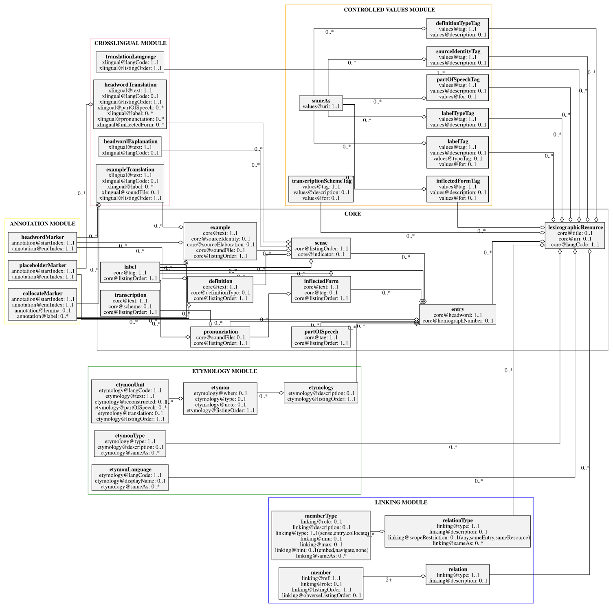

# Appendix E DMLex plain text description (Informative) <a id='diagram_nvh'></a>

This description uses the [NVH schema notation style](https://www.namevaluehierarchy.org/schema.html) and the convention that all object types and their properties are prefixed by either `core@` or `MODULENAME@` strings. Their arity is denoted by a `*` (zero or more), `+` (one or more), `?` (zero or one) or `N+` (`N` or more). If no arity is given, it indicates the arity of 1, i.e. being required and occurring exactly once.

```nvh
core@lexicographicResource:
    core@title: ?
    core@uri: ?
    core@langCode:
    core@entry: *
    xlingual@translationLanguage: +
    values@definitionTypeTag: *
    values@inflectedFormTag: *
    values@labelTag: *
    values@labelTypeTag: *
    values@partOfSpeechTag: *
    values@sourceIdentityTag: *
    values@transcriptionSchemeTag: *
    linking@relation: *
    linking@relationType: *
    etymology@etymonLanguage: *
    etymology@etymonType: *
core@entry:
    core@headword:
    core@homographNumber: ?
    core@partOfSpeech: *
    core@label: *
    core@pronunciation: *
    core@inflectedForm: *
    core@sense: *
    annotation@placeholderMarker: *
    etymology@etymology: *
core@partOfSpeech:
    core@tag:
    core@listingOrder:
core@inflectedForm:
    core@text:
    core@tag: ?
    core@label: *
    core@pronunciation: *
    core@listingOrder:
core@sense:
    core@listingOrder:
    core@indicator: ?
    core@label: *
    core@definition: *
    core@example: *
    xlingual@headwordExplanation: *
    xlingual@headwordTranslation: *
core@definition:
    core@text:
    core@definitionType: ?
    core@listingOrder:
    annotation@headwordMarker: *
    annotation@collocateMarker: *
core@label:
    core@tag:
    core@listingOrder:
core@pronunciation:
    core@soundFile: ?
    core@transcription: *
    core@listingOrder:
    core@label: *
core@transcription:
    core@text:
    core@scheme: ?
    core@listingOrder:
core@example:
    core@text:
    core@sourceIdentity: ?
    core@sourceElaboration: ?
    core@label: *
    core@soundFile: ?
    core@listingOrder:
    xlingual@exampleTranslation: *
    annotation@headwordMarker: *
    annotation@collocateMarker: *
xlingual@translationLanguage:
    xlingual@langCode:
    xlingual@listingOrder:
xlingual@headwordExplanation:
    xlingual@text:
    xlingual@langCode: ?
xlingual@headwordTranslation:
    xlingual@text:
    xlingual@langCode: ?
    xlingual@listingOrder:
    xlingual@partOfSpeech: *
    xlingual@label: *
    xlingual@pronunciation: *
    xlingual@inflectedForm: *
    annotation@placeholderMarker: *
xlingual@exampleTranslation:
    xlingual@text:
    xlingual@langCode: ?
    xlingual@label: *
    xlingual@soundFile: ?
    xlingual@listingOrder:
    annotation@headwordMarker: *
    annotation@collocateMarker: *
values@definitionTypeTag:
    values@tag:
    values@description: ?
    values@sameAs: *
values@inflectedFormTag:
    values@tag:
    values@description: ?
    values@for: ?
    values@sameAs: *
values@labelTag:
    values@tag:
    values@description: ?
    values@typeTag: ?
    values@for: ?
    values@sameAs: *
values@labelTypeTag:
    values@tag:
    values@description: ?
    values@sameAs: *
values@partOfSpeechTag:
    values@tag:
    values@description: ?
    values@for: ?
    values@sameAs: *
values@sourceIdentityTag:
    values@tag:
    values@description: ?
    values@sameAs: *
values@transcriptionSchemeTag:
    values@tag:
    values@description: ?
    values@for: ?
values@sameAs:
    values@uri:
linking@relation:
    linking@type:
    linking@description: ?
    linking@member: 2+
linking@member:
    linking@ref:
    linking@role: ?
    linking@listingOrder:
    linking@obverseListingOrder: ?
linking@relationType:
    linking@type:
    linking@description: ?
    linking@scopeRestriction: ?(any,sameEntry,sameResource)
    linking@memberType: *
    linking@sameAs: *
linking@memberType:
    linking@role: ?
    linking@description: ?
    linking@type: (sense,entry,collocate)
    linking@min: ?
    linking@max: ?
    linking@hint: ?(embed,navigate,none)
    linking@sameAs: *
annotation@placeholderMarker:
    annotation@startIndex:
    annotation@endIndex:
annotation@headwordMarker:
    annotation@startIndex:
    annotation@endIndex:
annotation@collocateMarker:
    annotation@startIndex:
    annotation@endIndex:
    annotation@lemma: ?
    annotation@label: *
etymology@etymology:
    etymology@description: ?
    etymology@etymon: *
    etymology@listingOrder: 
etymology@etymon:
    etymology@when: ?
    etymology@type: ?
    etymology@note: ?
    etymology@etymonUnit: +
    etymology@listingOrder:
etymology@etymonUnit:
    etymology@langCode:
    etymology@text:
    etymology@reconstructed: ?
    etymology@partOfSpeech: *
    etymology@translation: ?
    etymology@listingOrder:
etymology@etymonLanguage:
    etymology@langCode:
    etymology@displayName: ?
    etymology@sameAs: *
etymology@etymonType:
    etymology@type:
    etymology@description: ?
    etymology@sameAs: *
```

# Appendix F Specification Change Tracking (Informative) <a id='specChangeTracking'></a>

## F.1 Tracking of changes <a id='ReviewChangeTrack'></a>

### F.1.1 Tracking of changes made during the OASIS publishing process after Public Reviews <a id='f-1-1-tracking-of-changes-made-during-the-oasis-publishing-process-after-public-reviews'></a>

No technical changes were made during the approval and publishing process since the Committee Specification Draft 04 public review version published on 06 September 2024.

### F.1.2 Tracking of changes made in response to Public Reviews <a id='f-1-2-tracking-of-changes-made-in-response-to-public-reviews'></a>

This is to facilitate human tracking of changes in the specification made since the first Public Review publication on 8th September 2023.

#### F.1.2.1 Tracking of changes in response to the 4th Public Review <a id='csprd04'></a>

This section tracks major changes made to this specification compared to the Committee Specification Draft 04 [https://docs.oasis-open.org/lexidma/dmlex/v1.0/csd04/dmlex-v1.0-csd04.pdf.pdf](https://docs.oasis-open.org/lexidma/dmlex/v1.0/csd04/dmlex-v1.0-csd04.pdf). The fourth Public Review took place from 10 September 2024 until 11 October 2024.

1. No changes were made except administratively progressiong the draft to Committee Specification.

#### F.1.2.2 Tracking of changes in response to the 3rd Public Review <a id='csprd03'></a>

This section tracks major changes made to this specification compared to the Committee Specification Draft 03 [https://docs.oasis-open.org/lexidma/dmlex/v1.0/csd03/dmlex-v1.0-csd03.pdf.pdf](https://docs.oasis-open.org/lexidma/dmlex/v1.0/csd03/dmlex-v1.0-csd03.pdf). The third Public Review took place from 28 June 2024 until 27 July 2024.

1. The `sameAs` object has been added as property of `etymonLanguage` and `etymonType` (GitHub issue [140](https://github.com/oasis-tcs/lexidma/issues/140)).

2. The `translation` property of `etymon` has been removed (GitHub issue [139](https://github.com/oasis-tcs/lexidma/issues/139)).

3. The XSD schema has been updated to accept entries, senses and collocate markers without an `id` attribute. (GitHub issue [135](https://github.com/oasis-tcs/lexidma/issues/135)).

#### F.1.2.3 Tracking of changes in response to the 2nd Public Review <a id='csprd02'></a>

This section tracks major changes made to this specification compared to the Committee Specification Draft 02 <https://docs.oasis-open.org/lexidma/dmlex/v1.0/csd02/dmlex-v1.0-csd02.pdf>. The second Public Review took place from 31st January 2024 until 29th February 2024.

1. A method for constructing fragment identification strings has been added to the specification (GitHub issue [97](https://github.com/oasis-tcs/lexidma/issues/97)).

2. Consistency has been introduced to the use of `<text>` child elements in the XML serialisation. (GitHub issue [72](https://github.com/oasis-tcs/lexidma/issues/72)).

3. Clarifications have been added on how whitespace should be handled, both at the level of the data model and in the XML serialisation (GitHub issue [84](https://github.com/oasis-tcs/lexidma/issues/84)).

4. Several validation artifacts have been added to the specification, including an XML schema and a JSON schema (GitHub issue [93](https://github.com/oasis-tcs/lexidma/issues/93)).

5. A clarification has been added on element ordering in the XML serialisation (GitHub issue [117](https://github.com/oasis-tcs/lexidma/issues/117)).

6. A clarification has been added to the XML serialisation on which elements can be the top-level elements in a DMLex-comformant XML document (GitHub issue [118](https://github.com/oasis-tcs/lexidma/issues/118)).

#### F.1.2.4 Tracking of changes in response to the 1st Public Review <a id='csprd01'></a>

This section tracks major changes made to this specification compared to the Committee Specification Draft 01 <https://docs.oasis-open.org/lexidma/dmlex/v1.0/dmlex-v1.0.pdf>. The initial Public Review took place from 22nd September 2023 until 17th November 2023.

1. Clarifications have been added to explain why DMLex allows lexicographic resources with zero entries and entries with zero senses, in response to a review comment (GitHub issue [52](https://github.com/oasis-tcs/lexidma/issues/52)).

2. The data type of `pronunciation.soundFile` has been changed to Internationalized Resource Identifier (IRI), in response to a review comment (GitHub issue [54](https://github.com/oasis-tcs/lexidma/issues/54)).

3. In the Controlled Values Module, the properties of various object types such as `forHeadwords`, `forPartOfSpeech` and so on, which had originally been intended to model various constraints on the use of tags, have been radically simplified into a single property called `for` – in response to a review comment (GitHub issue [55](https://github.com/oasis-tcs/lexidma/issues/55)).

4. In the Linking Module, uniqueness constraints on `relation` have been removed in response to a review comment (GitHub issue [56](https://github.com/oasis-tcs/lexidma/issues/56)).

5. The Etymology Module has been updated to disallow the existence of empty etymologies, in response to a review comment (GitHub issue [59](https://github.com/oasis-tcs/lexidma/issues/59)).

6. In the XML and JSON serializations (which are normative) and in the NVH serialization (which is informative), items which have `id` properties (those are: entries, senses, collocate markers) have been changed so that the `id` property is relevant only if implementing the Linking Module – in response to a review comment (GitHub issue [65](https://github.com/oasis-tcs/lexidma/issues/65)).

7. In the Linking Module, the `member_id` property of `member` has been changed to `ref` to avoid a potential misunderstanding about the purpose of this property, in response to a review comment (GitHub issue [66](https://github.com/oasis-tcs/lexidma/issues/66)).

8. In the Linking Module, the `obverseListingOrder` property of `member` has been made optional in response to a review comment (GitHub issue [67](https://github.com/oasis-tcs/lexidma/issues/67)).

9. In the Linking Module, the `role` property of `memberType` has been made optional in response to a review comment (GitHub issue [68](https://github.com/oasis-tcs/lexidma/issues/68)).

10. In the XML serialization, whitespace handling rules have been added, both at the default level for all elements, and specifically for elements which are allowed to contain inline markup, in reponse to a review comment (GitHub issue [69](https://github.com/oasis-tcs/lexidma/issues/69)).

11. Multiple changes have made to the Examples section to correct inconsistencies between the examples and the rest of the specificiation, in response to various review comments (including GitHub issue [62](https://github.com/oasis-tcs/lexidma/issues/62)).

# Appendix G Acknowledgements (Informative) <a id='acknowledgements'></a>

The following individuals have participated in the creation of this specification and are gratefully acknowledged:

- Erjavec, Tomaž - Jožef Stefan Institute

- Filip, David - Masaryk University (previously TCD, ADAPT Centre)

- Jakubíček, Miloš - Lexical Computing, Masaryk University

- Kallas, Jelena - Institute of the Estonian Language

- Kernerman, Ilan - K Dictionaries

- Kokol, Marko - Jožef Stefan Institute

- Kosem, Iztok - Jožef Stefan Institute

- Krek, Simon - Jožef Stefan Institute

- Kovář, Vojtěch - Lexical Computing, Masaryk University

- McCrae, John - University of Galway

- Měchura, Michal - Masaryk University

- Tiberius, Carole - Dutch Language Institute

# Appendix H Notices (Informative) <a id='full-notices'></a>

Copyright © OASIS Open 2025. All Rights Reserved.

All capitalized terms in the following text have the meanings assigned to them in the OASIS Intellectual Property Rights Policy (the "OASIS IPR Policy"). The full [Policy](https://www.oasis-open.org/policies-guidelines/ipr/) may be found at the OASIS website.

This document and translations of it may be copied and furnished to others, and derivative works that comment on or otherwise explain it or assist in its implementation may be prepared, copied, published, and distributed, in whole or in part, without restriction of any kind, provided that the above copyright notice and this section are included on all such copies and derivative works. However, this document itself may not be modified in any way, including by removing the copyright notice or references to OASIS, except as needed for the purpose of developing any document or deliverable produced by an OASIS Technical Committee (in which case the rules applicable to copyrights, as set forth in the OASIS IPR Policy, must be followed) or as required to translate it into languages other than English.

The limited permissions granted above are perpetual and will not be revoked by OASIS or its successors or assigns.

This document and the information contained herein is provided on an "AS IS" basis and OASIS DISCLAIMS ALL WARRANTIES, EXPRESS OR IMPLIED, INCLUDING BUT NOT LIMITED TO ANY WARRANTY THAT THE USE OF THE INFORMATION HEREIN WILL NOT INFRINGE ANY OWNERSHIP RIGHTS OR ANY IMPLIED WARRANTIES OF MERCHANTABILITY OR FITNESS FOR A PARTICULAR PURPOSE.

As stated in the OASIS IPR Policy, the following three paragraphs in brackets apply to OASIS Standards Final Deliverable documents (Committee Specification, OASIS Standard, or Approved Errata).

\[OASIS requests that any OASIS Party or any other party that believes it has patent claims that would necessarily be infringed by implementations of this OASIS Standards Final Deliverable, to notify OASIS TC Administrator and provide an indication of its willingness to grant patent licenses to such patent claims in a manner consistent with the IPR Mode of the OASIS Technical Committee that produced this deliverable.\]

\[OASIS invites any party to contact the OASIS TC Administrator if it is aware of a claim of ownership of any patent claims that would necessarily be infringed by implementations of this OASIS Standards Final Deliverable by a patent holder that is not willing to provide a license to such patent claims in a manner consistent with the IPR Mode of the OASIS Technical Committee that produced this OASIS Standards Final Deliverable. OASIS may include such claims on its website, but disclaims any obligation to do so.\]

\[OASIS takes no position regarding the validity or scope of any intellectual property or other rights that might be claimed to pertain to the implementation or use of the technology described in this OASIS Standards Final Deliverable or the extent to which any license under such rights might or might not be available; neither does it represent that it has made any effort to identify any such rights. Information on OASIS' procedures with respect to rights in any document or deliverable produced by an OASIS Technical Committee can be found on the OASIS website. Copies of claims of rights made available for publication and any assurances of licenses to be made available, or the result of an attempt made to obtain a general license or permission for the use of such proprietary rights by implementers or users of this OASIS Standards Final Deliverable, can be obtained from the OASIS TC Administrator. OASIS makes no representation that any information or list of intellectual property rights will at any time be complete, or that any claims in such list are, in fact, Essential Claims.\]

The name "OASIS" is a trademark of [OASIS](https://www.oasis-open.org/)), the owner and developer of this specification, and should be used only to refer to the organization and its official outputs. OASIS welcomes reference to, and implementation and use of, specifications, while reserving the right to enforce its marks against misleading uses. Please see <https://www.oasis-open.org/policies-guidelines/trademark/> for above guidance.
