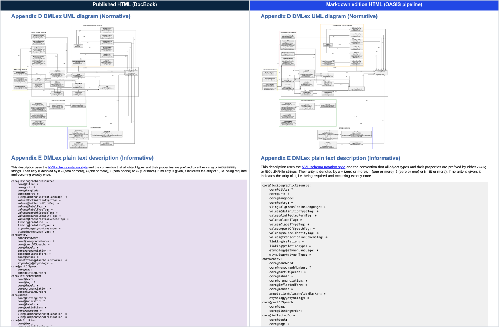

# Publication Assurance

[](https://github.com/MColetta-OASIS/lexidma/actions/workflows/publication-assurance.yml?query=branch%3Amarkdown-conversion)
[](https://github.com/OASIS-Docs/publication-assurance/releases/tag/v1.10.1)
[](https://github.com/OASIS-Docs/publication-assurance/blob/v1.10.1/pub-check/CHECKS.md)
[](reports/2026-09-24/)

**Latest run: [reports/2026-09-24](reports/2026-09-24/)**, with the audit,
both validation reports, the rendering comparison and the rendered PDFs.

[](reports/2026-09-24/)

## Purpose

This directory renders the Markdown editions of DMLex the way OASIS publishes
them and checks each one against the OASIS publication acceptance criteria
before the TC votes. It is a worked example of the OASIS publication
assurance pipeline
([OASIS-Docs/publication-assurance](https://github.com/OASIS-Docs/publication-assurance))
running inside a TC repository.

Every change to a Markdown edition runs the same three steps in CI:

1. **Render.** Markdown to HTML with the OASIS converter, then HTML to PDF
   with the OASIS print styles and headless Chrome: the published footer is
   read from the document, and the table of contents is numbered from the
   printed pages.
2. **Stage.** The HTML, PDF, Markdown, figures and schemas are laid out at the
   path they would have on `docs.oasis-open.org`, for example
   `lexidma/dmlex/v1.1/wd01/`.
3. **Gate.** `oasis-pub-check` runs its 178 checks on the staged package: naming,
   front matter, links, cited files, schemas, PDF against source and more. A
   blocker fails the build. Warnings do not.

The TC sees the same verdict that OASIS TC Administration sees at intake, while
the document is still the TC's to change.

The renderer is part of the OASIS publication tooling and is used from a
pinned release: `render/render.sh` in
[OASIS-Docs/publication-assurance v1.10.1](https://github.com/OASIS-Docs/publication-assurance/tree/v1.10.1/render),
with `render/compare.mjs` for side-by-side screenshots. This directory keeps
what is DMLex's own:

| File | Role |
|---|---|
| `reports/` | Validation, audit and rendering comparison reports, one folder per run |
| `measure_pdf_type.py` | Measures the printed type sizes of a rendered PDF (used for the 24 September report) |
| `count_figure_widths.py` | Counts figure widths in the edition (used for the 24 September report) |

## Requirements

- pandoc 3.x
- Python 3.10 or later with `beautifulsoup4`
- Node.js 18 or later (`render.sh` installs `puppeteer-core` next to itself on
  first run)
- poppler (`pdfinfo`, `pdftotext`), for the contents page numbers and the
  gate's PDF checks
- Chrome or Chromium; set `CHROME` to the binary if it is not found
- `git`, to fetch the release

## Usage

```bash
git clone --depth 1 --branch v1.10.1 https://github.com/OASIS-Docs/publication-assurance _pa
_pa/render/render.sh MD_DIR SCHEMAS_DIR OUT_ROOT
```

| Argument | Meaning |
|---|---|
| `MD_DIR` | The directory holding one Markdown edition and its figures |
| `SCHEMAS_DIR` | The schemas the edition cites, staged as `schemas/` (`-` for none) |
| `OUT_ROOT` | Receives the staged tree |

The publish path comes from the "This stage" URL in the Markdown, so the
directory, the filenames and the cover are the ones the gate checks against
each other.

```bash
# the v1.1 working draft
_pa/render/render.sh dmlex-v1.1 dmlex-v1.1/schemas _publication

# the Markdown edition of the v1.0 OASIS Standard
_pa/render/render.sh dmlex-v1.0/markdown dmlex-v1.0/specification/schemas _publication
```

The output is `_publication/lexidma/dmlex/<version>/<stage>/` with
`<name>.html`, `<name>.pdf`, `<name>.md`, the figures and `schemas/`. The last
line of output is the gate's verdict. The exit status is 0 when the package is
publishable and 1 when it has blockers. With `PUBCHECK=0` the script stops
after staging.

## CI

`.github/workflows/publication-assurance.yml` runs on any change to a Markdown
edition, its schemas or this directory. It has one job per edition:

| Job | Gate |
|---|---|
| DMLex v1.1 WD01 | Report only for now: its blockers are all inherited from v1.0 and await a TC decision. Switch to enforced (`enforce: true`) once they are resolved |
| DMLex v1.0 OS | Report only: the OASIS Standard is published and cannot change |

The gate step is the published action, pinned to a release:

```yaml
- uses: OASIS-Docs/publication-assurance@v1.10.1
  with:
    target: _publication/lexidma/dmlex/v1.1/wd01
    fail-on-blockers: false   # report only until the TC resolves the inherited blockers
```

Report-only runs pass, so the badge above is green, and each blocker still
appears as a warning on the run, in the job summary and in the published
Validation Report. The job summary lists every finding. The rendered package and the gate report
are uploaded as the `dmlex-v1.1-wd01-rendered` and `dmlex-v1.0-os-rendered`
artifacts.

## Current Results

The run of 24 September 2026 is in `reports/2026-09-24/`:

| Report | Files |
|---|---|
| Publication audit (15 gates, 9 findings) | `dmlex-markdown-edition-publication-audit-2026-09-24.{pdf,docx,md,json}` |
| Validation, v1.1 WD01 (170 checks) | `dmlex-v1.1-wd01-pub-check-validation-2026-09-24.{pdf,docx,md,json}` |
| Validation, v1.0 OS Markdown edition | `dmlex-v1.0-os-markdown-pub-check-validation-2026-09-24.{pdf,docx,md,json}` |
| Rendering comparison, published against Markdown, HTML and PDF | `dmlex-rendering-comparison-2026-09-24.{pdf,docx,md}` and `comparison/` |
| Rendered PDFs | `rendered/dmlex-v1.1-wd01.pdf`, `rendered/dmlex-v1.0-os.pdf` |

The Markdown edition reproduces the published standard word for word, with
every code block identical. The gate's remaining blockers are all in the
published v1.0 source and carry into v1.1 until the TC changes them:

| Blocker | Where | What the TC decides |
|---|---|---|
| Both JSON schemas declare the same `$id`, which does not resolve to a schema | `schemas/JSON/*.schema.json` | The `$id` of each v1.1 schema |
| `dmlex.nvh` is cited but not in the repository | Appendix C, `schemas/informativeCopiesOf3rdPartySchemas/NVH/` | Commit the file under the cited name, or change the citation |
| [XML Catalogs] cites a member-only URL | Appendix B | A public URL for the reference |

WD01 also fixes two typos from the published source: the doubled `.pdf.pdf`
in Appendix F, and "OASIS OASIS Standard" in the citation.

## Provenance

The pipeline, the gate and these reports are provided by OASIS staff (TC
Administration) as a publication service. They are not a contribution to the
TC's work product. The rendered documents contain the TC's text without
technical change.
