# Rendering Comparison: DMLex Version 1.0 OASIS Standard, DocBook and Markdown editions

24 September 2026. OASIS TC Administration, for the LEXIDMA TC (TCADMIN-4742).

## Summary

This report compares the Markdown edition of DMLex Version 1.0 OASIS Standard, rendered through the OASIS publication pipeline, with the edition OASIS published from the TC's DocBook source. Each figure puts the published edition on the left and the Markdown edition on the right, at the same place in the document.

| Measure | Published (DocBook) | Markdown edition |
|---|---|---|
| Words compared (tokens) | 61,253 | 61,225, 0 unexplained differences |
| Numbered headings | 311 | 311 |
| Code blocks | 316 | 316, all identical |
| Internal links | 3,166 | 3,166, none broken |
| Figures | 49 at 566.9px | 49 at 567px |
| PDF pages | 218 | 228 |
| PDF body text (median word height) | 13.6pt | 13.4pt |

The text is the same. The Markdown edition takes the look of the OASIS Markdown template. The PDF runs to more pages because code blocks carry a border and padding, and notes render as shaded blocks.

## How the comparison was made

- **Text.** `tools/docbook-to-markdown/verify_md.py` reduces both editions to visible text and aligns them word by word against the live page at docs.oasis-open.org. It also compares code blocks byte for byte, headings in order, every internal anchor and every image. Eleven accepted deviations are listed in `allow.json`, each with its reason.
- **Rendering.** `tools/publication-assurance/render.sh` runs the OASIS pipeline: pandoc with the OASIS stylesheet and the OASIS post-processor for HTML, then the OASIS PDF preprocessor and headless Chrome for PDF. It stages the result at its docs.oasis-open.org path and runs oasis-pub-check v1.4.2.
- **Pictures.** `tools/publication-assurance/compare.mjs` scrolls both HTML editions to the same anchor and captures the viewport. PDF pages were matched by their text and rasterised at 110 dpi.

## Defects found and fixed

Two rendering defects were found by these comparisons and fixed before release.

- **Figure width.** Every figure in the DocBook source is 16cm wide, and the converter dropped the width, so the Appendix D UML diagram ran off the page. The converter now carries the width through.
- **PDF scale and footer.** One long inline code path in section 3.2.1 could not wrap, and Chrome shrank every page of the PDF to fit it: 12pt text printed at about 7.5pt. The OASIS PDF preprocessor now lets inline code wrap (publication-assurance v1.4.2). The PDF also now carries the published footer on every page.

## Differences that remain

These come from the OASIS Markdown template, not from the content.

- The cover labels the URIs "This stage", "Previous stage" and "Latest stage", where the DocBook stylesheet says "version".
- Notes render as shaded blocks with a rule, where DocBook uses a "Note" heading.
- The table of contents is a nested list, and object-type names in it are in body type rather than monospace.
- Code blocks have a grey background with a border, where DocBook uses lilac with no border.
- The Appendix D UML diagram is regenerated from the TC's own source by Graphviz, so boxes sit in different places. The classes, attributes and relations are the same.

## HTML, side by side

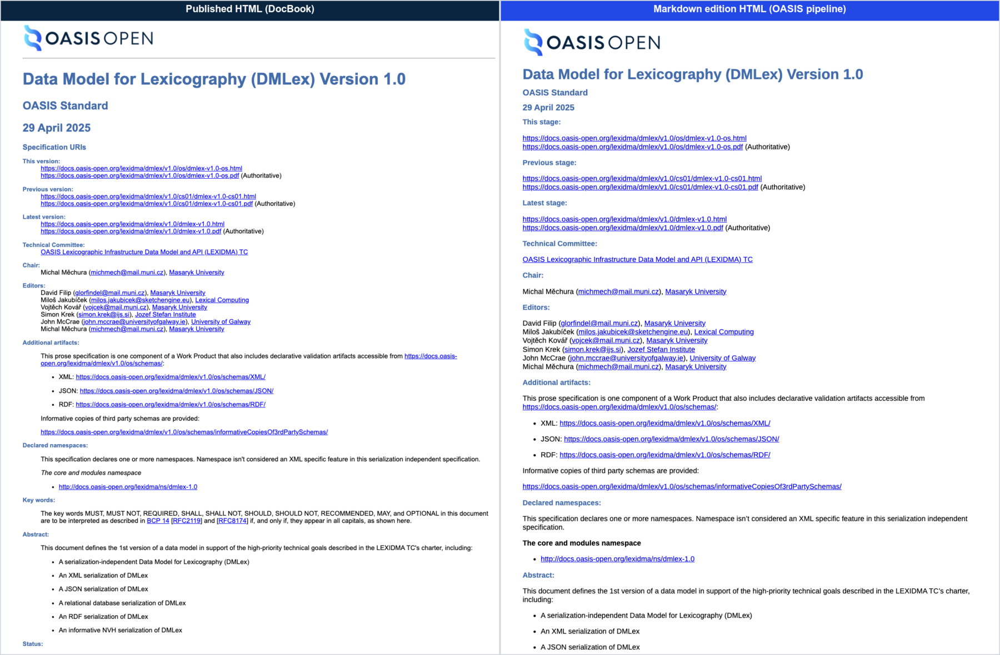

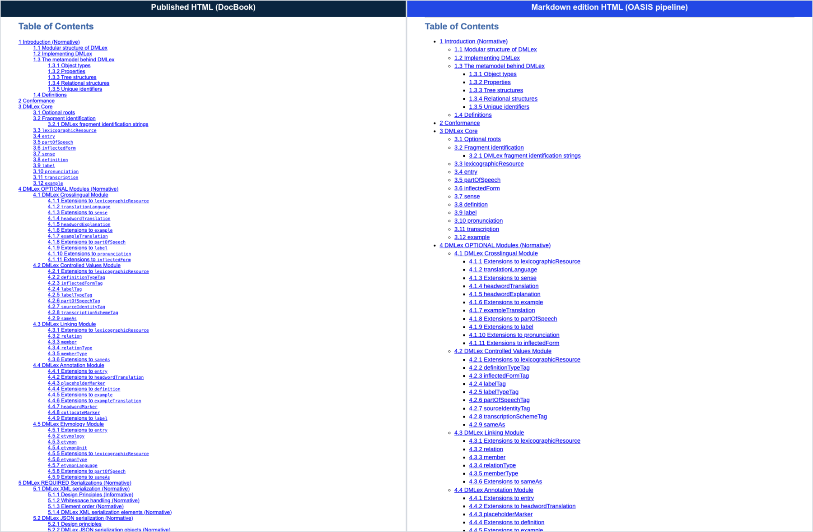

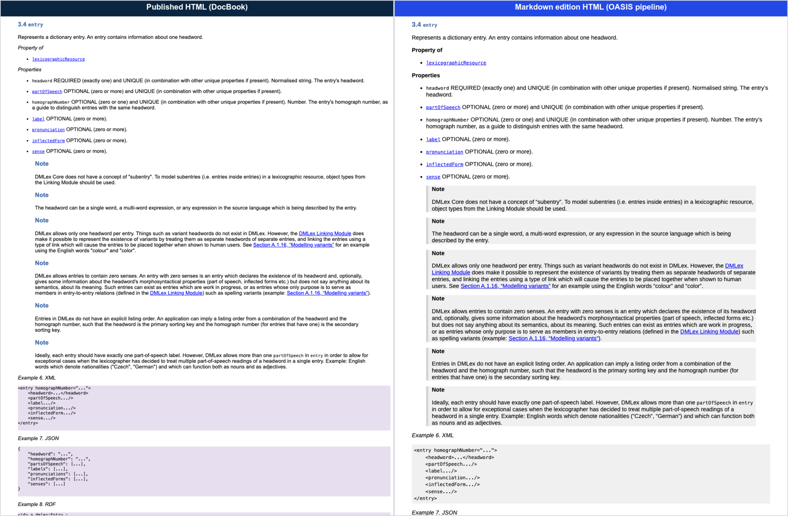

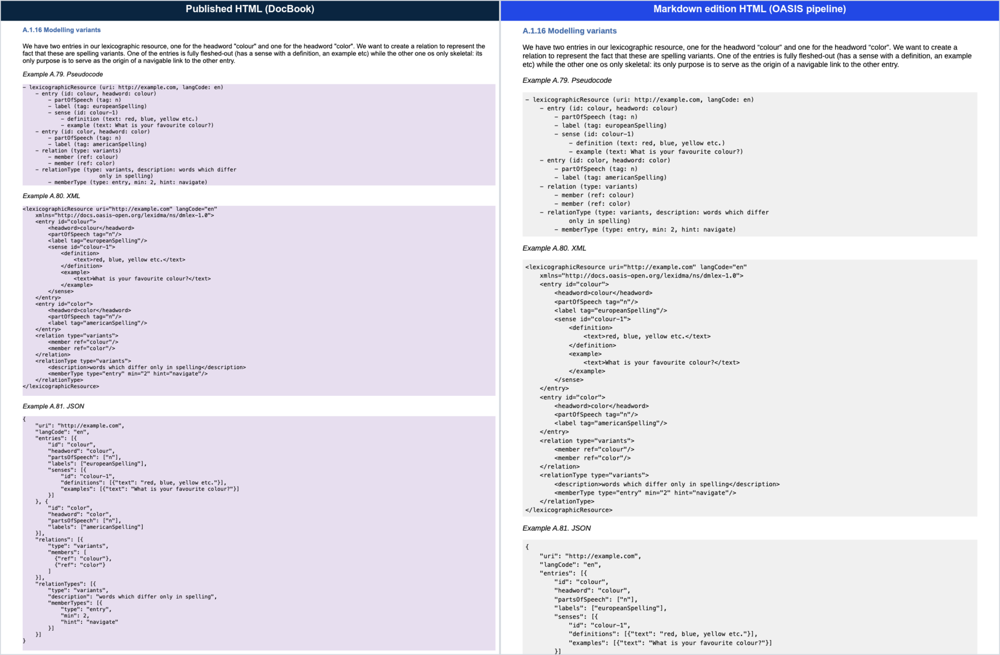

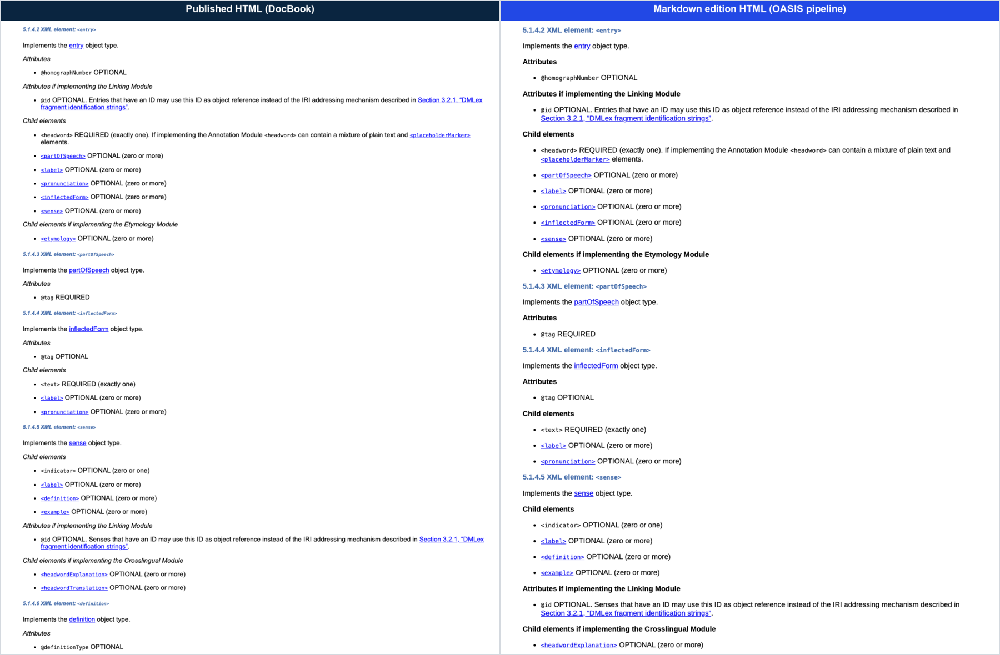

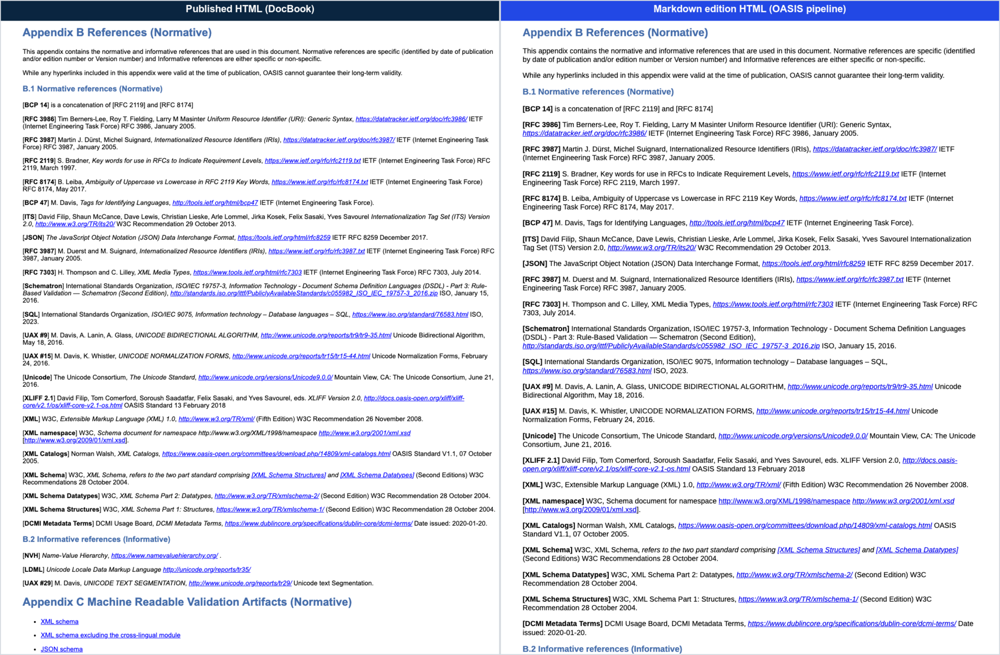

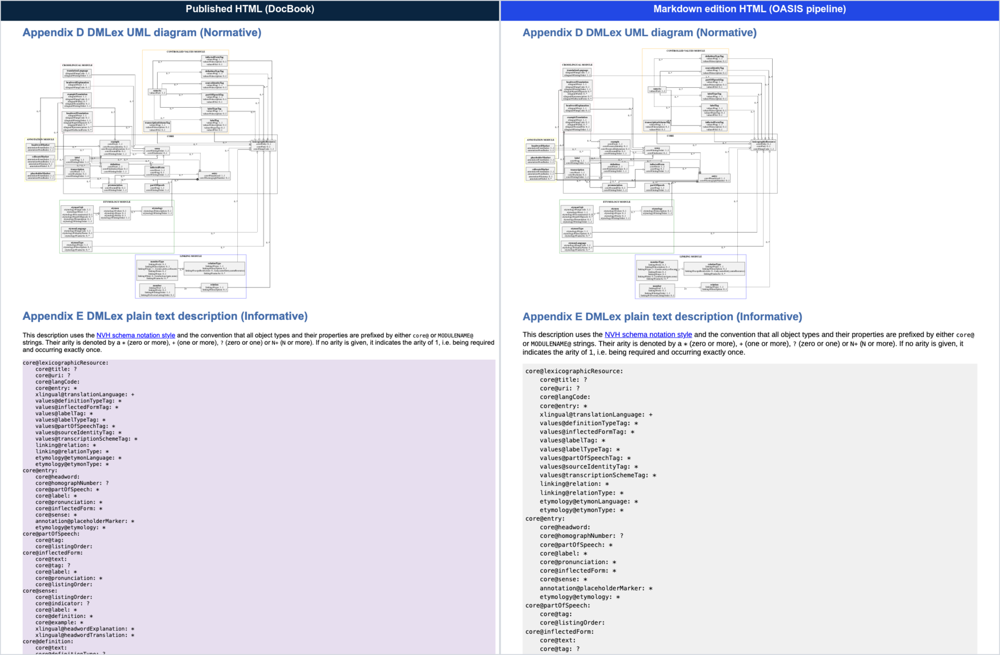

## PDF, side by side

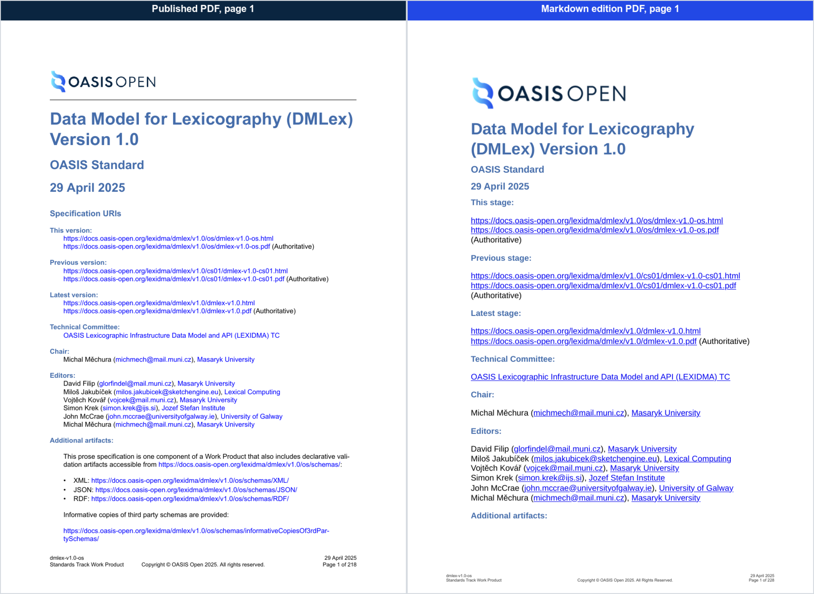

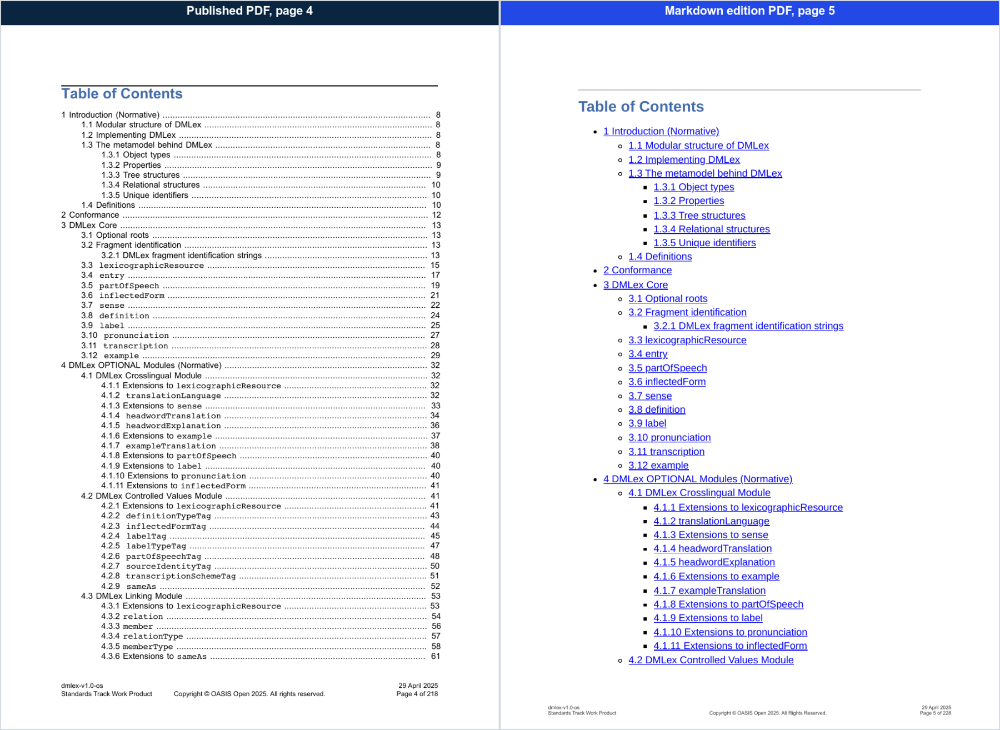

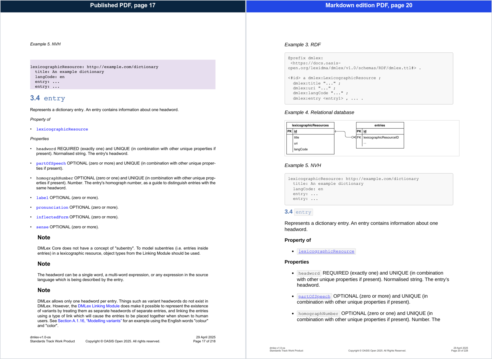

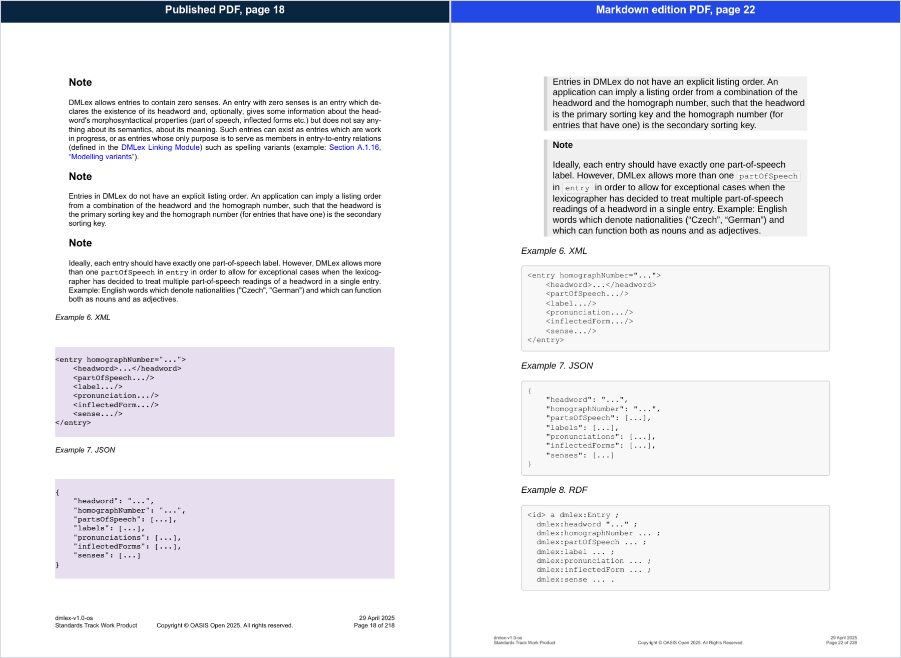

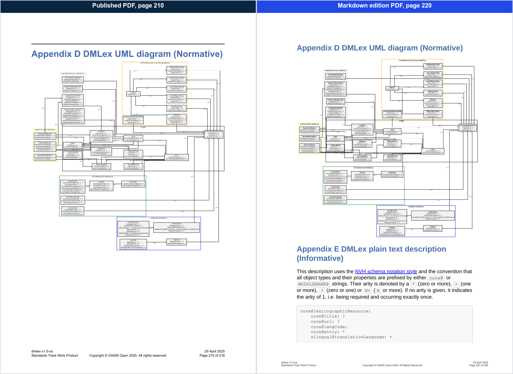
